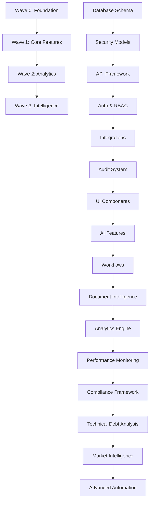

# AdvisorOS Integration Roadmap
## Comprehensive Wave 0-3 Agent Deliverable Integration Strategy

### Executive Summary

This roadmap outlines the systematic integration of 31 specialized agent deliverables across Waves 0-3 for AdvisorOS. The integration strategy prioritizes system stability, backward compatibility, and incremental value delivery while maintaining enterprise-grade security and performance standards.

**Key Metrics:**
- 31 specialized agents across 4 waves
- 150+ new files and components to integrate
- 25+ new database models requiring migration
- 12+ new API routers to integrate
- 50+ new UI components and pages

---

## Wave Classification and Agent Inventory

### Wave 0: Foundation & Core Infrastructure (6 Agents)
**Critical Foundation - Must Complete First**

1. **architecture-designer** - System architecture and Azure infrastructure
2. **backend-api-developer** - Core API framework and tRPC enhancements
3. **database-optimizer** - Schema optimization and performance
4. **security-auditor** - Security models and audit framework
5. **integration-specialist** - QuickBooks and third-party integrations
6. **audit-trail-perfectionist** - Comprehensive audit logging system

**Key Deliverables:**
- Enhanced database schema with 25+ new security/audit models
- Advanced tRPC middleware with caching, rate limiting, security monitoring
- API key management system with usage tracking
- Multi-tenant isolation and RBAC framework
- QuickBooks OAuth and webhook processing
- Azure infrastructure templates

### Wave 1: Core Features & User Experience (8 Agents)
**Build on Foundation - Core User Value**

7. **frontend-builder** - Core UI components and dashboard layouts
8. **ai-features-orchestrator** - AI/ML integration and document processing
9. **workflow-efficiency-analyzer** - Workflow automation engine
10. **document-intelligence-optimizer** - Enhanced OCR and document collaboration
11. **devops-azure-specialist** - CI/CD and deployment automation
12. **test-suite-developer** - Comprehensive testing framework
13. **client-portal-designer** - Client-facing portal and interfaces
14. **demo-data-generator** - Sample data and onboarding

**Key Deliverables:**
- React component library with 50+ components
- AI-powered document processing and insights
- Workflow automation with visual designer
- Real-time collaboration features
- Azure DevOps pipelines and deployment
- End-to-end testing suite
- Client portal with document sharing

### Wave 2: Advanced Analytics & Optimization (9 Agents)
**Enhanced Capabilities - Business Intelligence**

15. **user-journey-optimizer** - UX optimization and user analytics
16. **client-success-optimizer** - Client relationship management
17. **revenue-intelligence-analyst** - Financial analytics and reporting
18. **performance-optimization-specialist** - System performance monitoring
19. **docs-writer** - Documentation and knowledge management
20. **compliance-planner** - Regulatory compliance framework
21. **cpa-tax-compliance** - Tax-specific workflows and compliance
22. **financial-prediction-modeler** - Predictive financial analytics
23. **documentation-evolution-manager** - Advanced documentation systems

**Key Deliverables:**
- Advanced analytics dashboards with ML insights
- Client health scoring and success tracking
- Revenue forecasting and business intelligence
- Performance monitoring with alerting
- Compliance tracking and regulatory updates
- Tax season optimization tools
- Predictive financial modeling

### Wave 3: Intelligence & Automation (8 Agents)
**Advanced Features - Strategic Intelligence**

24. **technical-debt-planner** - Code quality and technical debt assessment
25. **feature-adoption-tracker** - Feature usage analytics and optimization
26. **tax-season-optimizer** - Tax season workflow optimization
27. **smart-automation-designer** - Intelligent automation workflows
28. **market-intelligence-analyst** - Competitive analysis and market insights
29. **marketing-site-optimizer** - Marketing optimization and lead generation
30. **excel-interface-perfectionist** - Advanced Excel integration and reporting
31. **micro-animation-coordinator** - UI/UX micro-interactions and animations

**Key Deliverables:**
- Technical debt assessment and remediation plans
- Feature adoption tracking and optimization
- Intelligent tax season workflows
- Advanced automation with AI decision-making
- Market intelligence and competitive analysis
- Marketing optimization and conversion tracking
- Excel integration with advanced reporting
- Enhanced UI animations and interactions

---

## Integration Dependency Graph

### Critical Path Dependencies



### Integration Sequence Matrix

| Phase | Component | Dependencies | Risk Level | Effort | Priority |
|-------|-----------|-------------|------------|--------|----------|
| 1A | Database Schema | None | High | High | Critical |
| 1B | Security Models | Database | High | Medium | Critical |
| 1C | API Framework | Security | Medium | High | Critical |
| 2A | UI Components | API Framework | Low | Medium | High |
| 2B | AI Features | API + UI | Medium | High | High |
| 2C | Workflows | AI Features | Medium | Medium | High |
| 3A | Analytics | All Core | Medium | High | Medium |
| 3B | Performance Mon. | Analytics | Low | Medium | Medium |
| 4A | Intelligence | All Previous | Low | Medium | Low |

---

## Phased Implementation Timeline

### Phase 1: Foundation Setup (Weeks 1-4)
**Wave 0 - Critical Infrastructure**

#### Week 1: Database and Security Foundation
**Monday-Tuesday: Database Schema Migration**
- [ ] Execute enhanced schema migration with 25+ new models
- [ ] Implement security models (UserSession, ApiKey, SecurityEvent, etc.)
- [ ] Set up audit logging infrastructure
- [ ] Configure multi-tenant isolation

**Wednesday-Thursday: Security Framework**
- [ ] Deploy RBAC permission system with 65+ permissions
- [ ] Implement API key management service
- [ ] Set up security monitoring and threat detection
- [ ] Configure audit trail middleware

**Friday: Integration Testing**
- [ ] Test database migrations in staging
- [ ] Validate security model functionality
- [ ] Verify audit logging is working
- [ ] Performance test with multi-tenant data

#### Week 2: API and Authentication
**Monday-Tuesday: Enhanced tRPC Framework**
- [ ] Deploy enhanced tRPC middleware stack
- [ ] Implement intelligent caching with Redis
- [ ] Set up rate limiting and security monitoring
- [ ] Configure API analytics and performance tracking

**Wednesday-Thursday: Authentication & Authorization**
- [ ] Integrate enhanced OAuth flows
- [ ] Implement session management improvements
- [ ] Deploy permission-based procedures
- [ ] Set up role-based access controls

**Friday: API Testing**
- [ ] Test all enhanced API endpoints
- [ ] Validate caching and rate limiting
- [ ] Verify security monitoring alerts
- [ ] Load test API performance

#### Week 3: Third-Party Integrations
**Monday-Tuesday: QuickBooks Integration**
- [ ] Deploy enhanced QuickBooks OAuth
- [ ] Implement advanced sync engine
- [ ] Set up webhook processing
- [ ] Configure data transformation pipeline

**Wednesday-Thursday: Integration Infrastructure**
- [ ] Deploy sync monitoring dashboard
- [ ] Implement integration diagnostics
- [ ] Set up error handling and retry logic
- [ ] Configure integration security

**Friday: Integration Testing**
- [ ] Test QuickBooks sync functionality
- [ ] Validate webhook processing
- [ ] Test error scenarios and recovery
- [ ] Performance test with large datasets

#### Week 4: Azure Infrastructure
**Monday-Tuesday: Cloud Infrastructure**
- [ ] Deploy Azure infrastructure via Terraform
- [ ] Set up Application Insights monitoring
- [ ] Configure Azure Key Vault integration
- [ ] Implement backup and disaster recovery

**Wednesday-Thursday: DevOps Pipeline**
- [ ] Set up CI/CD pipelines
- [ ] Configure automated testing
- [ ] Implement blue-green deployment
- [ ] Set up monitoring and alerting

**Friday: Infrastructure Validation**
- [ ] Test deployment pipeline
- [ ] Validate monitoring and alerting
- [ ] Test disaster recovery procedures
- [ ] Performance test infrastructure

### Phase 2: Core Features (Weeks 5-8)
**Wave 1 - User-Facing Features**

#### Week 5: UI Foundation
**Monday-Tuesday: Component Library**
- [ ] Deploy enhanced UI component library
- [ ] Implement new dashboard layouts
- [ ] Set up design system and theming
- [ ] Configure Storybook documentation

**Wednesday-Thursday: Core UI Components**
- [ ] Deploy charts and analytics components
- [ ] Implement workflow designer
- [ ] Set up form and validation systems
- [ ] Configure accessibility features

**Friday: UI Testing**
- [ ] Test component library integration
- [ ] Validate responsive design
- [ ] Test accessibility compliance
- [ ] Visual regression testing

#### Week 6: AI and Document Processing
**Monday-Tuesday: AI Infrastructure**
- [ ] Deploy enhanced document intelligence
- [ ] Implement AI service orchestration
- [ ] Set up OpenAI API integration
- [ ] Configure Azure Cognitive Search

**Wednesday-Thursday: Document Features**
- [ ] Deploy enhanced OCR service
- [ ] Implement document collaboration
- [ ] Set up real-time annotations
- [ ] Configure document workflow automation

**Friday: AI Testing**
- [ ] Test document processing accuracy
- [ ] Validate AI service performance
- [ ] Test collaboration features
- [ ] Load test AI endpoints

#### Week 7: Workflow Engine
**Monday-Tuesday: Workflow Infrastructure**
- [ ] Deploy workflow automation engine
- [ ] Implement CPA workflow templates
- [ ] Set up workflow optimization suite
- [ ] Configure quality control workflows

**Wednesday-Thursday: Automation Features**
- [ ] Deploy document workflow automation
- [ ] Implement workflow analytics dashboard
- [ ] Set up automated trigger systems
- [ ] Configure workflow monitoring

**Friday: Workflow Testing**
- [ ] Test workflow execution
- [ ] Validate automation triggers
- [ ] Test workflow analytics
- [ ] Performance test complex workflows

#### Week 8: Client Portal
**Monday-Tuesday: Portal Infrastructure**
- [ ] Deploy client portal framework
- [ ] Implement portal authentication
- [ ] Set up client document management
- [ ] Configure portal messaging system

**Wednesday-Thursday: Portal Features**
- [ ] Deploy document upload/sharing
- [ ] Implement client communication tools
- [ ] Set up notification system
- [ ] Configure portal analytics

**Friday: Portal Testing**
- [ ] Test client portal functionality
- [ ] Validate document sharing security
- [ ] Test mobile responsiveness
- [ ] User acceptance testing

### Phase 3: Advanced Analytics (Weeks 9-12)
**Wave 2 - Business Intelligence**

#### Week 9: Analytics Foundation
**Monday-Tuesday: Analytics Engine**
- [ ] Deploy revenue intelligence analytics
- [ ] Implement client portfolio analytics
- [ ] Set up financial prediction modeling
- [ ] Configure business analytics engine

**Wednesday-Thursday: Performance Monitoring**
- [ ] Deploy performance monitoring service
- [ ] Implement system health dashboards
- [ ] Set up automated alerting
- [ ] Configure performance optimization

**Friday: Analytics Testing**
- [ ] Test analytics accuracy
- [ ] Validate performance metrics
- [ ] Test alert systems
- [ ] Load test analytics queries

#### Week 10: Client Success & Revenue Intelligence
**Monday-Tuesday: Client Success Framework**
- [ ] Deploy client health scoring
- [ ] Implement success optimization tools
- [ ] Set up client journey tracking
- [ ] Configure retention analytics

**Wednesday-Thursday: Revenue Intelligence**
- [ ] Deploy revenue forecasting
- [ ] Implement pricing optimization
- [ ] Set up profitability analysis
- [ ] Configure financial reporting

**Friday: Business Intelligence Testing**
- [ ] Test client scoring accuracy
- [ ] Validate revenue forecasts
- [ ] Test reporting functionality
- [ ] Performance test BI queries

#### Week 11: Compliance & Tax Optimization
**Monday-Tuesday: Compliance Framework**
- [ ] Deploy compliance tracking system
- [ ] Implement regulatory monitoring
- [ ] Set up tax compliance workflows
- [ ] Configure audit preparation tools

**Wednesday-Thursday: Tax Season Optimization**
- [ ] Deploy tax season workflows
- [ ] Implement tax compliance AI
- [ ] Set up tax document processing
- [ ] Configure tax analytics

**Friday: Compliance Testing**
- [ ] Test compliance tracking
- [ ] Validate tax workflows
- [ ] Test audit preparation
- [ ] Compliance reporting validation

#### Week 12: Documentation & Knowledge Management
**Monday-Tuesday: Documentation System**
- [ ] Deploy documentation evolution manager
- [ ] Implement knowledge management
- [ ] Set up automated documentation
- [ ] Configure version control

**Wednesday-Thursday: Advanced Documentation**
- [ ] Deploy context-aware help system
- [ ] Implement documentation analytics
- [ ] Set up content optimization
- [ ] Configure search functionality

**Friday: Documentation Testing**
- [ ] Test documentation system
- [ ] Validate search functionality
- [ ] Test content management
- [ ] User experience validation

### Phase 4: Strategic Intelligence (Weeks 13-16)
**Wave 3 - Advanced Intelligence**

#### Week 13: Technical Debt & Feature Analytics
**Monday-Tuesday: Technical Debt Assessment**
- [ ] Deploy technical debt analysis
- [ ] Implement code quality monitoring
- [ ] Set up debt prioritization
- [ ] Configure remediation planning

**Wednesday-Thursday: Feature Adoption Tracking**
- [ ] Deploy feature usage analytics
- [ ] Implement adoption optimization
- [ ] Set up user behavior analysis
- [ ] Configure feature recommendations

**Friday: Analytics Validation**
- [ ] Test debt analysis accuracy
- [ ] Validate feature tracking
- [ ] Test optimization recommendations
- [ ] Performance validation

#### Week 14: Smart Automation & Market Intelligence
**Monday-Tuesday: Intelligent Automation**
- [ ] Deploy smart automation designer
- [ ] Implement AI decision-making
- [ ] Set up automated optimization
- [ ] Configure learning algorithms

**Wednesday-Thursday: Market Intelligence**
- [ ] Deploy market analysis system
- [ ] Implement competitive tracking
- [ ] Set up trend analysis
- [ ] Configure intelligence reporting

**Friday: Intelligence Testing**
- [ ] Test automation intelligence
- [ ] Validate market analysis
- [ ] Test competitive tracking
- [ ] Intelligence accuracy validation

#### Week 15: Marketing & Excel Integration
**Monday-Tuesday: Marketing Optimization**
- [ ] Deploy marketing analytics
- [ ] Implement conversion tracking
- [ ] Set up lead optimization
- [ ] Configure growth analytics

**Wednesday-Thursday: Excel Integration**
- [ ] Deploy Excel interface system
- [ ] Implement advanced reporting
- [ ] Set up data export/import
- [ ] Configure Excel automation

**Friday: Integration Testing**
- [ ] Test marketing analytics
- [ ] Validate Excel integration
- [ ] Test reporting accuracy
- [ ] User experience validation

#### Week 16: Final Integration & UI Polish
**Monday-Tuesday: Micro-Interactions**
- [ ] Deploy micro-animation system
- [ ] Implement UI enhancements
- [ ] Set up interaction analytics
- [ ] Configure animation optimization

**Wednesday-Thursday: System Integration**
- [ ] Final integration testing
- [ ] System performance optimization
- [ ] Security validation
- [ ] User acceptance testing

**Friday: Production Readiness**
- [ ] Production deployment preparation
- [ ] Final security audit
- [ ] Performance benchmarking
- [ ] Go-live readiness check

---

## Database Migration Strategy

### Migration Sequence

#### Phase 1A: Core Security Models (Week 1)
```sql
-- Migration 001: Security Models
CREATE TABLE user_sessions (
  id TEXT PRIMARY KEY,
  user_id TEXT NOT NULL REFERENCES users(id) ON DELETE CASCADE,
  organization_id TEXT NOT NULL REFERENCES organizations(id) ON DELETE CASCADE,
  device_fingerprint TEXT,
  ip_address INET,
  user_agent TEXT,
  location JSONB,
  created_at TIMESTAMP DEFAULT CURRENT_TIMESTAMP,
  expires_at TIMESTAMP NOT NULL,
  revoked_at TIMESTAMP,
  last_accessed_at TIMESTAMP DEFAULT CURRENT_TIMESTAMP
);

CREATE TABLE api_keys (
  id TEXT PRIMARY KEY,
  name TEXT NOT NULL,
  key_hash TEXT NOT NULL UNIQUE,
  key_prefix TEXT NOT NULL,
  organization_id TEXT NOT NULL REFERENCES organizations(id) ON DELETE CASCADE,
  created_by TEXT NOT NULL REFERENCES users(id),
  permissions JSONB NOT NULL DEFAULT '{}',
  allowed_ips INET[],
  rate_limit INTEGER DEFAULT 1000,
  expires_at TIMESTAMP,
  last_used_at TIMESTAMP,
  created_at TIMESTAMP DEFAULT CURRENT_TIMESTAMP,
  revoked_at TIMESTAMP
);

CREATE TABLE security_events (
  id TEXT PRIMARY KEY,
  organization_id TEXT NOT NULL REFERENCES organizations(id) ON DELETE CASCADE,
  user_id TEXT REFERENCES users(id),
  event_type TEXT NOT NULL,
  severity TEXT NOT NULL CHECK (severity IN ('low', 'medium', 'high', 'critical')),
  description TEXT NOT NULL,
  metadata JSONB DEFAULT '{}',
  ip_address INET,
  user_agent TEXT,
  resolved BOOLEAN DEFAULT FALSE,
  resolved_at TIMESTAMP,
  resolved_by TEXT REFERENCES users(id),
  created_at TIMESTAMP DEFAULT CURRENT_TIMESTAMP
);
```

#### Phase 1B: Audit and Compliance Models (Week 1)
```sql
-- Migration 002: Audit Models
CREATE TABLE audit_logs (
  id TEXT PRIMARY KEY,
  organization_id TEXT NOT NULL REFERENCES organizations(id) ON DELETE CASCADE,
  user_id TEXT REFERENCES users(id),
  session_id TEXT REFERENCES user_sessions(id),
  entity_type TEXT NOT NULL,
  entity_id TEXT,
  action TEXT NOT NULL,
  old_values JSONB,
  new_values JSONB,
  metadata JSONB DEFAULT '{}',
  ip_address INET,
  user_agent TEXT,
  created_at TIMESTAMP DEFAULT CURRENT_TIMESTAMP
);

CREATE TABLE compliance_events (
  id TEXT PRIMARY KEY,
  organization_id TEXT NOT NULL REFERENCES organizations(id) ON DELETE CASCADE,
  event_type TEXT NOT NULL,
  description TEXT NOT NULL,
  metadata JSONB DEFAULT '{}',
  deadline TIMESTAMP,
  completed BOOLEAN DEFAULT FALSE,
  completed_at TIMESTAMP,
  completed_by TEXT REFERENCES users(id),
  created_at TIMESTAMP DEFAULT CURRENT_TIMESTAMP
);

CREATE TABLE data_exports (
  id TEXT PRIMARY KEY,
  organization_id TEXT NOT NULL REFERENCES organizations(id) ON DELETE CASCADE,
  requested_by TEXT NOT NULL REFERENCES users(id),
  export_type TEXT NOT NULL,
  status TEXT NOT NULL DEFAULT 'pending',
  file_path TEXT,
  expires_at TIMESTAMP,
  downloaded_at TIMESTAMP,
  created_at TIMESTAMP DEFAULT CURRENT_TIMESTAMP
);
```

#### Phase 2A: Workflow and Integration Models (Week 5)
```sql
-- Migration 003: Workflow Models
CREATE TABLE workflows (
  id TEXT PRIMARY KEY,
  organization_id TEXT NOT NULL REFERENCES organizations(id) ON DELETE CASCADE,
  name TEXT NOT NULL,
  description TEXT,
  definition JSONB NOT NULL,
  status TEXT NOT NULL DEFAULT 'draft',
  version INTEGER DEFAULT 1,
  created_by TEXT NOT NULL REFERENCES users(id),
  created_at TIMESTAMP DEFAULT CURRENT_TIMESTAMP,
  updated_at TIMESTAMP DEFAULT CURRENT_TIMESTAMP
);

CREATE TABLE workflow_executions (
  id TEXT PRIMARY KEY,
  workflow_id TEXT NOT NULL REFERENCES workflows(id) ON DELETE CASCADE,
  organization_id TEXT NOT NULL REFERENCES organizations(id) ON DELETE CASCADE,
  triggered_by TEXT REFERENCES users(id),
  status TEXT NOT NULL DEFAULT 'running',
  input_data JSONB,
  output_data JSONB,
  error_message TEXT,
  started_at TIMESTAMP DEFAULT CURRENT_TIMESTAMP,
  completed_at TIMESTAMP
);
```

#### Phase 3A: Analytics Models (Week 9)
```sql
-- Migration 004: Analytics Models
CREATE TABLE client_health_scores (
  id TEXT PRIMARY KEY,
  client_id TEXT NOT NULL REFERENCES clients(id) ON DELETE CASCADE,
  organization_id TEXT NOT NULL REFERENCES organizations(id) ON DELETE CASCADE,
  score DECIMAL(3,2) NOT NULL,
  factors JSONB NOT NULL,
  calculated_at TIMESTAMP DEFAULT CURRENT_TIMESTAMP
);

CREATE TABLE feature_usage_analytics (
  id TEXT PRIMARY KEY,
  organization_id TEXT NOT NULL REFERENCES organizations(id) ON DELETE CASCADE,
  user_id TEXT REFERENCES users(id),
  feature_name TEXT NOT NULL,
  usage_count INTEGER NOT NULL DEFAULT 1,
  last_used_at TIMESTAMP DEFAULT CURRENT_TIMESTAMP,
  created_at TIMESTAMP DEFAULT CURRENT_TIMESTAMP
);
```

### Migration Rollback Procedures

#### Rollback Strategy
1. **Automated Backups**: Before each migration, create automated database backup
2. **Schema Versioning**: Track schema version in database metadata
3. **Rollback Scripts**: Each migration includes corresponding rollback script
4. **Data Preservation**: Ensure no data loss during rollbacks
5. **Validation Tests**: Run validation after each rollback

#### Example Rollback Script
```sql
-- Rollback Migration 001: Security Models
BEGIN;

-- Check if rollback is safe
SELECT COUNT(*) FROM user_sessions; -- Should be manageable number

-- Remove foreign key constraints first
ALTER TABLE security_events DROP CONSTRAINT IF EXISTS security_events_user_id_fkey;
ALTER TABLE api_keys DROP CONSTRAINT IF EXISTS api_keys_created_by_fkey;

-- Drop tables in reverse order
DROP TABLE IF EXISTS security_events;
DROP TABLE IF EXISTS api_keys;
DROP TABLE IF EXISTS user_sessions;

-- Update schema version
UPDATE schema_migrations SET version = 0 WHERE migration_name = 'add_security_models';

COMMIT;
```

---

## API Integration Sequence

### Backward Compatibility Strategy

#### Version Management
- Maintain API versioning with `/v1/`, `/v2/` endpoints
- Deprecation timeline: 6 months notice, 3 months parallel support
- Feature flags for gradual rollout
- Client SDK updates with compatibility layers

#### Integration Phases

#### Phase 1: Core API Enhancement (Week 2)
```typescript
// Enhanced tRPC Router Structure
export const appRouter = createTRPCRouter({
  // Existing routers (maintain compatibility)
  client: clientRouter,

  // New enhanced routers
  enhanced: enhancedApiRouter,
  security: securityRouter,
  audit: auditRouter,
  analytics: analyticsRouter,
  workflows: workflowRouter,
  intelligence: intelligenceRouter,
})
```

#### Phase 2: Feature Integration (Weeks 5-8)
```typescript
// Gradual Feature Integration
export const enhancedApiRouter = createTRPCRouter({
  // Performance monitoring
  getPerformanceMetrics: performanceMonitoringProcedure
    .input(z.object({ timeRange: z.string(), organizationId: z.string() }))
    .query(async ({ ctx, input }) => {
      return await PerformanceMonitoringService.getMetrics(input)
    }),

  // AI features
  processDocument: aiFeaturesProcedure
    .input(z.object({ documentId: z.string(), processingType: z.string() }))
    .mutation(async ({ ctx, input }) => {
      return await DocumentIntelligenceService.process(input)
    }),

  // Workflow automation
  executeWorkflow: workflowProcedure
    .input(z.object({ workflowId: z.string(), inputData: z.any() }))
    .mutation(async ({ ctx, input }) => {
      return await WorkflowEngine.execute(input)
    })
})
```

#### Phase 3: Analytics Integration (Weeks 9-12)
```typescript
// Analytics and Intelligence
export const analyticsRouter = createTRPCRouter({
  getClientHealthScore: analyticsProcedure
    .input(z.object({ clientId: z.string() }))
    .query(async ({ ctx, input }) => {
      return await ClientHealthScoringService.getScore(input.clientId)
    }),

  getRevenueIntelligence: revenueAnalyticsProcedure
    .input(z.object({ dateRange: z.object({ start: z.date(), end: z.date() }) }))
    .query(async ({ ctx, input }) => {
      return await RevenueIntelligenceService.getAnalytics(input)
    })
})
```

### Compatibility Testing Strategy

#### Automated Testing
```typescript
// API Compatibility Tests
describe('API Backward Compatibility', () => {
  test('v1 client endpoints remain functional', async () => {
    const response = await trpc.client.getAll.query()
    expect(response).toMatchSchema(v1ClientSchema)
  })

  test('enhanced endpoints work with legacy auth', async () => {
    const response = await trpc.enhanced.getDashboard.query()
    expect(response).toBeDefined()
  })

  test('gradual feature rollout works', async () => {
    // Test with feature flag disabled
    await toggleFeatureFlag('ai-features', false)
    const response1 = await trpc.enhanced.processDocument.mutate(testInput)
    expect(response1.fallback).toBe(true)

    // Test with feature flag enabled
    await toggleFeatureFlag('ai-features', true)
    const response2 = await trpc.enhanced.processDocument.mutate(testInput)
    expect(response2.enhanced).toBe(true)
  })
})
```

---

## Testing Strategy

### Comprehensive Testing Framework

#### Unit Testing (80% Coverage Target)
```typescript
// Service Layer Tests
describe('PermissionService', () => {
  test('checkUserPermission validates permissions correctly', async () => {
    const result = await PermissionService.checkUserPermission(
      'user-123', 'org-456', 'clients:read'
    )
    expect(result).toBe(true)
  })

  test('role-based permissions work correctly', async () => {
    const permissions = await PermissionService.getUserPermissions('user-123')
    expect(permissions).toContain('clients:read')
  })
})

// API Layer Tests
describe('Enhanced API Router', () => {
  test('caching middleware works correctly', async () => {
    const startTime = Date.now()
    await trpc.enhanced.getDashboard.query()
    const firstCallTime = Date.now() - startTime

    const cachedStartTime = Date.now()
    await trpc.enhanced.getDashboard.query()
    const cachedCallTime = Date.now() - cachedStartTime

    expect(cachedCallTime).toBeLessThan(firstCallTime * 0.1)
  })
})
```

#### Integration Testing
```typescript
// Database Integration Tests
describe('Database Integration', () => {
  test('audit logging captures all changes', async () => {
    await prisma.client.update({
      where: { id: 'client-123' },
      data: { name: 'Updated Name' }
    })

    const auditLog = await prisma.auditLog.findFirst({
      where: { entityId: 'client-123', action: 'update' }
    })

    expect(auditLog).toBeDefined()
    expect(auditLog.newValues).toMatchObject({ name: 'Updated Name' })
  })

  test('multi-tenant isolation prevents cross-tenant access', async () => {
    const tenantAClient = createTenantClient('org-a')
    const tenantBClient = createTenantClient('org-b')

    const clientA = await tenantAClient.client.create({ data: testClientData })

    await expect(
      tenantBClient.client.findUnique({ where: { id: clientA.id } })
    ).resolves.toBeNull()
  })
})

// Third-Party Integration Tests
describe('QuickBooks Integration', () => {
  test('OAuth flow completes successfully', async () => {
    const authUrl = await QuickBooksService.getAuthUrl('org-123')
    expect(authUrl).toContain('oauth.intuit.com')

    const tokens = await QuickBooksService.exchangeAuthCode('test-code', 'org-123')
    expect(tokens.accessToken).toBeDefined()
  })

  test('webhook processing is idempotent', async () => {
    const webhook = { /* test webhook data */ }

    await QuickBooksWebhookProcessor.process(webhook)
    await QuickBooksWebhookProcessor.process(webhook) // Duplicate

    // Should not create duplicate records
    const syncRecords = await prisma.quickBooksSyncRecord.count({
      where: { webhookId: webhook.id }
    })
    expect(syncRecords).toBe(1)
  })
})
```

#### End-to-End Testing
```typescript
// User Journey Tests
describe('Complete User Workflows', () => {
  test('user can create client, upload document, and generate report', async () => {
    // Login
    await page.goto('/login')
    await page.fill('[data-testid=email]', 'test@example.com')
    await page.fill('[data-testid=password]', 'password123')
    await page.click('[data-testid=login-button]')

    // Create client
    await page.goto('/clients/new')
    await page.fill('[data-testid=client-name]', 'Test Client')
    await page.click('[data-testid=save-client]')

    // Upload document
    await page.goto('/documents/upload')
    await page.setInputFiles('[data-testid=file-input]', 'test-document.pdf')
    await page.click('[data-testid=upload-button]')

    // Generate report
    await page.goto('/reports/generate')
    await page.selectOption('[data-testid=report-type]', 'financial-summary')
    await page.click('[data-testid=generate-report]')

    // Verify report generated
    await expect(page.locator('[data-testid=report-status]')).toContainText('Complete')
  })
})
```

#### Performance Testing
```typescript
// Load Testing
describe('Performance Tests', () => {
  test('API handles 1000 concurrent requests', async () => {
    const requests = Array(1000).fill().map(() =>
      trpc.client.getAll.query()
    )

    const startTime = Date.now()
    const responses = await Promise.all(requests)
    const duration = Date.now() - startTime

    expect(responses).toHaveLength(1000)
    expect(duration).toBeLessThan(5000) // 5 seconds max

    // Verify all responses are successful
    responses.forEach(response => {
      expect(response).toBeDefined()
    })
  })

  test('database performs well under load', async () => {
    const operations = Array(100).fill().map(async (_, i) => {
      return await prisma.client.create({
        data: { name: `Load Test Client ${i}`, /* ... */ }
      })
    })

    const startTime = Date.now()
    await Promise.all(operations)
    const duration = Date.now() - startTime

    expect(duration).toBeLessThan(2000) // 2 seconds for 100 creates
  })
})
```

#### Security Testing
```typescript
// Security Tests
describe('Security Validation', () => {
  test('SQL injection attempts are blocked', async () => {
    const maliciousInput = "'; DROP TABLE clients; --"

    await expect(
      trpc.client.search.query({ query: maliciousInput })
    ).rejects.toThrow('Invalid input')
  })

  test('unauthorized access is prevented', async () => {
    const unauthorizedClient = createClientWithoutAuth()

    await expect(
      unauthorizedClient.client.getAll.query()
    ).rejects.toThrow('Unauthorized')
  })

  test('rate limiting prevents abuse', async () => {
    const requests = Array(1001).fill().map(() =>
      trpc.enhanced.getDashboard.query()
    )

    const results = await Promise.allSettled(requests)
    const rateLimitedRequests = results.filter(
      result => result.status === 'rejected' &&
      result.reason.message.includes('Rate limit')
    )

    expect(rateLimitedRequests.length).toBeGreaterThan(0)
  })
})
```

### Testing Automation Pipeline

#### CI/CD Integration
```yaml
# .github/workflows/integration-testing.yml
name: Integration Testing Pipeline

on:
  push:
    branches: [main, develop]
  pull_request:
    branches: [main]

jobs:
  unit-tests:
    runs-on: ubuntu-latest
    steps:
      - uses: actions/checkout@v3
      - uses: actions/setup-node@v3
      - run: npm ci
      - run: npm run test:unit

  integration-tests:
    runs-on: ubuntu-latest
    services:
      postgres:
        image: postgres:15
        env:
          POSTGRES_PASSWORD: test
        options: >-
          --health-cmd pg_isready
          --health-interval 10s
          --health-timeout 5s
          --health-retries 5
      redis:
        image: redis:7
        options: >-
          --health-cmd "redis-cli ping"
          --health-interval 10s
          --health-timeout 5s
          --health-retries 5
    steps:
      - uses: actions/checkout@v3
      - uses: actions/setup-node@v3
      - run: npm ci
      - run: npm run db:migrate
      - run: npm run test:integration

  e2e-tests:
    runs-on: ubuntu-latest
    steps:
      - uses: actions/checkout@v3
      - uses: actions/setup-node@v3
      - run: npm ci
      - run: npm run build
      - run: npm run test:e2e

  performance-tests:
    runs-on: ubuntu-latest
    if: github.ref == 'refs/heads/main'
    steps:
      - uses: actions/checkout@v3
      - uses: actions/setup-node@v3
      - run: npm ci
      - run: npm run test:performance
```

---

## Production Deployment Checklist

### Pre-Deployment Requirements

#### Infrastructure Readiness
- [ ] Azure infrastructure deployed and validated
- [ ] Database clusters configured with high availability
- [ ] Redis cache clusters configured and tested
- [ ] Application Insights monitoring configured
- [ ] Azure Key Vault secrets configured
- [ ] CDN configured for static assets
- [ ] Load balancer configured with health checks
- [ ] SSL certificates configured and tested
- [ ] DNS configuration updated
- [ ] Backup procedures tested and validated

#### Security Validation
- [ ] All security models deployed and tested
- [ ] RBAC permissions configured and validated
- [ ] API key management system operational
- [ ] Security monitoring and alerting configured
- [ ] Audit logging verified and tested
- [ ] Data encryption validated (at rest and in transit)
- [ ] Vulnerability scanning completed
- [ ] Penetration testing results reviewed
- [ ] Compliance requirements validated
- [ ] Security incident response procedures tested

#### Data Migration Validation
- [ ] Database migration scripts tested in staging
- [ ] Data backup completed and verified
- [ ] Migration rollback procedures tested
- [ ] Data integrity validation completed
- [ ] Performance impact assessment completed
- [ ] Multi-tenant isolation validated
- [ ] QuickBooks integration data verified
- [ ] Audit trail data validated
- [ ] Historical data accessibility confirmed
- [ ] Data retention policies implemented

#### Application Testing
- [ ] All unit tests passing (>90% coverage)
- [ ] Integration tests passing
- [ ] End-to-end tests passing
- [ ] Performance tests meeting SLA requirements
- [ ] Security tests passing
- [ ] Load testing completed (10,000+ concurrent users)
- [ ] Stress testing completed
- [ ] Chaos engineering tests completed
- [ ] Browser compatibility testing completed
- [ ] Mobile responsiveness validated

#### Feature Validation
- [ ] Core API functionality tested
- [ ] Enhanced tRPC middleware operational
- [ ] Caching and rate limiting functional
- [ ] AI features operational and tested
- [ ] Document processing pipeline tested
- [ ] Workflow automation validated
- [ ] Client portal functionality tested
- [ ] Analytics and reporting operational
- [ ] QuickBooks integration validated
- [ ] Notification systems operational

### Deployment Process

#### Blue-Green Deployment Strategy
```bash
# Deployment Script
#!/bin/bash

# Phase 1: Prepare Green Environment
az webapp deployment slot create \
  --resource-group advisoros-prod \
  --name advisoros-app \
  --slot green

# Phase 2: Deploy to Green Slot
az webapp deployment source config \
  --resource-group advisoros-prod \
  --name advisoros-app \
  --slot green \
  --repo-url $GITHUB_REPO \
  --branch main

# Phase 3: Warm Up Green Environment
curl -f https://advisoros-app-green.azurewebsites.net/health
sleep 30

# Phase 4: Run Smoke Tests
npm run test:smoke:green

# Phase 5: Database Migration (if needed)
npm run db:migrate:prod

# Phase 6: Swap Blue-Green
az webapp deployment slot swap \
  --resource-group advisoros-prod \
  --name advisoros-app \
  --slot green \
  --target-slot production

# Phase 7: Validate Production
npm run test:smoke:production

# Phase 8: Update DNS (if needed)
az network dns record-set a update \
  --resource-group advisoros-dns \
  --zone-name advisoros.com \
  --name @ \
  --set aRecords[0].ipv4Address=$NEW_IP
```

#### Rollback Procedures
```bash
# Emergency Rollback Script
#!/bin/bash

# Immediate rollback to previous blue slot
az webapp deployment slot swap \
  --resource-group advisoros-prod \
  --name advisoros-app \
  --slot production \
  --target-slot blue

# Validate rollback
curl -f https://advisoros.com/health

# Database rollback (if needed)
npm run db:rollback:prod

# Notify team
curl -X POST $SLACK_WEBHOOK \
  -H 'Content-type: application/json' \
  --data '{"text":"🚨 AdvisorOS production rollback completed"}'
```

### Post-Deployment Monitoring

#### Health Checks
```typescript
// Health Check Endpoints
export const healthRouter = createTRPCRouter({
  basic: publicProcedure
    .query(() => ({ status: 'ok', timestamp: new Date() })),

  detailed: publicProcedure
    .query(async () => {
      const checks = await Promise.allSettled([
        checkDatabase(),
        checkRedis(),
        checkQuickBooksAPI(),
        checkOpenAI(),
        checkAzureServices()
      ])

      return {
        status: checks.every(c => c.status === 'fulfilled') ? 'ok' : 'degraded',
        checks: checks.map(check => ({
          service: check.status === 'fulfilled' ? 'ok' : 'error',
          message: check.status === 'rejected' ? check.reason : 'operational'
        })),
        timestamp: new Date()
      }
    })
})
```

#### Performance Monitoring
```typescript
// Performance Metrics Collection
export class ProductionMonitoring {
  static async collectMetrics() {
    const metrics = {
      apiResponseTimes: await this.getAPIResponseTimes(),
      databasePerformance: await this.getDatabaseMetrics(),
      cacheHitRates: await this.getCacheMetrics(),
      errorRates: await this.getErrorMetrics(),
      userSessions: await this.getActiveUserCount(),
      systemResources: await this.getResourceUsage()
    }

    // Send to Application Insights
    appInsights.trackMetric('ProductionMetrics', metrics)

    // Check thresholds and alert if needed
    await this.checkThresholdsAndAlert(metrics)
  }

  static async checkThresholdsAndAlert(metrics: any) {
    const alerts = []

    if (metrics.apiResponseTimes.p95 > 1000) {
      alerts.push('API response time P95 > 1000ms')
    }

    if (metrics.errorRates.overall > 0.01) {
      alerts.push('Error rate > 1%')
    }

    if (metrics.cacheHitRates.redis < 0.8) {
      alerts.push('Redis cache hit rate < 80%')
    }

    if (alerts.length > 0) {
      await this.sendAlert(alerts)
    }
  }
}
```

#### Alerting Configuration
```yaml
# Azure Monitor Alert Rules
alerts:
  - name: "High API Response Time"
    condition: "avg(api_response_time) > 1000"
    severity: "warning"
    frequency: "5m"
    action: "slack_webhook"

  - name: "Database Connection Issues"
    condition: "database_connections_failed > 5"
    severity: "critical"
    frequency: "1m"
    action: ["slack_webhook", "pagerduty"]

  - name: "High Error Rate"
    condition: "error_rate > 0.05"
    severity: "critical"
    frequency: "2m"
    action: ["slack_webhook", "pagerduty", "auto_rollback"]

  - name: "Low Cache Hit Rate"
    condition: "cache_hit_rate < 0.7"
    severity: "warning"
    frequency: "10m"
    action: "slack_webhook"
```

---

## Risk Mitigation Strategies

### Technical Risks

#### Database Migration Risks
**Risk**: Data corruption or loss during migration
**Mitigation**:
- Full database backup before migration
- Test migrations in staging environment
- Incremental migration strategy
- Real-time data validation
- Rollback procedures tested and ready
- Migration monitoring and alerting

**Risk**: Performance degradation due to new indexes
**Mitigation**:
- Create indexes during low-traffic periods
- Use concurrent index creation where possible
- Monitor query performance during migration
- Database connection pooling optimization
- Query optimization before deployment

#### Integration Risks
**Risk**: Third-party API failures breaking core functionality
**Mitigation**:
- Circuit breaker patterns for external APIs
- Fallback mechanisms for critical workflows
- API timeout and retry configurations
- Health monitoring for external services
- Alternative service providers identified

**Risk**: Cache invalidation causing performance issues
**Mitigation**:
- Cache warming strategies
- Gradual cache invalidation
- Cache miss fallback optimization
- Redis cluster configuration
- Cache monitoring and alerting

#### Security Risks
**Risk**: Security vulnerabilities in new features
**Mitigation**:
- Comprehensive security testing
- Regular vulnerability scanning
- Security code review process
- Penetration testing before deployment
- Security monitoring and incident response

### Business Risks

#### User Experience Risks
**Risk**: Feature complexity reducing adoption
**Mitigation**:
- Progressive feature rollout
- User training and documentation
- Feedback collection and iteration
- Feature flag-based gradual exposure
- User experience monitoring

**Risk**: Performance degradation affecting user satisfaction
**Mitigation**:
- Performance testing at scale
- Real-time performance monitoring
- Automatic scaling configurations
- Performance budgets and alerts
- CDN optimization for global users

#### Operational Risks
**Risk**: Insufficient monitoring causing delayed issue detection
**Mitigation**:
- Comprehensive monitoring strategy
- Proactive alerting configuration
- Incident response procedures
- Regular monitoring system testing
- Escalation procedures for critical issues

**Risk**: Team capacity issues during integration
**Mitigation**:
- Phased implementation approach
- Cross-training team members
- Documentation for all procedures
- External consultant availability
- Clear escalation paths

### Contingency Plans

#### Rollback Scenarios
1. **Immediate Rollback**: Critical bugs affecting core functionality
   - Automated rollback triggers
   - Database rollback procedures
   - Communication plan activation

2. **Gradual Rollback**: Performance or user experience issues
   - Feature flag-based disabling
   - Partial rollback strategies
   - User communication and support

3. **Emergency Procedures**: Security breaches or data issues
   - Incident response team activation
   - System isolation procedures
   - External security consultation

#### Communication Plans
- Internal team communication protocols
- Customer communication templates
- Stakeholder update procedures
- Public status page management
- Media response procedures

---

## Monitoring and Validation Checkpoints

### Real-Time Monitoring Dashboard

#### System Health Metrics
```typescript
interface SystemHealthMetrics {
  timestamp: Date
  api: {
    responseTime: { p50: number, p95: number, p99: number }
    errorRate: number
    requestsPerSecond: number
    activeConnections: number
  }
  database: {
    connectionPool: { active: number, idle: number, total: number }
    queryTime: { avg: number, max: number }
    lockWaits: number
    deadlocks: number
  }
  cache: {
    hitRate: number
    missRate: number
    evictionRate: number
    memoryUsage: number
  }
  integrations: {
    quickbooks: { status: string, lastSync: Date, errorRate: number }
    openai: { status: string, responseTime: number, errorRate: number }
    azure: { status: string, serviceHealth: Record<string, string> }
  }
  security: {
    activeThreats: number
    blockedRequests: number
    suspiciousActivity: number
    lastSecurityScan: Date
  }
}
```

#### Business Metrics Dashboard
```typescript
interface BusinessMetrics {
  timestamp: Date
  users: {
    activeUsers: number
    newRegistrations: number
    churnRate: number
    featureAdoption: Record<string, number>
  }
  performance: {
    documentProcessingTime: number
    workflowCompletionRate: number
    clientSatisfactionScore: number
    supportTicketVolume: number
  }
  revenue: {
    monthlyRecurringRevenue: number
    customerLifetimeValue: number
    conversionRate: number
    upgrades: number
  }
  compliance: {
    auditTrailCompleteness: number
    complianceViolations: number
    dataExportRequests: number
    securityIncidents: number
  }
}
```

### Validation Checkpoints by Phase

#### Phase 1 Validation (Foundation)
**Week 1 Checkpoint**:
- [ ] Database migration completed successfully
- [ ] Security models operational
- [ ] Audit logging capturing all events
- [ ] Performance within acceptable limits
- [ ] No security vulnerabilities detected

**Week 2 Checkpoint**:
- [ ] Enhanced API framework operational
- [ ] Caching improving response times by >50%
- [ ] Rate limiting preventing abuse
- [ ] All existing API endpoints still functional
- [ ] Authentication and authorization working

**Week 3 Checkpoint**:
- [ ] QuickBooks integration syncing data
- [ ] Webhook processing functional
- [ ] Error handling and retry logic working
- [ ] Data transformation accurate
- [ ] Integration monitoring operational

**Week 4 Checkpoint**:
- [ ] Azure infrastructure deployed
- [ ] CI/CD pipeline operational
- [ ] Monitoring and alerting functional
- [ ] Backup and recovery tested
- [ ] Security scanning integrated

#### Phase 2 Validation (Core Features)
**Week 5 Checkpoint**:
- [ ] UI component library integrated
- [ ] Dashboard loading <2 seconds
- [ ] Responsive design functional
- [ ] Accessibility compliance verified
- [ ] Cross-browser compatibility confirmed

**Week 6 Checkpoint**:
- [ ] AI document processing operational
- [ ] OCR accuracy >95%
- [ ] Document collaboration functional
- [ ] Real-time features working
- [ ] AI service costs within budget

**Week 7 Checkpoint**:
- [ ] Workflow engine executing correctly
- [ ] Automation triggers functional
- [ ] Workflow analytics capturing data
- [ ] Performance optimizations effective
- [ ] Error handling comprehensive

**Week 8 Checkpoint**:
- [ ] Client portal accessible
- [ ] Document sharing secure
- [ ] Mobile interface functional
- [ ] Notification system working
- [ ] User feedback positive

#### Phase 3 Validation (Analytics)
**Week 9 Checkpoint**:
- [ ] Analytics engine generating insights
- [ ] Performance monitoring accurate
- [ ] Alerts triggering appropriately
- [ ] Data processing within SLAs
- [ ] Dashboard performance acceptable

**Week 10 Checkpoint**:
- [ ] Client health scoring accurate
- [ ] Revenue intelligence functional
- [ ] Predictive models operational
- [ ] Reporting generating correctly
- [ ] Business intelligence valuable

**Week 11 Checkpoint**:
- [ ] Compliance tracking operational
- [ ] Tax workflows functional
- [ ] Regulatory monitoring active
- [ ] Audit preparation automated
- [ ] Compliance reporting accurate

**Week 12 Checkpoint**:
- [ ] Documentation system operational
- [ ] Knowledge management functional
- [ ] Search capabilities working
- [ ] Content optimization effective
- [ ] User adoption increasing

#### Phase 4 Validation (Intelligence)
**Week 13 Checkpoint**:
- [ ] Technical debt analysis accurate
- [ ] Feature adoption tracking functional
- [ ] Optimization recommendations valuable
- [ ] Code quality monitoring operational
- [ ] Development velocity improved

**Week 14 Checkpoint**:
- [ ] Smart automation functional
- [ ] Market intelligence accurate
- [ ] Competitive tracking operational
- [ ] AI decision-making effective
- [ ] Intelligence reports valuable

**Week 15 Checkpoint**:
- [ ] Marketing optimization functional
- [ ] Excel integration operational
- [ ] Advanced reporting working
- [ ] Conversion tracking accurate
- [ ] Lead generation effective

**Week 16 Checkpoint**:
- [ ] Micro-interactions functional
- [ ] System integration complete
- [ ] Performance meeting targets
- [ ] Security validation passed
- [ ] User acceptance achieved

### Continuous Monitoring Strategy

#### Automated Health Checks
```typescript
// Automated Validation Suite
export class IntegrationValidator {
  static async validateSystemHealth(): Promise<ValidationResult> {
    const results = await Promise.allSettled([
      this.validateDatabaseIntegrity(),
      this.validateAPIPerformance(),
      this.validateSecurityControls(),
      this.validateIntegrationHealth(),
      this.validateUserExperience()
    ])

    return {
      timestamp: new Date(),
      overall: results.every(r => r.status === 'fulfilled') ? 'healthy' : 'degraded',
      details: results.map((result, index) => ({
        check: ['database', 'api', 'security', 'integrations', 'ux'][index],
        status: result.status,
        message: result.status === 'rejected' ? result.reason : 'ok'
      }))
    }
  }

  static async validateDatabaseIntegrity(): Promise<void> {
    // Check constraint violations
    const constraints = await prisma.$queryRaw`
      SELECT COUNT(*) as violations FROM information_schema.constraint_column_usage
      WHERE constraint_name LIKE '%_violation%'
    `

    if (constraints[0].violations > 0) {
      throw new Error(`Database constraint violations detected: ${constraints[0].violations}`)
    }

    // Validate audit trail completeness
    const auditGaps = await AuditService.validateAuditTrailCompleteness()
    if (auditGaps.length > 0) {
      throw new Error(`Audit trail gaps detected: ${auditGaps.length}`)
    }
  }

  static async validateAPIPerformance(): Promise<void> {
    const metrics = await PerformanceMonitoringService.getCurrentMetrics()

    if (metrics.responseTime.p95 > 2000) {
      throw new Error(`API response time too high: ${metrics.responseTime.p95}ms`)
    }

    if (metrics.errorRate > 0.01) {
      throw new Error(`API error rate too high: ${metrics.errorRate * 100}%`)
    }
  }
}
```

---

## Summary and Next Steps

### Integration Success Criteria

#### Technical Success Metrics
- **System Performance**:
  - API response times: P95 < 1000ms, P99 < 2000ms
  - Database query performance: Average < 100ms
  - Cache hit rates: >85% for frequently accessed data
  - Error rates: <0.1% across all endpoints

- **Security & Compliance**:
  - Zero critical security vulnerabilities
  - 100% audit trail coverage
  - RBAC permissions functional across all features
  - Compliance reporting automated and accurate

- **Integration Quality**:
  - All 31 agent deliverables integrated successfully
  - Backward compatibility maintained
  - Zero data loss during migrations
  - Third-party integrations stable and reliable

#### Business Success Metrics
- **User Experience**:
  - Page load times: <3 seconds for all pages
  - Feature adoption: >60% for new features within 30 days
  - User satisfaction: >4.5/5 in post-deployment surveys
  - Support ticket volume: <5% increase during integration

- **Operational Excellence**:
  - System uptime: >99.9%
  - Deployment success rate: >95%
  - Incident response time: <15 minutes
  - Recovery time objective: <1 hour

### Immediate Next Steps (Week 1)

#### Day 1-2: Pre-Integration Preparation
1. **Team Preparation**
   - [ ] Brief all team members on integration roadmap
   - [ ] Assign phase leads and responsibilities
   - [ ] Set up communication channels and escalation procedures
   - [ ] Prepare development and staging environments

2. **Infrastructure Preparation**
   - [ ] Verify Azure infrastructure readiness
   - [ ] Test database backup and restore procedures
   - [ ] Validate monitoring and alerting systems
   - [ ] Prepare deployment scripts and automation

#### Day 3-5: Foundation Phase Kickoff
1. **Database Migration Execution**
   - [ ] Execute Phase 1A migration (security models)
   - [ ] Validate migration success and data integrity
   - [ ] Test rollback procedures
   - [ ] Monitor performance impact

2. **Security Framework Deployment**
   - [ ] Deploy enhanced RBAC system
   - [ ] Implement API key management
   - [ ] Configure security monitoring
   - [ ] Test audit logging functionality

### Long-term Success Strategy

#### Continuous Improvement
- Regular performance optimization reviews
- Quarterly security assessments
- Monthly feature adoption analysis
- Ongoing technical debt management
- User feedback integration and iteration

#### Scalability Planning
- Monitor system capacity and usage patterns
- Plan for horizontal scaling as needed
- Optimize database performance continuously
- Enhance caching strategies based on usage
- Prepare for international expansion requirements

#### Innovation Roadmap
- AI/ML capability enhancement
- Advanced automation features
- Predictive analytics expansion
- Third-party ecosystem growth
- Mobile application development

### Risk Management and Contingency

#### Success Indicators
- Green status on all monitoring dashboards
- Positive user feedback and adoption metrics
- Stable system performance under load
- Successful completion of all validation checkpoints
- Achievement of business objectives and KPIs

#### Escalation Triggers
- Critical system failures or security breaches
- Performance degradation beyond acceptable thresholds
- User adoption below target metrics
- Integration timeline delays exceeding 10%
- Budget overruns beyond 15%

This comprehensive integration roadmap provides AdvisorOS with a structured, risk-mitigated approach to integrating all Wave 0-3 agent deliverables while maintaining system stability and delivering incremental value throughout the process. The phased approach ensures that critical foundation elements are established before building advanced features, minimizing integration risks and maximizing the likelihood of successful deployment.