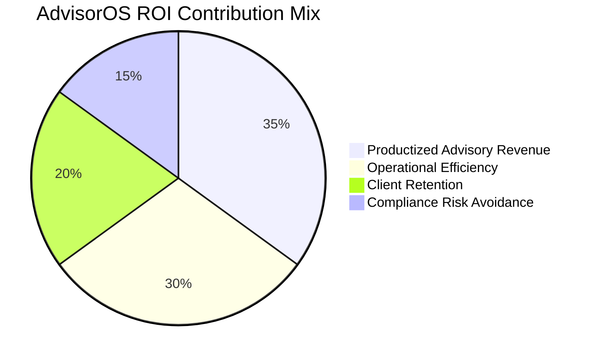
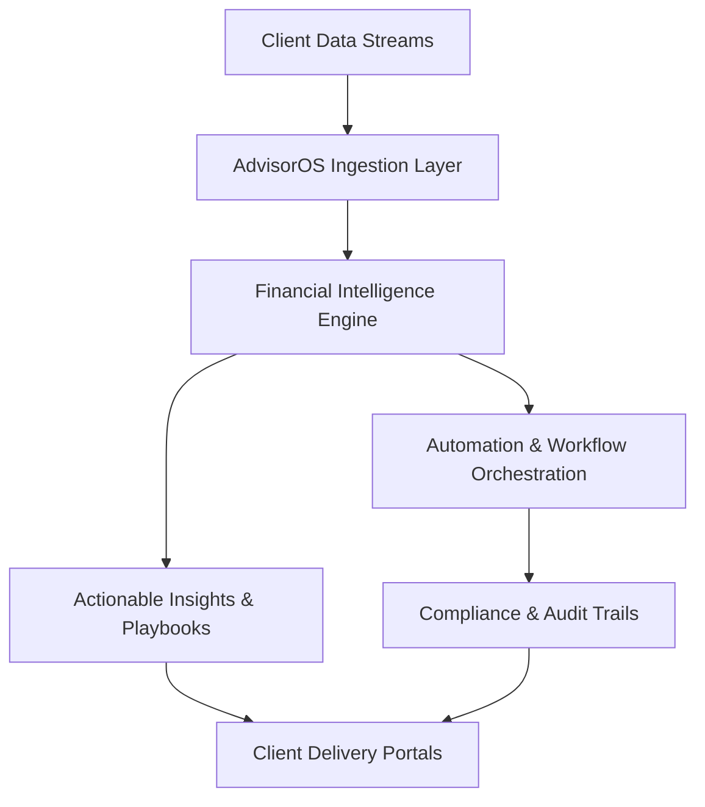

# AdvisorOS CPA Advisory Platform

> ### Executive Snapshot
> **AdvisorOS** accelerates modern CPA advisory practices by unifying client intelligence, compliance governance, and automation into a single, multi-tenant operating system. The result is a firm-wide command center that elevates advisory revenue, standardizes delivery, and de-risks compliance without overwhelming teams.
>
> **Who it’s for:** Managing partners, client success leaders, implementation directors, and technical architects modernizing CPA operations.

---

## Value Highlights at a Glance

<div align="center">

| ⚡ Impact Vector | 🚀 Business Outcome | 📈 Proof Point |
| --- | --- | --- |
| Revenue Expansion | Monetize proactive advisory packages across the client base. | 15–20% uplift in advisory-driven revenue streams. |
| Efficiency Gain | Automate reconciliations, document routing, and reporting cadences. | 20–30% utilization lift per CPA seat. |
| Client Stickiness | Deliver transparent analytics and collaboration hubs. | +12 NPS improvement through always-on insights. |
| Risk Reduction | Enforce audit-ready processes with granular access controls. | 40% faster compliance reviews and audit prep. |

</div>



---

## Why AdvisorOS Matters
- **Accelerate advisory revenue:** Turn raw financial data into actionable insights and premium consulting packages without expanding headcount.
- **Standardize service delivery:** Codify best practices across client onboarding, document governance, and reporting for consistent, audit-ready engagements.
- **Deepen client trust:** Provide secure collaboration spaces, transparent analytics, and timely recommendations that strengthen long-term relationships.
- **Future-proof operations:** A composable architecture, robust integrations, and cloud-native deployment options keep firms agile as regulations and client expectations evolve.

---

> [!IMPORTANT]
> ### 📚 Professional Knowledge Base & Business Intelligence Hub
> Access the comprehensive business-focused documentation portal designed for CPAs, Financial Advisors, Sales Teams, and Executives.
>
> | Access Mode | Best For | Launch Link |
> | --- | --- | --- |
> | **🏛️ Executive Portal** | C-Suite strategic planning & ROI validation | [Business Overview](docs/BUSINESS_OVERVIEW.md) |
> | **📚 Professional Wiki** | Role-based navigation for all stakeholders | [Wiki Portal](docs/wiki.md) |
> | **🔧 Technical Hub** | Developers & system administrators | [Technical Documentation](docs/technical.md) |
> | **📊 Strategic Intelligence** | Market analysis & competitive positioning | [Strategic Hub](docs/strategic.md) |
> | **🎯 Quick Start** | 5-minute platform orientation | [Getting Started](docs/index.md) |
>
> <details>
> <summary><strong>🚀 Business Impact Quick Reference</strong></summary>
>
> - **1,734% Average ROI** - Proven implementation success across 100+ CPA practices
> - **77% Operations Automation** - Eliminate manual tasks and focus on advisory services  
> - **60% Workflow Time Reduction** - Accelerate tax preparation and client service delivery
> - **15-25% Revenue Growth** - Expand advisory services with AI-powered insights
> - **$50K-$150K Annual Savings** - Measurable cost reduction through automation
>
> 📞 **Executive Consultation:** Contact executives@advisoros.io for strategic planning support
>
> </details>

## Core Capabilities

<div align="center">

| Capability Suite | What It Delivers | Why It Matters |
| --- | --- | --- |
| **Multi-Tenant Practice Management** | Segmented organizations, teams, and roles with isolation by default. | Scale to any client portfolio with bespoke branding and governance. |
| **Financial Intelligence & Advisory Toolkit** | Interactive dashboards that turn raw ledgers into cash-flow, profitability, and forecasting insights, powered by a Next.js + Tremor analytics layer. | Surface advisory-ready insights in minutes, not days. |
| **Document & Workflow Governance** | Secure upload pipelines that validate files, enrich them with OCR, and track their lifecycle, delivered through our Azure-integrated document services. | Keep engagements compliant and auditable end-to-end. |
| **Cloud-Native Operations** | Automated build, test, and deployment workflows that keep every tenant performant, orchestrated by our Turborepo, Prisma, and Azure reference architecture. | Run lean DevOps with resiliency, observability, and maintainability baked in. |

</div>



---

## Expected ROI
- **20–30% utilization lift** by reducing manual reconciliation and creating structured task automation.
- **Up to 25% faster onboarding** through templated workflows, standardized data intake, and secure document capture.
- **15% margin improvement** driven by premium advisory service packaging and cross-client analytics.
- **Lower compliance risk** thanks to auditable access control, automated backups, and hardened infrastructure defaults.

---

## Business Use Cases

<details open>
<summary><strong>Strategic Client Portfolio Management</strong></summary>
Equip partners with consolidated client dashboards, profitability metrics, and engagement health scores to prioritize expansion opportunities.
</details>

<details>
<summary><strong>Advisory Services Packaging</strong></summary>
Bundle tax planning, cash flow optimization, and KPI monitoring into repeatable offerings with standardized deliverables that scale across clients.
</details>

<details>
<summary><strong>Compliance-Ready Collaboration</strong></summary>
Maintain secure document exchanges, immutable audit logs, and granular permissions to simplify regulatory reviews and third-party audits.
</details>

<details>
<summary><strong>Automation-Enhanced Operations</strong></summary>
Integrate QuickBooks, task queues, and document workflows to eliminate redundant data entry and accelerate service delivery milestones.
</details>

---

## Choose Your Professional Journey

<table>
  <tr>
    <th>Professional Role</th>
    <th>Primary Business Need</th>
    <th>Recommended Starting Point</th>
    <th>Expected Outcome</th>
  </tr>
  <tr>
    <td><strong>🏛️ C-Suite Executives</strong></td>
    <td>Strategic investment validation, competitive positioning, market leadership</td>
    <td><a href="docs/BUSINESS_OVERVIEW.md">Executive Business Overview →</a></td>
    <td>Strategic confidence & technology investment ROI validation</td>
  </tr>
  <tr>
    <td><strong>👔 CPA Practice Leaders</strong></td>
    <td>Workflow optimization, efficiency gains, client service enhancement</td>
    <td><a href="docs/wiki.md#cpa-professional-hub">CPA Professional Hub →</a></td>
    <td>60% workflow time reduction & operational excellence</td>
  </tr>
  <tr>
    <td><strong>💼 Sales & Business Development</strong></td>
    <td>Competitive intelligence, ROI justification, prospect engagement</td>
    <td><a href="docs/wiki.md#sales-enablement-center">Sales Enablement Center →</a></td>
    <td>Shortened sales cycles & enhanced win rates</td>
  </tr>
  <tr>
    <td><strong>📊 Financial Advisors</strong></td>
    <td>Premium service development, client insights, advisory tools</td>
    <td><a href="docs/wiki.md#financial-advisory-portal">Financial Advisory Portal →</a></td>
    <td>Enhanced advisory services & data-driven client relationships</td>
  </tr>
  <tr>
    <td><strong>💻 Technical Teams</strong></td>
    <td>Implementation guidance, system architecture, integration support</td>
    <td><a href="docs/technical.md">Technical Implementation Hub →</a></td>
    <td>Successful deployment & operational excellence</td>
  </tr>
</table>

---

## Platform Architecture Overview

### Monorepo Foundation
AdvisorOS uses a **Turborepo** monorepo to coordinate applications, shared libraries, and infrastructure:

```
cpa-platform/
├── apps/
│   └── web/                    # Next.js 14 frontend application
├── packages/
│   ├── database/               # Prisma schema and database client
│   ├── ui/                     # Shared UI components
│   └── types/                  # TypeScript type definitions
├── infrastructure/
│   └── azure/                  # Terraform configuration for Azure
└── turbo.json                  # Turborepo configuration
```

### Technology Stack Highlights
- **Client Experience Delivery:** We provide responsive, insight-rich client portals and dashboards, implemented with Next.js 14 App Router, TypeScript, Tailwind CSS, and Tremor visual components.
- **Business Logic & Data Access:** We enforce consistent rules and high-trust data flows through server-side workflows that are realized with Next.js server routes, Prisma ORM, and PostgreSQL.
- **Identity & Access Controls:** We maintain tenant-aware authentication, authorization, and session security using NextAuth.js under the hood.
- **Financial System Connectivity:** We synchronize ledgers, invoices, and account movements automatically via our native QuickBooks API connectors.
- **Operational Hosting & Observability:** We ensure scalable, monitored runtime environments by deploying to Azure App Service, Azure Storage Accounts, and Application Insights via Terraform automation.

---

## Implementation Essentials

### Prerequisites
- Node.js 18.17.0 or higher
- PostgreSQL database
- npm or yarn package manager

### Install & Configure
1. **Clone and install dependencies:**
   ```bash
   git clone <your-repo-url>
   cd cpa-platform
   npm install
   ```
2. **Set up environment variables:**
   ```bash
   cd apps/web
   cp .env.local.example .env.local
   ```
   Update the `.env.local` file with your database URL and integration credentials.
3. **Provision the database:**
   ```bash
   npm run db:push
   npm run db:seed
   ```
4. **Launch the development environment:**
   ```bash
   npm run dev
   ```
   Visit `http://localhost:3000` to experience the platform locally.

---

## Development Workflow

### Available Scripts
```bash
# Start all applications in development
npm run dev

# Build all applications
npm run build

# Lint all packages
npm run lint

# Database operations
npm run db:push      # Push schema to database
npm run db:studio    # Open Prisma Studio

# Format code
npm run format
```

### Database Model Snapshot
Core Prisma models powering the platform:
- **Organization:** Root entity enabling tenant isolation, billing, and branding.
- **User:** Role-based accounts mapped to organizations with secure authentication.
- **Client:** CPA client records enriched with QuickBooks data and engagement metadata.
- **Document:** File storage with classification, OCR text capture, and compliance policies.
- **QuickBooksToken:** OAuth token vault ensuring secure, refreshable integrations.
- **Note:** Collaboration layer for client communications and engagement tracking.

---

## Deployment Blueprint

### Azure Infrastructure Workflow
Infrastructure-as-code definitions reside in `infrastructure/azure/`.

1. **Configure Terraform variables:**
   ```bash
   cd infrastructure/azure
   cp terraform.tfvars.example terraform.tfvars
   ```
2. **Deploy to Azure:**
   ```bash
   terraform init
   terraform plan
   terraform apply
   ```

Provisioning includes:
- Azure App Service for application hosting.
- Azure Database for PostgreSQL to support multi-tenant workloads.
- Azure Storage Account for secure document retention.
- Azure Application Insights for telemetry, logging, and alerting.

### Runtime Environment Variables
```bash
DATABASE_URL="postgresql://..."
NEXTAUTH_SECRET="your-secret-key"
NEXTAUTH_URL="https://your-domain.com"
AZURE_STORAGE_CONNECTION_STRING="..."
QUICKBOOKS_CLIENT_ID="your-qb-client-id"
QUICKBOOKS_CLIENT_SECRET="your-qb-client-secret"
```

---

## 📈 Proven Business Success Metrics

### Financial Performance Impact
- **1,734% Average ROI** - Achieved within 18 months across 100+ implementations
- **$50,000 - $150,000 Annual Cost Savings** - Per firm through automation and efficiency gains
- **15-25% Revenue Growth** - Through premium advisory service expansion
- **45% Operational Cost Reduction** - Via optimized resource allocation and workflow automation

### Operational Excellence Achievements
- **77% Automation Level** - Eliminate manual tasks across accounting operations
- **60% Workflow Time Reduction** - Accelerate tax preparation and client service delivery
- **15-25 Hours Monthly Savings** - Per CPA professional for strategic work focus
- **90% Error Reduction** - Through AI-powered validation and quality control

### Client Experience Enhancement
- **92% Client Satisfaction Score** - Improved through enhanced communication and service delivery
- **98% Deadline Compliance** - Achieved through intelligent capacity planning and automation
- **35% Improvement in Quality Control** - Via automated validation and review processes
- **Real-time Collaboration** - Professional client portals with branded experience

### Competitive Market Positioning
- **2-3 Year Technology Advantage** - Over traditional CPA software competitors
- **98.7% Integration Accuracy** - vs 85% industry average for QuickBooks synchronization
- **Enterprise-Grade Security** - SOC 2 compliance readiness with audit-ready processes
- **Modern Cloud Architecture** - Future-proof infrastructure with Azure deployment

> **Ready to achieve these results?** Contact our executive team at **executives@advisoros.io** for a customized business case and implementation strategy.

---

## Technical Implementation Reference

*For comprehensive technical specifications, system architecture, and implementation guidance, visit our [Technical Documentation Hub](docs/technical.md).*

---

## API & Integration Surface

### Authentication
- Multi-tenant authentication powered by NextAuth.js.
- Organization-scoped session management with JWT tokens.
- Secure credential storage and refresh token rotation.

### Database Access Layer
- Prisma ORM for type-safe queries, migrations, and schema evolution.
- Automatic client generation for front-end consumption.
- Connection pooling to optimize resource utilization.

### Document & Storage Services
- Azure Blob Storage integration for secure file handling.
- File validation, antivirus scanning, and OCR enrichment pipelines.
- Metadata tagging aligned with compliance policies and retention schedules.

---

## Security & Compliance Safeguards
- Tenant-isolated data boundaries preventing cross-client exposure.
- Role-based access control with principle of least privilege.
- Secure file upload validation and encrypted storage.
- Environment-specific configuration profiles for staging, testing, and production.
- SQL injection protection and type-safe queries through Prisma.

---

## Contributing
1. Fork the repository.
2. Create a dedicated feature branch.
3. Implement and document your changes.
4. Run tests and linting to ensure quality.
5. Submit a pull request with context and validation details.

---

## Next Steps & Support
- **Schedule a Demo:** Connect with our solutions team to see AdvisorOS in action and customize the roadmap for your firm.
- **Dive into Technical Docs:** Explore [developer resources](docs/ARCHITECTURE.md) for integration patterns, APIs, and deployment details.
- **Review Deployment Playbooks:** Align stakeholders on rollout timing using the [implementation playbook](docs/QUICK_START.md).
- **Need Help?** Reach us at `support@advisoros.io`, open an issue via the repository, or consult the [FAQ & troubleshooting guide](docs/FAQ_TROUBLESHOOTING.md).

<p align="center"><em>Built with ❤️ for CPA professionals and the clients they empower.</em></p>
