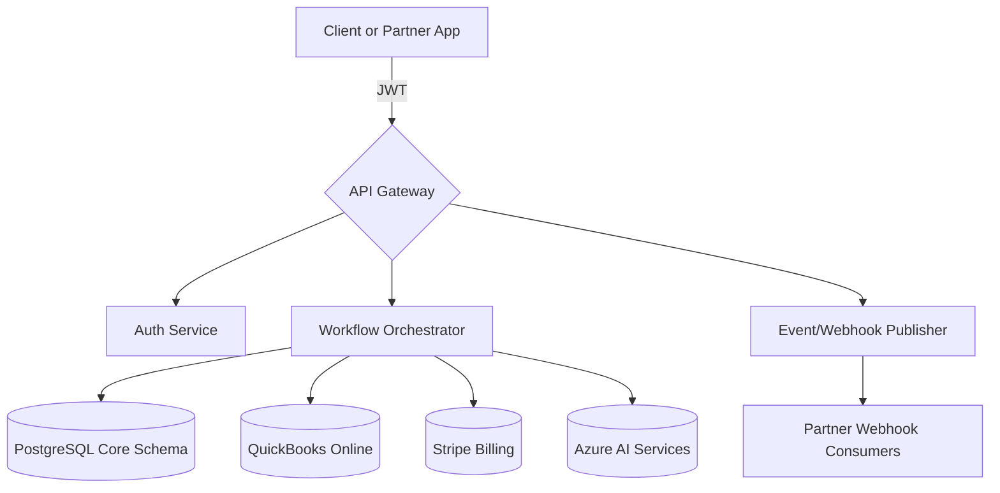

# AdvisorOS API Reference

> [!TIP]
> Partner with this guide when you want to translate inspired client experiences into production-grade integrations without losing sight of the commercial upside.

## Overview

| Field | Guidance |
| --- | --- |
| **Purpose** | Provide a single, authoritative catalog for every public AdvisorOS REST and event endpoint, complete with usage policy and validation guidance. |
| **Audience** | Product managers, solution architects, integration engineers, and partner developers familiar with RESTful conventions, JSON, and OAuth/JWT tooling. |
| **Context** | The API powers client onboarding, workflow orchestration, billing, intelligence, and compliance monitoring across enterprise advisory firms and their partner ecosystems. |

> [!NOTE]
> Think of this API as the connective tissue that lets your advisory practice move with the grace of a boutique and the scale of a national firm.

## Business Value & ROI

| Outcome | Narrative | Leading Indicators |
| --- | --- | --- |
| Revenue / Growth | Launch packaged digital services, embed AdvisorOS in partner portals, and monetize data-driven add-ons with consistent contracts. | New partner apps launched, upsell revenue attributed to API-enabled products |
| Efficiency | Consolidate disparate integration stacks into a unified interface with reusable pagination, auth, and error semantics. | Engineering hours saved per release, reduction in custom connector maintenance |
| Risk & Trust | Enforce compliance-grade auditing, data residency, and rate-limiting across every call to maintain regulator and client confidence. | Decline in integration incidents, audit exceptions avoided |

> [!IMPORTANT]
> - Finance teams can point to faster revenue recognition on new offerings delivered via the API-first onboarding journey.
> - Operations leaders can spotlight double-digit reductions in integration run costs by retiring bespoke middleware.
> - Risk officers gain auditable traceability for every client touchpoint, strengthening control narratives with regulators.

## Key Connectors/Dependencies

- **AdvisorOS Modules**
  - _Data Platform_ — Relies on the relational models curated in [DATABASE.md](DATABASE.md) for referential integrity and reporting joins.
  - _Workflow Orchestrator_ — Shares state engines with the guidance in [ARCHITECTURE.md](ARCHITECTURE.md) to keep complex processes idempotent.
  - _Deployment Topology_ — Requires environment consistency and version pinning as defined in [DEPLOYMENT.md](DEPLOYMENT.md).
- **External Services**
  - _QuickBooks Online_ — OAuth 2.0 client credentials with scoped access (see [INTEGRATION_GUIDES.md](INTEGRATION_GUIDES.md#accounting-connectors)).
  - _Stripe Billing_ — API keys bound to AdvisorOS invoice templates, inclusive of webhook signing secrets.
  - _Azure AI Services_ — Token-based access for document intelligence, with data residency controls.
- **Operational Readiness Checklist**
  - [ ] Organization-level API client created with least-privilege scopes.
  - [ ] Security review completed referencing [COMPREHENSIVE_SECURITY_AUDIT_REPORT.md](../COMPREHENSIVE_SECURITY_AUDIT_REPORT.md).
  - [ ] Logging sink connected to centralized observability stack (Splunk, Datadog, or ELK) following [operations/DEPLOYMENT_GUIDE.md](operations/DEPLOYMENT_GUIDE.md#observability).

## Implementation Guidance

> [!TIP]
> Use the navigation map and expandable playbooks below to jump directly to the lifecycle moment you are designing for.

### Architecture Snapshot


### Navigation Map
- [Authentication & Authorization](#authentication--authorization)
- [Core Request Model](#core-request-model)
- [Domain Endpoints](#domain-endpoints)
- [Event Streaming & Webhooks](#event-streaming--webhooks)
- [Quality Gates & Monitoring](#quality-gates--monitoring)

### Authentication & Authorization

<details>
<summary><strong>JWT Lifecycle</strong> — Provision tokens with the right guardrails</summary>

1. **Token Issuance**
   ```http
   POST /api/auth/login
   Content-Type: application/json

   {
     "email": "integrations@advisoros.example",
     "password": "<managed-secret>",
     "organizationId": "org-hero"
   }
   ```
   - Response bundles access and refresh tokens with 60-minute expiry.
2. **Refresh Flow**
   ```http
   POST /api/auth/refresh
   Content-Type: application/json

   {
     "refreshToken": "<persisted-refresh-token>"
   }
   ```
   - Store refresh tokens in KMS-backed vaults; never ship them in client-side code.
3. **Step-Up (2FA) Verification**
   ```http
   POST /api/auth/2fa/verify
   Authorization: Bearer <temporary-token>

   {
     "code": "123456"
   }
   ```
   - Use for privileged operations (e.g., remapping payout accounts).

</details>

<details>
<summary><strong>Access Control Design</strong> — Align scopes with least privilege</summary>

- Map roles to scopes documented in [FEATURES.md](FEATURES.md#role-based-capabilities).
- Apply organization headers to every request:
  ```http
  X-Organization-ID: <org-id>
  X-Request-ID: <uuid>
  ```
- Enforce rate limits per client key (default: 600 requests/minute burst, 10,000/day sustained).

</details>

### Core Request Model

> [!NOTE]
> Every endpoint honors JSON payloads, deterministic pagination, and verbose error envelopes so downstream automation can be resilient.

```http
Content-Type: application/json
Authorization: Bearer <token>
X-Organization-ID: <organization-id>
X-Request-ID: <unique-request-id>
```

**Standard Response Envelope**
```json
{
  "success": true,
  "data": {},
  "warnings": [],
  "meta": {
    "requestId": "uuid",
    "pagination": {
      "cursor": "opaque-token",
      "hasMore": false
    }
  }
}
```

- **Errors**: Delivered with HTTP status, machine-readable `code`, human-friendly `message`, and contextual `details` array.
- **Pagination**: Use `meta.pagination.cursor`; send `?cursor=...` on subsequent calls.

### Domain Endpoints

<details>
<summary><strong>Client Management</strong> — Create, update, and archive client records</summary>

- `GET /api/v1/clients` — Paginated client list with filtering on status, advisor, and lifecycle stage.
- `POST /api/v1/clients` — Create clients; requires `client:write` scope and validated identity payload.
- `PATCH /api/v1/clients/{clientId}` — Partial updates; optimistic locking with `If-Match` header.
- **Validation**: Run schema checks using the JSON schemas in [`api-specs/clients.yaml`](api-specs/clients.yaml).

</details>

<details>
<summary><strong>Document Management</strong> — Orchestrate secure uploads and AI classification</summary>

- `POST /api/v1/documents/upload-url` — Issue single-use signed URLs; integrates with Azure Blob SAS tokens.
- `POST /api/v1/documents/{documentId}/classify` — Invokes Azure AI; returns classification confidence scores.
- **Monitoring**: Correlate with the observability guidance in [operations/DEPLOYMENT_GUIDE.md](operations/DEPLOYMENT_GUIDE.md#observability).

</details>

<details>
<summary><strong>Billing & Revenue</strong> — Sync financial operations through Stripe</summary>

- `POST /api/v1/billing/invoices` — Create invoices referencing AdvisorOS fee schedules.
- `POST /api/v1/billing/webhooks/stripe` — Consume Stripe events; validate signatures via `Stripe-Signature` header.
- **Settlement Checks**: Reference [FINANCIAL_ANALYTICS_IMPLEMENTATION.md](../FINANCIAL_ANALYTICS_IMPLEMENTATION.md) for reconciliation practices.

</details>

<details>
<summary><strong>Workflow Automation</strong> — Automate advisory tasks end-to-end</summary>

- `POST /api/v1/workflows/{workflowId}/trigger`
- `GET /api/v1/workflows/runs?status=active`
- **Mermaid Snapshot**
  ```mermaid
  graph LR
    Start --> Intake{Intake}
    Intake --> Review[Advisor Review]
    Review --> Compliance{Compliance Hold}
    Compliance --> Complete[Client Delivery]
  ```

</details>

### Event Streaming & Webhooks

> [!WARNING]
> Subscribe thoughtfully—duplicate webhook processing is the #1 source of downstream reconciliation work.

- Configure webhook destinations in the AdvisorOS console; signatures rotate every 90 days.
- Event payloads follow the structure stored in [`api-specs/events.yaml`](api-specs/events.yaml).
- Leverage idempotency keys in the `X-Event-ID` header to avoid duplicate processing.

### Quality Gates & Monitoring

- **Pre-Deployment Tests**: Run `node verify-all-integrations.js` to execute contract tests against critical endpoints.
- **Runtime Telemetry**: Subscribe to the API latency and error budget dashboards in Grafana (see [operations/DEPLOYMENT_GUIDE.md](operations/DEPLOYMENT_GUIDE.md#dashboards)).
- **Alerting**: Configure PagerDuty routing using the templates in [ops/tooling-dashboard.ts](../ops/tooling-dashboard.ts).

## Future Enhancements

| Theme | Description | Owner / ETA |
| --- | --- | --- |
| Optimization | Expand bulk endpoints with async job orchestration to support 10x record loads. | Platform Engineering / Q4 |
| Innovation | Introduce GraphQL façade for partner experiences needing flexible aggregations. | Product Innovation / Pilot in Q1 |
| Risk Mitigation | Deliver field-level encryption for sensitive client data at rest and in transit. | Security Engineering / In Discovery |

> [!CAUTION]
> Achieving the roadmap above requires dedicated performance testing capacity and alignment with external partners for contract updates.

## Cross-References

- [FEATURES.md](FEATURES.md) — Map API capabilities to the end-user experiences and entitlements they unlock.
- [operations/DEPLOYMENT_GUIDE.md](operations/DEPLOYMENT_GUIDE.md) — Coordinate release gates, monitoring hooks, and rollback strategy.
- [INTEGRATION_GUIDES.md](INTEGRATION_GUIDES.md) — Pair endpoint usage with connector-specific configuration.
- [COMPREHENSIVE_SECURITY_AUDIT_REPORT.md](../COMPREHENSIVE_SECURITY_AUDIT_REPORT.md) — Validate compliance considerations tied to API traffic.
