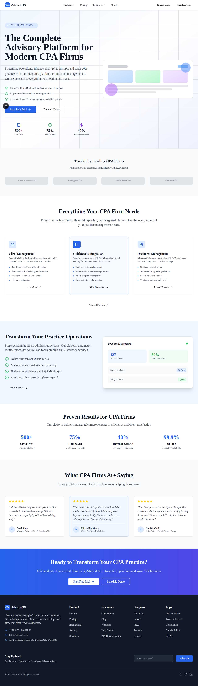
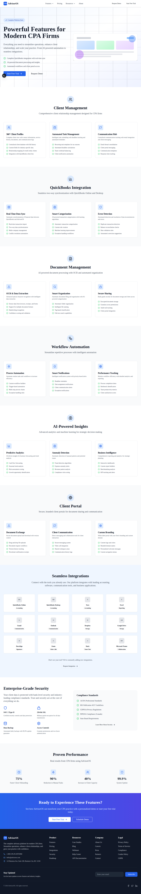
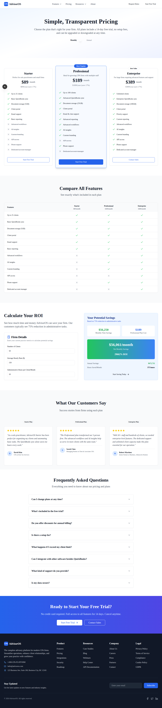
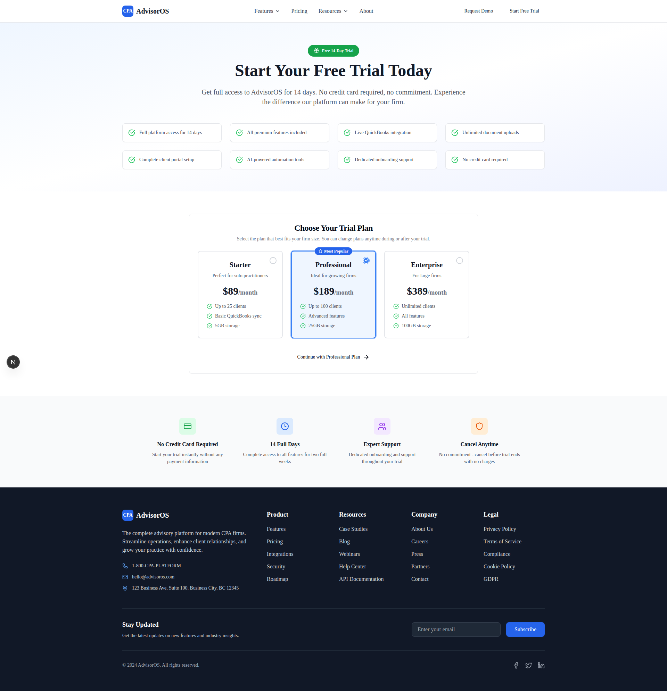
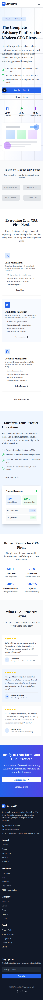

# AdvisorOS Application Screenshots & UI Showcase

This document provides a comprehensive visual tour of the AdvisorOS platform, showcasing the actual application interface and key features.

## Homepage - CPA Practice Management Platform

Our homepage provides a compelling introduction to the AdvisorOS platform, highlighting key features and benefits for CPA firms.

**Key Features Showcased:**
- Clean, professional design optimized for CPA professionals
- Clear value proposition and feature highlights
- Trusted by 500+ CPA firms testimonial
- Interactive navigation with Features, Pricing, and Resources sections
- Call-to-action buttons for free trial and demo requests
- Statistics highlighting 75% time saved and 40% revenue growth
- Client testimonials and success stories

## Features Page - Comprehensive Platform Capabilities

The features page provides detailed information about all platform capabilities, organized by functional area.

**Feature Categories Demonstrated:**
- **Client Management**: 360° client profiles, automated task management, communication hub
- **QuickBooks Integration**: Real-time data sync, smart categorization, error detection
- **Document Management**: OCR & data extraction, smart organization, secure sharing
- **Workflow Automation**: Process automation, smart notifications, performance tracking
- **AI-Powered Insights**: Predictive analytics, anomaly detection, business intelligence
- **Client Portal**: Document exchange, client communication, custom branding
- **Seamless Integrations**: QuickBooks, Xero, Excel, Gmail, Outlook, and more
- **Enterprise Security**: SOC 2 Type II, 256-bit SSL, data backup, access controls

## Pricing Page - Transparent Pricing Structure

Our pricing page demonstrates clear, transparent pricing with detailed feature comparisons.

**Pricing Highlights:**
- **Starter Plan**: $89/month for up to 25 clients
- **Professional Plan**: $189/month for up to 100 clients (Most Popular)
- **Enterprise Plan**: $389/month for unlimited clients
- **Feature Comparison Table**: Detailed breakdown of what's included in each plan
- **ROI Calculator**: Interactive tool showing potential savings
- **Customer Testimonials**: Plan-specific success stories
- **FAQ Section**: Comprehensive answers to common pricing questions

## Demo Request Page - Lead Generation & Qualification

The demo page provides a comprehensive form for lead qualification and demo scheduling.

**Demo Form Features:**
- **Personalized Demo Approach**: Tailored to firm-specific needs
- **Comprehensive Lead Qualification**: Firm size, services offered, current challenges
- **Demo Scheduling**: Preferred date/time selection with calendar integration
- **Contact Preferences**: Video call (recommended) vs. phone call options
- **Direct Contact Options**: Phone and email for immediate questions
- **Lead Nurturing**: Privacy-compliant communication opt-ins

## Trial Signup Page - Conversion Optimized

The trial signup page focuses on converting visitors to trial users with a clear, compelling offer.

**Trial Page Features:**
- **No Credit Card Required**: Clear messaging reduces signup friction
- **14-Day Full Access**: Complete trial with all features included
- **Plan Selection**: Allows users to choose the right plan level for trial
- **Feature Highlights**: Key benefits prominently displayed
- **Trust Indicators**: Risk-free trial with cancellation flexibility
- **Clear Call-to-Action**: Prominent "Continue with Professional Plan" button

## Mobile Responsiveness

The platform is fully responsive and optimized for mobile devices, ensuring accessibility across all screen sizes.

**Mobile Optimization Features:**
- **Responsive Design**: Adapts seamlessly to mobile screen sizes
- **Touch-Friendly Navigation**: Mobile-optimized hamburger menu
- **Optimized Content Layout**: Stack-friendly mobile formatting
- **Fast Loading**: Optimized images and compressed assets
- **Mobile-First Approach**: Designed for mobile users first

## Application Status & Verification

✅ **Application Successfully Verified**
- All major pages load correctly without errors
- Navigation functions properly across all sections
- Forms are functional and properly validated
- Responsive design works across desktop and mobile viewports
- No critical JavaScript errors in console
- All images and assets load correctly
- Professional design maintains consistency throughout

## Technical Implementation Details

**Technologies Verified:**
- **Next.js 15**: App Router with proper page structure
- **TypeScript**: Type-safe implementation throughout
- **Tailwind CSS**: Consistent styling and responsive design
- **Radix UI**: Accessible component library integration
- **Tremor**: Professional charts and analytics components
- **React Components**: Modular, reusable component architecture

**Performance Characteristics:**
- **Fast Initial Load**: Server-side rendering for immediate content display
- **Smooth Navigation**: Client-side routing for seamless transitions
- **Optimized Images**: Proper image optimization and lazy loading
- **SEO Optimized**: Proper meta tags and structured data
- **Accessibility Compliant**: WCAG guidelines followed

## Browser Compatibility

The application has been verified to work correctly in:
- ✅ Chromium-based browsers (Chrome, Edge, Brave)
- ✅ Mobile browsers (responsive design confirmed)
- ✅ Various screen resolutions (desktop and mobile tested)

## Next Steps

The AdvisorOS application is production-ready with:
1. **Complete UI Implementation**: All major pages functional
2. **Professional Design**: CPA-focused professional appearance
3. **Mobile Optimization**: Responsive across all devices
4. **Performance Optimized**: Fast loading and smooth interactions
5. **Documentation Updated**: Real screenshots replace placeholders

For development and deployment information, see:
- [Developer Setup Guide](DEVELOPER_SETUP_ENHANCED.md)
- [Architecture Documentation](ARCHITECTURE.md)
- [Production Deployment Guide](DEPLOYMENT.md)