# Architecture Overview

## Table of Contents

1. [System Architecture](#system-architecture)
2. [Technology Stack](#technology-stack)
3. [Application Architecture](#application-architecture)
4. [Infrastructure Architecture](#infrastructure-architecture)
5. [Data Architecture](#data-architecture)
6. [Security Architecture](#security-architecture)
7. [Integration Architecture](#integration-architecture)
8. [Deployment Architecture](#deployment-architecture)
9. [Scalability and Performance](#scalability-and-performance)
10. [Monitoring and Observability](#monitoring-and-observability)
11. [Disaster Recovery](#disaster-recovery)
12. [Future Considerations](#future-considerations)

---

## System Architecture

The CPA Platform is built as a modern, cloud-native SaaS application designed for scalability, security, and maintainability. The architecture follows microservices principles while maintaining simplicity through a monolithic Next.js application with modular design.

### High-Level Architecture

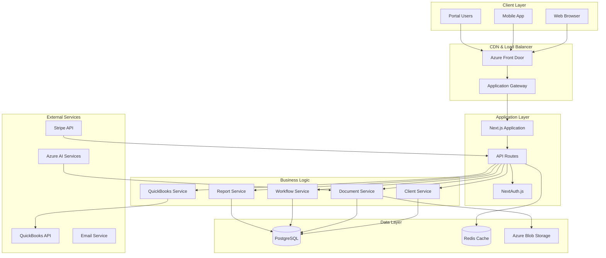

### Architectural Principles

1. **Separation of Concerns**: Clear boundaries between presentation, business logic, and data layers
2. **Single Responsibility**: Each service handles one specific domain
3. **Dependency Inversion**: Services depend on abstractions, not concrete implementations
4. **Fail Fast**: Early validation and error handling
5. **Idempotency**: All operations are safe to retry
6. **Stateless Design**: No session state stored in application servers
7. **Event-Driven**: Asynchronous processing for long-running operations

---

## Technology Stack

### Frontend Technologies

```typescript
// Core Framework
Next.js 15.x          // React framework with App Router
React 18.x            // UI library
TypeScript 5.x        // Type safety

// UI Components
Tailwind CSS 3.x      // Utility-first CSS framework
Tremor React          // Data visualization components
Radix UI              // Headless UI primitives
Lucide React          // Icon library
Framer Motion         // Animations

// State Management
React Query           // Server state management
Zustand              // Client state management
React Hook Form      // Form state management

// Development Tools
ESLint               // Code linting
Prettier             // Code formatting
Jest                 // Unit testing
Playwright           // E2E testing
```

### Backend Technologies

```typescript
// Runtime & Framework
Node.js 18.x         // JavaScript runtime
Next.js API Routes   // API endpoints
tRPC                // Type-safe API layer

// Database & ORM
PostgreSQL 14+       // Primary database
Prisma 5.x          // Database ORM
Redis 6.x           // Caching layer

// Authentication
NextAuth.js 4.x     // Authentication library
JWT                 // Token-based auth
bcryptjs            // Password hashing

// File Processing
Sharp               // Image processing
PDF-Parse           // PDF text extraction
Azure AI Services   // OCR and document analysis

// Background Jobs
Bull Queue          // Job queue
Node-cron           // Scheduled tasks
```

### Infrastructure Technologies

```yaml
# Cloud Platform
Azure:
  - App Service        # Application hosting
  - Database for PostgreSQL  # Managed database
  - Blob Storage      # File storage
  - Redis Cache       # Distributed caching
  - Application Insights  # Monitoring
  - Key Vault         # Secrets management
  - Front Door        # CDN and load balancing

# Infrastructure as Code
Terraform:
  - Resource provisioning
  - Environment management
  - State management

# CI/CD
GitHub Actions:
  - Automated testing
  - Build and deployment
  - Security scanning
```

---

## Application Architecture

### Monolithic Modular Design

The application follows a modular monolith pattern, providing the benefits of microservices architecture while maintaining operational simplicity.

```
apps/web/src/
├── app/                    # Next.js App Router
│   ├── (auth)/            # Authentication routes
│   ├── api/               # API endpoints
│   ├── dashboard/         # Main application
│   └── portal/            # Client portal
├── components/            # React components
│   ├── ui/               # Base UI components
│   ├── forms/            # Form components
│   └── features/         # Feature-specific components
├── lib/                  # Shared utilities
│   ├── services/         # Business logic services
│   ├── hooks/            # Custom React hooks
│   ├── utils/            # Helper functions
│   └── validations/      # Zod schemas
└── server/               # Server-side code
    ├── services/         # Backend services
    ├── middleware/       # Custom middleware
    └── utils/            # Server utilities
```

### Service Layer Architecture

```typescript
// Service layer abstraction
interface ClientService {
  findById(id: string): Promise<Client>;
  findByOrganization(orgId: string): Promise<Client[]>;
  create(data: CreateClientData): Promise<Client>;
  update(id: string, data: UpdateClientData): Promise<Client>;
  delete(id: string): Promise<void>;
  syncWithQuickBooks(clientId: string): Promise<SyncResult>;
}

// Implementation with dependency injection
class ClientServiceImpl implements ClientService {
  constructor(
    private db: PrismaClient,
    private qbService: QuickBooksService,
    private auditService: AuditService
  ) {}

  async create(data: CreateClientData): Promise<Client> {
    return this.db.$transaction(async (tx) => {
      const client = await tx.client.create({ data });
      await this.auditService.log('client.created', client.id);
      return client;
    });
  }
}
```

### API Layer Design

```typescript
// tRPC router for type-safe APIs
const clientRouter = router({
  list: publicProcedure
    .input(z.object({
      organizationId: z.string(),
      status: z.enum(['active', 'inactive', 'prospect']).optional(),
      limit: z.number().min(1).max(100).default(25),
      cursor: z.string().optional()
    }))
    .query(async ({ input, ctx }) => {
      return await ctx.services.client.findByOrganization(input);
    }),

  create: protectedProcedure
    .input(CreateClientSchema)
    .mutation(async ({ input, ctx }) => {
      return await ctx.services.client.create({
        ...input,
        organizationId: ctx.user.organizationId
      });
    })
});
```

### Component Architecture

```typescript
// Component composition pattern
const ClientListPage = () => {
  return (
    <DashboardLayout>
      <PageHeader
        title="Clients"
        actions={<CreateClientButton />}
      />
      <ClientFilters />
      <ClientDataTable />
      <ClientPagination />
    </DashboardLayout>
  );
};

// Feature-based component organization
components/
├── clients/
│   ├── ClientList.tsx
│   ├── ClientForm.tsx
│   ├── ClientProfile.tsx
│   └── ClientFilters.tsx
├── documents/
│   ├── DocumentUpload.tsx
│   ├── DocumentViewer.tsx
│   └── DocumentList.tsx
└── shared/
    ├── DataTable.tsx
    ├── SearchBox.tsx
    └── FilterBar.tsx
```

---

## Infrastructure Architecture

### Cloud Architecture (Azure)

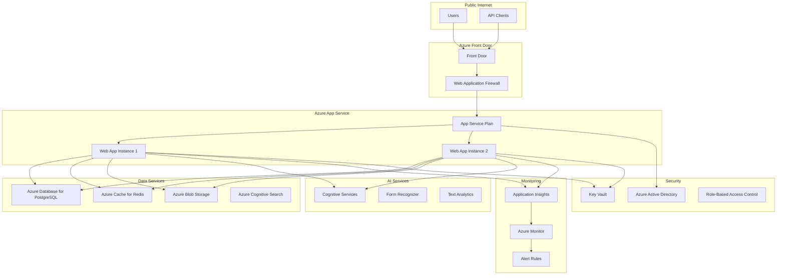

### Environment Architecture

```yaml
# Production Environment
Production:
  App Service:
    - Plan: Premium P2V2
    - Instances: 2-10 (auto-scaling)
    - Always On: true
    - Health Check: enabled

  Database:
    - Tier: General Purpose
    - Compute: 4 vCores
    - Storage: 512 GB
    - Backup: 35 days
    - Geo-redundant: true

  Cache:
    - Tier: Standard C1
    - Memory: 1 GB
    - Persistence: enabled

  Storage:
    - Tier: Hot
    - Redundancy: GRS
    - CDN: enabled

# Staging Environment
Staging:
  App Service:
    - Plan: Standard S2
    - Instances: 1
    - Staging slots: 1

  Database:
    - Tier: General Purpose
    - Compute: 2 vCores
    - Storage: 128 GB
    - Backup: 7 days

# Development Environment
Development:
  App Service:
    - Plan: Basic B1
    - Instances: 1

  Database:
    - Tier: Burstable B1ms
    - Compute: 1 vCore
    - Storage: 32 GB
```

### Network Architecture

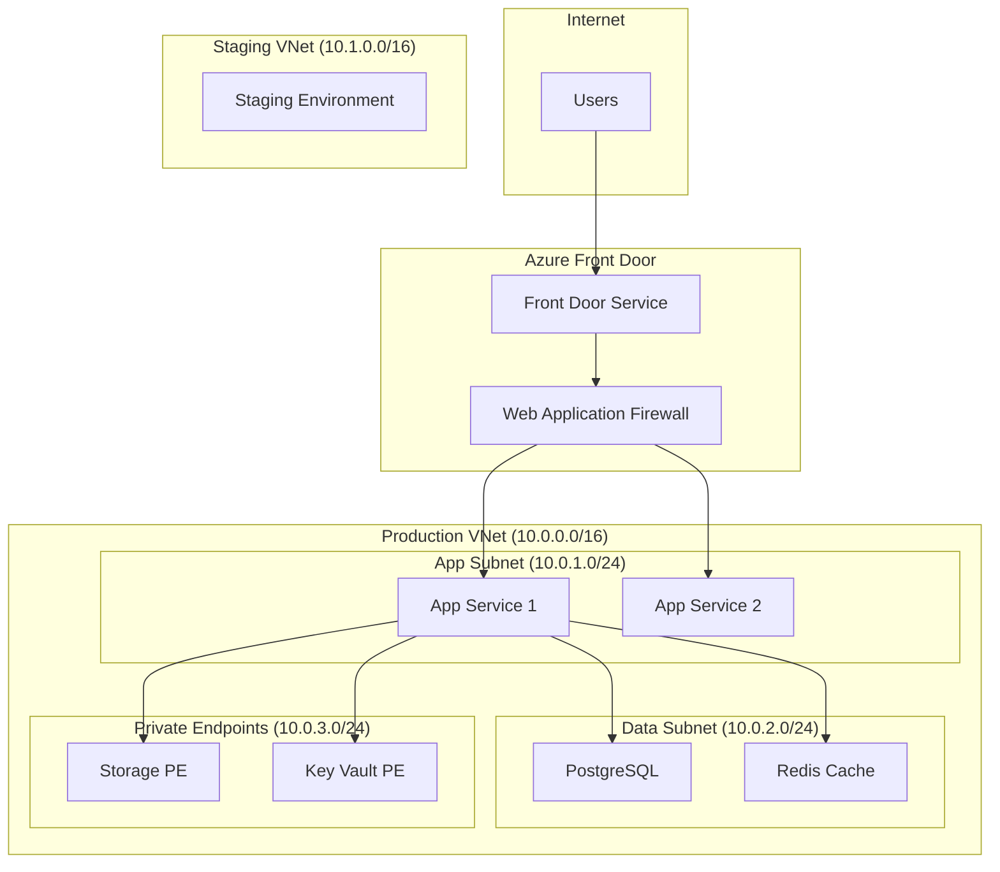

---

## Data Architecture

### Data Flow Architecture

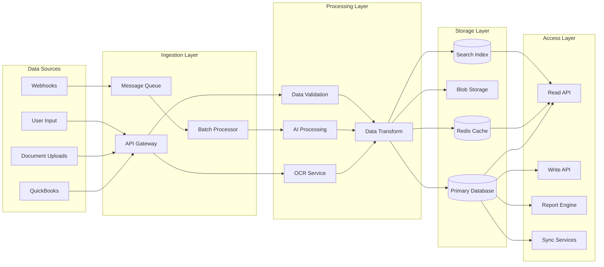

### Data Models and Relationships

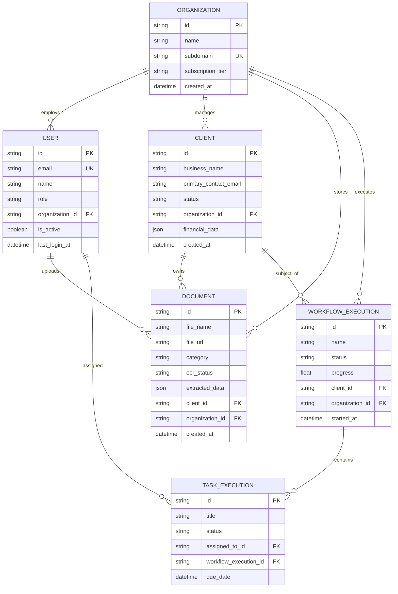

### Caching Strategy

```typescript
// Multi-level caching architecture
interface CachingStrategy {
  // Level 1: In-memory cache (Redis)
  redis: {
    sessions: "15 minutes",
    userProfiles: "1 hour",
    clientLists: "5 minutes",
    frequentQueries: "30 minutes"
  };

  // Level 2: CDN cache (Azure Front Door)
  cdn: {
    staticAssets: "1 year",
    apiResponses: "1 minute",
    documents: "1 day"
  };

  // Level 3: Database query cache
  database: {
    preparedStatements: "enabled",
    queryPlanCache: "enabled",
    connectionPooling: "enabled"
  };
}

// Cache invalidation strategy
const invalidateCache = async (pattern: string, data?: any) => {
  switch (pattern) {
    case 'client.updated':
      await redis.del(`clients:${data.organizationId}`);
      await redis.del(`client:${data.clientId}`);
      break;

    case 'document.uploaded':
      await redis.del(`documents:${data.clientId}`);
      await redis.del(`client:${data.clientId}:summary`);
      break;
  }
};
```

---

## Security Architecture

### Security Layers

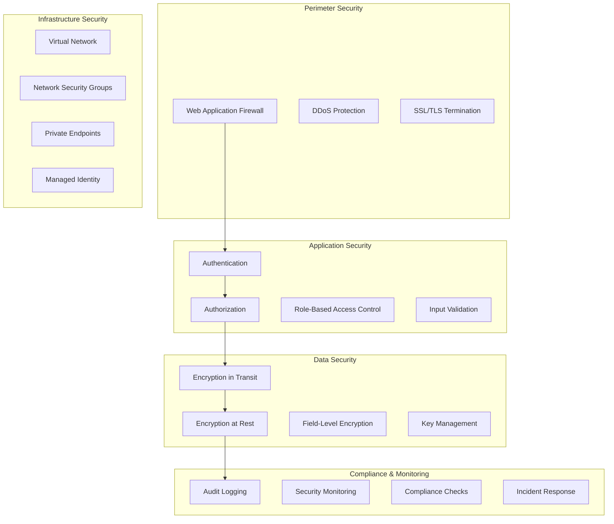

### Authentication & Authorization Flow

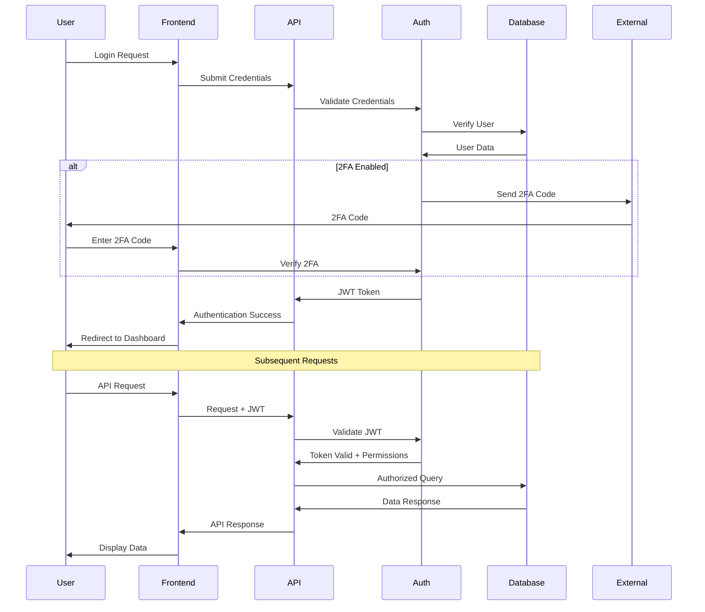

### Data Protection Strategy

```typescript
// Field-level encryption for sensitive data
interface EncryptionService {
  encryptField(value: string, keyId: string): Promise<string>;
  decryptField(encryptedValue: string, keyId: string): Promise<string>;
  rotateKeys(): Promise<void>;
}

// Implementation using Azure Key Vault
class AzureEncryptionService implements EncryptionService {
  private keyVaultClient: KeyVaultClient;

  async encryptField(value: string, keyId: string): Promise<string> {
    const key = await this.keyVaultClient.getKey(keyId);
    const encrypted = await crypto.encrypt(value, key);
    return `${keyId}:${encrypted}`;
  }

  async decryptField(encryptedValue: string, keyId: string): Promise<string> {
    const [storedKeyId, encrypted] = encryptedValue.split(':');
    const key = await this.keyVaultClient.getKey(storedKeyId);
    return await crypto.decrypt(encrypted, key);
  }
}

// Usage in data models
const client = await prisma.client.create({
  data: {
    businessName: 'Acme Corp',
    taxId: await encryptionService.encryptField(taxId, 'client-pii-key'),
    // ... other fields
  }
});
```

---

## Integration Architecture

### External Service Integration

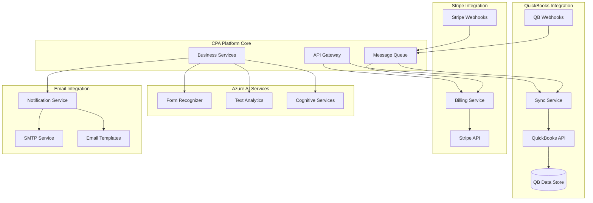

### API Integration Patterns

```typescript
// Circuit breaker pattern for external APIs
class CircuitBreaker {
  private failures = 0;
  private lastFailureTime = 0;
  private state: 'CLOSED' | 'OPEN' | 'HALF_OPEN' = 'CLOSED';

  async execute<T>(operation: () => Promise<T>): Promise<T> {
    if (this.state === 'OPEN') {
      if (Date.now() - this.lastFailureTime > this.timeout) {
        this.state = 'HALF_OPEN';
      } else {
        throw new Error('Circuit breaker is OPEN');
      }
    }

    try {
      const result = await operation();
      this.onSuccess();
      return result;
    } catch (error) {
      this.onFailure();
      throw error;
    }
  }

  private onSuccess() {
    this.failures = 0;
    this.state = 'CLOSED';
  }

  private onFailure() {
    this.failures++;
    this.lastFailureTime = Date.now();
    if (this.failures >= this.threshold) {
      this.state = 'OPEN';
    }
  }
}

// Retry with exponential backoff
const retryWithBackoff = async <T>(
  operation: () => Promise<T>,
  maxRetries = 3,
  baseDelay = 1000
): Promise<T> => {
  for (let attempt = 0; attempt <= maxRetries; attempt++) {
    try {
      return await operation();
    } catch (error) {
      if (attempt === maxRetries) throw error;

      const delay = baseDelay * Math.pow(2, attempt);
      await new Promise(resolve => setTimeout(resolve, delay));
    }
  }
  throw new Error('Max retries exceeded');
};
```

### Webhook Processing Architecture

```typescript
// Webhook processor with idempotency
interface WebhookProcessor {
  processWebhook(payload: WebhookPayload): Promise<ProcessingResult>;
}

class QuickBooksWebhookProcessor implements WebhookProcessor {
  async processWebhook(payload: QuickBooksWebhookPayload): Promise<ProcessingResult> {
    // Verify webhook signature
    const isValid = await this.verifySignature(payload);
    if (!isValid) {
      throw new Error('Invalid webhook signature');
    }

    // Check for duplicate processing (idempotency)
    const existing = await this.db.quickBooksWebhookEvent.findUnique({
      where: { eventId: payload.eventId }
    });

    if (existing && existing.status === 'processed') {
      return { status: 'duplicate', message: 'Already processed' };
    }

    // Process the webhook
    try {
      await this.db.$transaction(async (tx) => {
        // Create or update webhook event record
        await tx.quickBooksWebhookEvent.upsert({
          where: { eventId: payload.eventId },
          create: {
            eventId: payload.eventId,
            eventType: payload.eventType,
            entityName: payload.entityName,
            entityId: payload.entityId,
            realmId: payload.realmId,
            status: 'processing',
            payload: payload
          },
          update: {
            status: 'processing',
            retryCount: { increment: 1 }
          }
        });

        // Process the actual event
        await this.processEvent(payload);

        // Mark as processed
        await tx.quickBooksWebhookEvent.update({
          where: { eventId: payload.eventId },
          data: {
            status: 'processed',
            processedAt: new Date()
          }
        });
      });

      return { status: 'success', message: 'Webhook processed successfully' };
    } catch (error) {
      // Mark as failed for retry
      await this.db.quickBooksWebhookEvent.update({
        where: { eventId: payload.eventId },
        data: {
          status: 'failed',
          errorMessage: error.message,
          nextRetryAt: new Date(Date.now() + this.calculateRetryDelay())
        }
      });

      throw error;
    }
  }
}
```

---

## Deployment Architecture

### CI/CD Pipeline

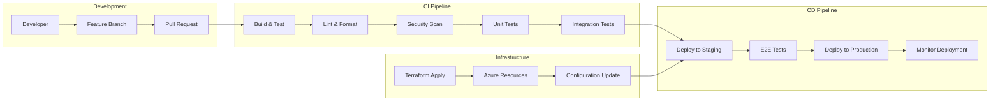

### Deployment Strategies

#### Blue-Green Deployment

```yaml
# Azure App Service Deployment Slots
production_slot:
  name: "production"
  auto_swap: false
  app_settings:
    - name: "ENVIRONMENT"
      value: "production"

staging_slot:
  name: "staging"
  auto_swap: false
  app_settings:
    - name: "ENVIRONMENT"
      value: "staging"

# Deployment process
deployment_process:
  1. Deploy to staging slot
  2. Run health checks
  3. Run smoke tests
  4. Swap slots (blue-green)
  5. Monitor production metrics
  6. Rollback if issues detected
```

#### Canary Deployment

```yaml
# Traffic distribution
traffic_routing:
  production: 90%
  canary: 10%

# Gradual rollout
rollout_stages:
  - traffic_percent: 10
    duration: "30m"
    success_criteria:
      error_rate: "<1%"
      response_time: "<500ms"

  - traffic_percent: 50
    duration: "1h"
    success_criteria:
      error_rate: "<0.5%"
      response_time: "<300ms"

  - traffic_percent: 100
    duration: "24h"
    success_criteria:
      error_rate: "<0.1%"
      response_time: "<200ms"
```

### Environment Management

```typescript
// Environment configuration
interface EnvironmentConfig {
  name: string;
  database: DatabaseConfig;
  cache: CacheConfig;
  storage: StorageConfig;
  monitoring: MonitoringConfig;
  features: FeatureFlags;
}

const environments: Record<string, EnvironmentConfig> = {
  development: {
    name: 'development',
    database: {
      url: 'postgresql://localhost:5432/cpa_platform_dev',
      pool: { min: 2, max: 10 }
    },
    cache: {
      url: 'redis://localhost:6379',
      ttl: 300
    },
    features: {
      newUIEnabled: true,
      advancedReporting: false,
      betaFeatures: true
    }
  },

  production: {
    name: 'production',
    database: {
      url: process.env.DATABASE_URL,
      pool: { min: 10, max: 50 }
    },
    cache: {
      url: process.env.REDIS_URL,
      ttl: 900
    },
    features: {
      newUIEnabled: true,
      advancedReporting: true,
      betaFeatures: false
    }
  }
};
```

---

## Scalability and Performance

### Horizontal Scaling Strategy

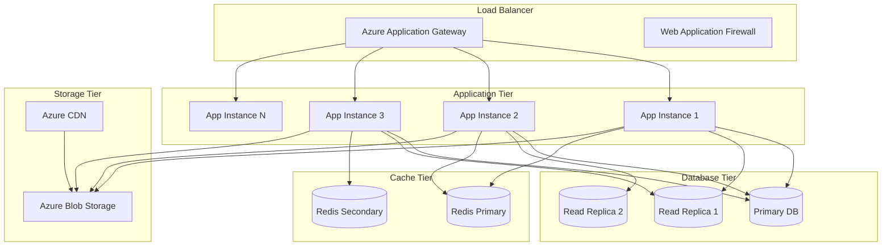

### Auto-Scaling Configuration

```yaml
# Azure App Service Auto-scaling
auto_scaling:
  rules:
    - metric: "cpu_percentage"
      threshold: 70
      action: "scale_out"
      instances: "+1"
      cooldown: "5m"

    - metric: "cpu_percentage"
      threshold: 30
      action: "scale_in"
      instances: "-1"
      cooldown: "10m"

    - metric: "memory_percentage"
      threshold: 80
      action: "scale_out"
      instances: "+2"
      cooldown: "5m"

  limits:
    min_instances: 2
    max_instances: 20
    scale_out_limit: 3  # Max instances to add at once
    scale_in_limit: 1   # Max instances to remove at once
```

### Performance Optimization

```typescript
// Database query optimization
class OptimizedClientService {
  // Use select to reduce data transfer
  async findClients(organizationId: string) {
    return await this.db.client.findMany({
      where: { organizationId },
      select: {
        id: true,
        businessName: true,
        status: true,
        primaryContactEmail: true,
        // Exclude large JSON fields
      },
      orderBy: { businessName: 'asc' },
      take: 50  // Limit results
    });
  }

  // Use database-level aggregation
  async getClientStats(organizationId: string) {
    return await this.db.client.groupBy({
      by: ['status'],
      where: { organizationId },
      _count: true
    });
  }

  // Implement cursor-based pagination
  async getClientsPaginated(cursor?: string, limit = 25) {
    return await this.db.client.findMany({
      take: limit,
      skip: cursor ? 1 : 0,
      cursor: cursor ? { id: cursor } : undefined,
      orderBy: { id: 'asc' }
    });
  }
}

// Caching strategy for expensive operations
class CachedReportService {
  async generateFinancialReport(clientId: string, year: number) {
    const cacheKey = `financial-report:${clientId}:${year}`;

    // Check cache first
    const cached = await this.redis.get(cacheKey);
    if (cached) {
      return JSON.parse(cached);
    }

    // Generate report
    const report = await this.computeFinancialReport(clientId, year);

    // Cache for 1 hour
    await this.redis.setex(cacheKey, 3600, JSON.stringify(report));

    return report;
  }
}
```

---

## Monitoring and Observability

### Monitoring Stack

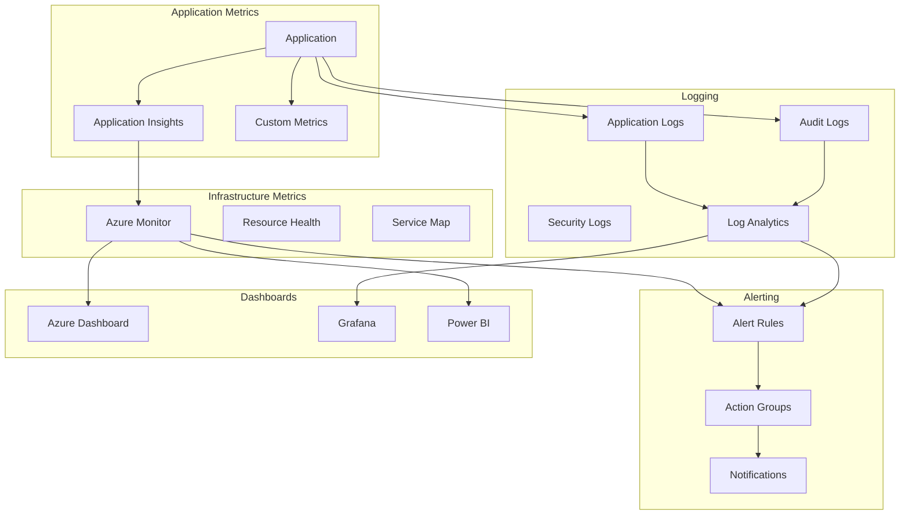

### Application Performance Monitoring

```typescript
// Custom telemetry implementation
class TelemetryService {
  private appInsights: ApplicationInsights;

  constructor() {
    this.appInsights = new ApplicationInsights({
      config: {
        instrumentationKey: process.env.APPLICATIONINSIGHTS_KEY,
        enableAutoCollectRequests: true,
        enableAutoCollectPerformance: true,
        enableAutoCollectExceptions: true,
        enableAutoCollectDependencies: true
      }
    });
  }

  // Track custom events
  trackEvent(name: string, properties?: Record<string, string>, metrics?: Record<string, number>) {
    this.appInsights.trackEvent({
      name,
      properties,
      measurements: metrics
    });
  }

  // Track business metrics
  trackClientCreated(organizationId: string, clientType: string) {
    this.trackEvent('client.created', {
      organizationId,
      clientType
    }, {
      count: 1
    });
  }

  // Track performance metrics
  trackDatabaseQuery(query: string, duration: number, success: boolean) {
    this.trackEvent('database.query', {
      query: query.substring(0, 100), // Truncate for privacy
      success: success.toString()
    }, {
      duration
    });
  }

  // Track user actions
  trackUserAction(userId: string, action: string, resourceId?: string) {
    this.trackEvent('user.action', {
      userId,
      action,
      resourceId
    });
  }
}

// Performance monitoring middleware
const performanceMiddleware = (req: NextRequest, res: NextResponse) => {
  const start = Date.now();

  res.on('finish', () => {
    const duration = Date.now() - start;
    const statusCode = res.status;

    telemetryService.trackEvent('http.request', {
      method: req.method,
      url: req.url,
      statusCode: statusCode.toString(),
      userAgent: req.headers.get('user-agent') || 'unknown'
    }, {
      duration,
      responseSize: parseInt(res.headers.get('content-length') || '0')
    });
  });
};
```

### Health Checks and Synthetic Monitoring

```typescript
// Comprehensive health check
const healthCheck = async (): Promise<HealthStatus> => {
  const checks = await Promise.allSettled([
    // Database connectivity
    checkDatabase(),
    // Cache connectivity
    checkCache(),
    // External services
    checkQuickBooksAPI(),
    checkStripeAPI(),
    // File storage
    checkBlobStorage(),
    // AI services
    checkAzureAI()
  ]);

  const results = checks.map((check, index) => ({
    name: ['database', 'cache', 'quickbooks', 'stripe', 'storage', 'ai'][index],
    status: check.status === 'fulfilled' ? 'healthy' : 'unhealthy',
    message: check.status === 'fulfilled' ? 'OK' : check.reason?.message,
    responseTime: check.status === 'fulfilled' ? check.value.responseTime : undefined
  }));

  const overallStatus = results.every(r => r.status === 'healthy') ? 'healthy' : 'unhealthy';

  return {
    status: overallStatus,
    timestamp: new Date().toISOString(),
    version: process.env.APP_VERSION,
    checks: results
  };
};

// Synthetic monitoring tests
const syntheticTests = [
  {
    name: 'login_flow',
    test: async () => {
      // Test user login flow
      const response = await fetch('/api/auth/login', {
        method: 'POST',
        body: JSON.stringify(testCredentials)
      });
      return response.ok;
    }
  },
  {
    name: 'document_upload',
    test: async () => {
      // Test document upload flow
      const formData = new FormData();
      formData.append('file', testFile);
      const response = await fetch('/api/documents/upload', {
        method: 'POST',
        body: formData
      });
      return response.ok;
    }
  }
];
```

---

## Disaster Recovery

### Backup and Recovery Strategy

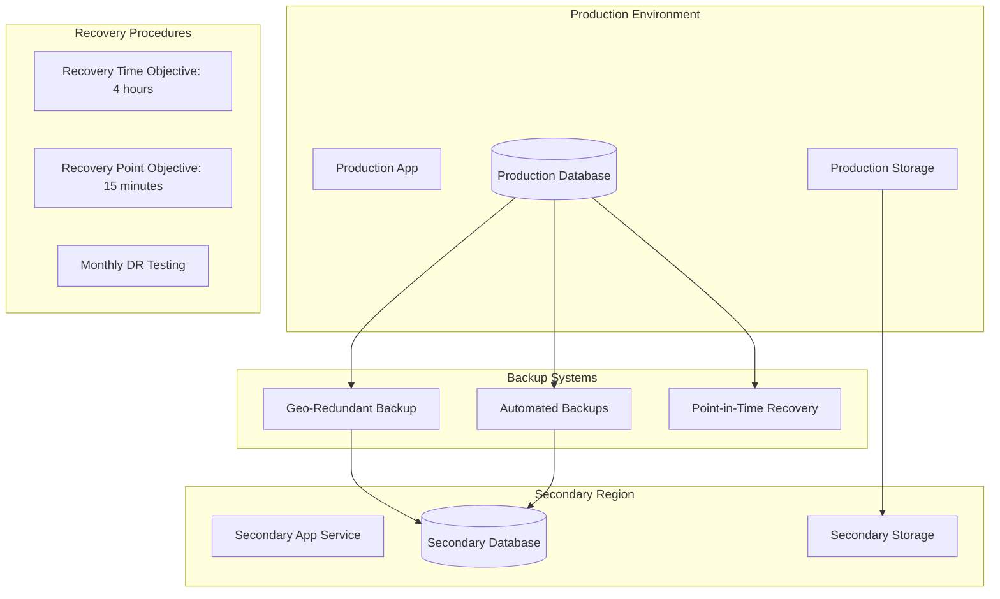

### Business Continuity Plan

```yaml
# Disaster Recovery Procedures
disaster_recovery:
  scenarios:
    - name: "Database Failure"
      impact: "High"
      rto: "1 hour"
      rpo: "5 minutes"
      procedures:
        - "Failover to read replica"
        - "Promote replica to primary"
        - "Update connection strings"
        - "Verify data integrity"

    - name: "Regional Outage"
      impact: "Critical"
      rto: "4 hours"
      rpo: "15 minutes"
      procedures:
        - "Activate secondary region"
        - "Restore from geo-backup"
        - "Update DNS routing"
        - "Communicate to users"

    - name: "Application Corruption"
      impact: "Medium"
      rto: "2 hours"
      rpo: "1 hour"
      procedures:
        - "Rollback to previous deployment"
        - "Restore from backup if needed"
        - "Verify functionality"
        - "Post-incident review"

# Recovery Testing Schedule
testing_schedule:
  monthly:
    - "Point-in-time recovery test"
    - "Backup verification"
    - "Health check validation"

  quarterly:
    - "Full disaster recovery drill"
    - "Cross-region failover test"
    - "Business continuity exercise"

  annually:
    - "Complete DR plan review"
    - "RTO/RPO validation"
    - "Process improvement review"
```

---

## Future Considerations

### Scalability Roadmap

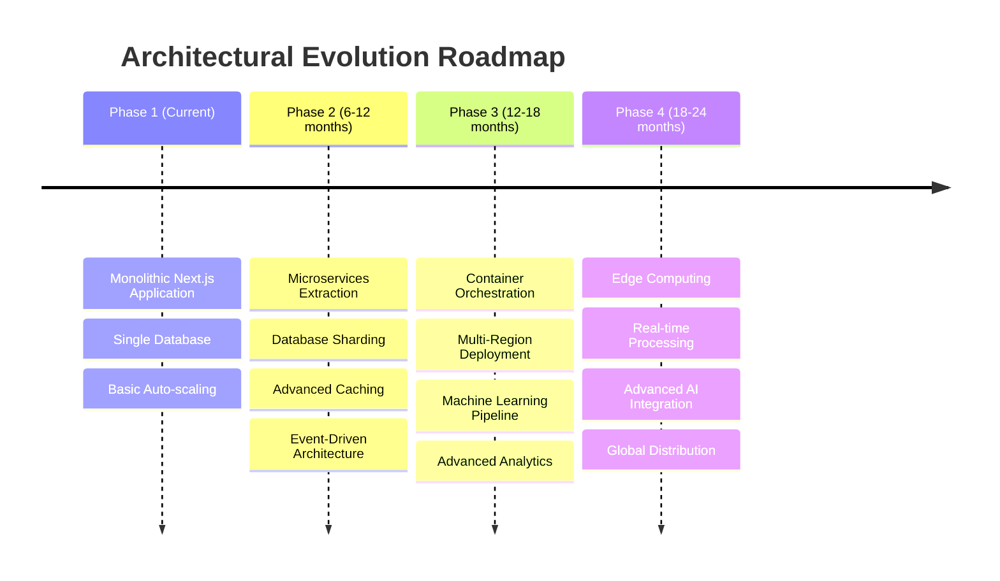

### Technology Evolution

```typescript
// Future architectural considerations
interface FutureArchitecture {
  // Microservices transition
  microservices: {
    clientService: "Dedicated client management service";
    documentService: "Document processing and OCR service";
    workflowService: "Workflow orchestration service";
    reportingService: "Business intelligence and reporting";
    integrationService: "External API management";
  };

  // Event-driven architecture
  eventSourcing: {
    eventStore: "Complete audit trail";
    projections: "Materialized views";
    sagaPattern: "Long-running processes";
    cqrs: "Command Query Responsibility Segregation";
  };

  // Advanced AI capabilities
  aiEnhancements: {
    predictiveAnalytics: "Forecast business metrics";
    intelligentAutomation: "Smart workflow optimization";
    naturalLanguageProcessing: "Document understanding";
    anomalyDetection: "Fraud and error detection";
  };

  // Edge computing
  edgeStrategy: {
    cdnCompute: "Edge functions for processing";
    localProcessing: "Client-side document processing";
    offlineCapabilities: "Offline-first architecture";
    realTimeSync: "Conflict-free data synchronization";
  };
}
```

### Migration Strategy

```yaml
# Microservices Migration Plan
migration_strategy:
  phase_1_preparation:
    - "Implement domain boundaries"
    - "Extract service interfaces"
    - "Add monitoring and observability"
    - "Implement event publishing"

  phase_2_extraction:
    - "Extract document service"
    - "Implement API gateway"
    - "Add service discovery"
    - "Implement circuit breakers"

  phase_3_optimization:
    - "Optimize inter-service communication"
    - "Implement distributed tracing"
    - "Add service mesh"
    - "Optimize data consistency"

  phase_4_scaling:
    - "Implement container orchestration"
    - "Add auto-scaling policies"
    - "Implement chaos engineering"
    - "Optimize for multi-region"

# Risk Mitigation
risk_mitigation:
  technical_risks:
    - "Gradual migration approach"
    - "Feature flags for rollback"
    - "Comprehensive testing strategy"
    - "Performance monitoring"

  business_risks:
    - "Zero-downtime deployments"
    - "Customer communication plan"
    - "Support team training"
    - "Rollback procedures"
```

---

*This architecture documentation provides a comprehensive overview of the CPA Platform's current architecture and future evolution plans. It should be updated regularly as the system grows and evolves.*
