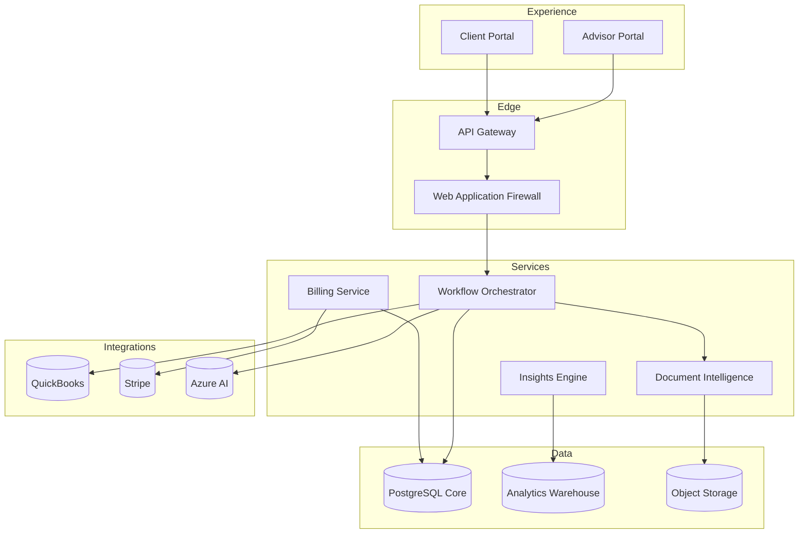

# AdvisorOS Architecture Blueprint

> [!TIP]
> This blueprint is the compass that keeps every AdvisorOS enhancement aligned with a resilient, data-rich platform strategy.

## Overview

| Field | Guidance |
| --- | --- |
| **Purpose** | Illuminate how AdvisorOS services, data, and integrations come together to deliver advisory outcomes at scale. |
| **Audience** | Enterprise architects, lead engineers, security strategists, and transformation sponsors versed in cloud-native patterns. |
| **Context** | Designed for regulated financial services firms that require auditable automation, modular services, and partner-ready extensibility. |

> [!NOTE]
> The architecture is intentionally modular so we can choreograph bespoke client journeys without sacrificing the trust and discipline our brand is known for.

## Business Value & ROI

| Outcome | Narrative | Leading Indicators |
| --- | --- | --- |
| Revenue / Growth | Composable services enable rapid launch of new advisory playbooks and white-label offerings. | New solution bundles shipped per quarter, partner activation velocity |
| Efficiency | Shared data contracts and automation lanes eliminate duplicate work and manual reconciliations. | Reduction in swivel-chair tasks, % workflows automated |
| Risk & Trust | Zero-trust segmentation and audit-grade logging strengthen regulator relationships. | Time to remediate incidents, audit findings resolved pre-close |

> [!IMPORTANT]
> - Portfolio leaders can quantify faster time-to-market for curated client programs.
> - Delivery teams report measurable lift in reuse and reduced integration debt.
> - Compliance leaders gain unwavering transparency into every cross-system interaction.

## Key Connectors/Dependencies

- **AdvisorOS Modules**
  - _Experience Layer_ — React/Next.js front ends connecting through the API Gateway; see [FEATURES.md](FEATURES.md#digital-experiences).
  - _Service Mesh_ — Node.js microservices orchestrated via the workflow engine detailed in [API_REFERENCE.md](API_REFERENCE.md#architecture-snapshot).
  - _Data Platform_ — PostgreSQL clusters alongside analytics workloads referenced in [DATABASE.md](DATABASE.md#implementation-guidance).
- **External Services**
  - _Identity Providers_ — Azure AD and Okta federation with SCIM provisioning.
  - _Finance Systems_ — QuickBooks Online and Stripe Billing via secure connectors.
  - _AI/ML_ — Azure Cognitive Services and custom ML pipelines running in Azure Machine Learning.
- **Operational Readiness Checklist**
  - [ ] Architecture decision records logged in [architecture/adrs](architecture/adrs/) with executive sponsor sign-off.
  - [ ] Threat modeling completed using STRIDE templates in [COMPREHENSIVE_SECURITY_AUDIT_REPORT.md](../COMPREHENSIVE_SECURITY_AUDIT_REPORT.md).
  - [ ] Capacity plans updated in [ops/deployment-automation.ts](../ops/deployment-automation.ts) with latest scaling assumptions.

## Implementation Guidance

> [!TIP]
> Use the layers below as a guided tour; each `
` block pairs the strategic intent with pragmatic configuration.

### Architecture Snapshot

### Layer Playbooks

<strong>Experience & Edge</strong> — Deliver curated advisory moments securely

1. **Global Routing** — CloudFront (or Azure Front Door) terminates TLS 1.3 and routes traffic through the WAF.
2. **API Gateway Policies** — Enforce JWT validation, request throttles, and schema linting.
3. **Change Control** — Align deployments with [DEPLOYMENT.md](DEPLOYMENT.md#implementation-guidance) to maintain blue/green parity.

<strong>Service Layer</strong> — Orchestrate modular capabilities

1. **Workflow Orchestrator** — Event-driven Node.js services communicate via NATS streaming; idempotency keys tracked in Redis.
2. **Billing & Revenue** — Stripe webhooks handled through durable queues with replay protection.
3. **Document Intelligence** — Azure Cognitive Services invoked asynchronously; classification outputs persisted alongside audit hashes.
4. **Observability** — Leverage OpenTelemetry exporters feeding Grafana dashboards described in [operations/DEPLOYMENT_GUIDE.md](operations/DEPLOYMENT_GUIDE.md#dashboards).

<strong>Data Platform</strong> — Anchor insights and compliance

1. **Core Schema** — Normalized relational design covering clients, engagements, documents, and ledger entries. Reference [DATABASE.md](DATABASE.md#schema-overview).
2. **Analytics Warehouse** — ELT jobs materialize aggregated tables (dbt, Azure Data Factory) for revenue intelligence.
3. **Data Governance** — Column-level encryption and masking governed through the policies captured in [SECURITY_COMPLIANCE_REPORT.md](../SECURITY_COMPLIANCE_REPORT.md).

<strong>Integration Fabric</strong> — Extend AdvisorOS beyond our walls

1. **Connector Framework** — Abstraction layer ensures retries, backoff, and circuit breakers.
2. **Credential Stewardship** — Secrets stored in Azure Key Vault; rotation policy tracked in [COMPREHENSIVE_SECURITY_AUDIT_REPORT.md](../COMPREHENSIVE_SECURITY_AUDIT_REPORT.md#key-management).
3. **Partner Playbooks** — Align configurations with [INTEGRATION_GUIDES.md](INTEGRATION_GUIDES.md#implementation-guidance) for QuickBooks, Stripe, and document AI.

### Quality Gates & Monitoring
- **Availability Objectives** — 99.9% monthly SLA with error budgets tracked in Grafana SLO dashboards.
- **Chaos Testing** — Run quarterly game days using [`scripts/disaster-recovery/automated-failover.sh`](../scripts/disaster-recovery/automated-failover.sh).
- **Cost Transparency** — Monitor spend with FinOps dashboards referenced in [COST_OPTIMIZATION_STRATEGY.md](../COST_OPTIMIZATION_STRATEGY.md).

## Future Enhancements

| Theme | Description | Owner / ETA |
| --- | --- | --- |
| Optimization | Adopt service mesh mTLS with zero-trust policy automation. | Platform Engineering / Q3 |
| Innovation | Introduce event-driven personalization via AI co-pilots. | Product Innovation / Pilot in Q4 |
| Risk Mitigation | Expand disaster recovery to active-active multi-region failover. | Infrastructure / In Design |

> [!CAUTION]
> These initiatives require synchronized investment in observability upgrades and budget approval for cross-region infrastructure.

## Cross-References

- [DATABASE.md](DATABASE.md) — Dive into schema design and data lifecycle governance.
- [DEPLOYMENT.md](DEPLOYMENT.md) — Execute infrastructure-as-code rollouts aligned with this architecture.
- [INTEGRATION_GUIDES.md](INTEGRATION_GUIDES.md) — Translate integration patterns into partner-ready execution steps.
- [COMPREHENSIVE_SECURITY_AUDIT_REPORT.md](../COMPREHENSIVE_SECURITY_AUDIT_REPORT.md) — Validate security commitments embedded in the architecture.
