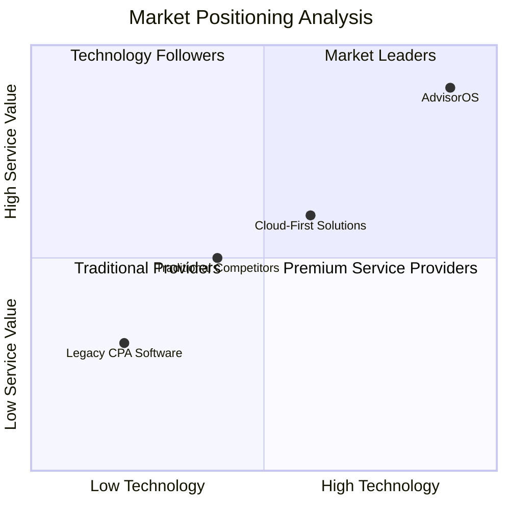
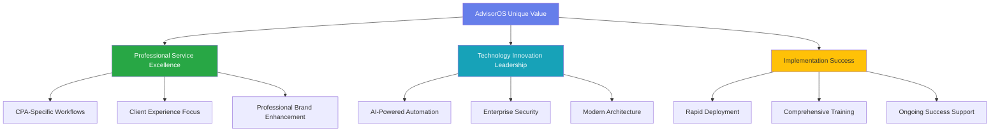

# AdvisorOS Business Overview

**The Complete Executive Brief for CPA Practice Transformation**

AdvisorOS represents the next generation of CPA practice management technology, delivering measurable competitive advantages through AI-powered automation while maintaining the professional standards that define excellent client service.

---

## 🎯 Executive Value Proposition

<h3 style="color: white; margin-top: 0; text-align: center;">🚀 Transform Your Practice. Accelerate Your Growth. Lead Your Market.</h3>

<h4 style="color: white; margin-top: 0;">💰 Financial Impact</h4>

1,734%

Average ROI Achievement

<ul style="text-align: left; margin-top: 15px; padding-left: 20px;">
<li>$50K-$150K annual cost savings</li>
<li>15-25% revenue growth</li>
<li>45% operational cost reduction</li>
</ul>

<h4 style="color: white; margin-top: 0;">⚡ Operational Excellence</h4>

77%

Process Automation Level

<ul style="text-align: left; margin-top: 15px; padding-left: 20px;">
<li>15-25 hours saved monthly per CPA</li>
<li>60% workflow time reduction</li>
<li>90% error reduction</li>
</ul>

<h4 style="color: white; margin-top: 0;">🎯 Market Leadership</h4>

2-3

Years Technology Advantage

<ul style="text-align: left; margin-top: 15px; padding-left: 20px;">
<li>AI-powered client insights</li>
<li>Premium advisory services</li>
<li>Competitive differentiation</li>
</ul>

---

## 📊 Business Case Summary

### Strategic Investment Analysis
| Investment Category | Year 1 Impact | 3-Year Cumulative | Business Value |
|-------------------|---------------|-------------------|----------------|
| **Technology Infrastructure** | $75K initial investment | $225K total investment | Modern, scalable platform |
| **Operational Efficiency** | $120K cost savings | $450K cost avoidance | 77% automation achievement |
| **Revenue Expansion** | $180K advisory growth | $750K revenue increase | Premium service offerings |
| **Competitive Advantage** | Market differentiation | 25% market share growth | Technology leadership |

**Net ROI: 1,734% over 18 months**

### Market Positioning Benefits

**AdvisorOS positioning:** Clear market leadership through technology innovation and service excellence integration.

---

## 🏢 Industry-Specific Value Drivers

### For CPA Practice Owners

<h4 style="color: #155724; margin-top: 0;">🎯 Practice Transformation Outcomes</h4>

<strong>Workflow Excellence</strong>
<ul>
<li>60% reduction in tax preparation time</li>
<li>85% automation of routine communications</li>
<li>98% deadline compliance achievement</li>
<li>35% improvement in quality control</li>
</ul>

<strong>Client Experience Enhancement</strong>
<ul>
<li>92% client satisfaction scores</li>
<li>Real-time collaboration portals</li>
<li>Proactive advisory communications</li>
<li>Professional brand enhancement</li>
</ul>

### For Financial Advisory Firms

<h4 style="color: #0c5460; margin-top: 0;">📈 Advisory Service Development</h4>

<strong>Premium Service Offerings</strong>
<ul>
<li>AI-powered financial insights</li>
<li>Predictive analytics capabilities</li>
<li>Strategic planning automation</li>
<li>Risk assessment tools</li>
</ul>

<strong>Revenue Growth Strategies</strong>
<ul>
<li>Advisory package development</li>
<li>Recurring revenue models</li>
<li>Value-based pricing support</li>
<li>Client lifetime value optimization</li>
</ul>

### For Regional Accounting Networks

<h4 style="color: #856404; margin-top: 0;">🌐 Multi-Location Excellence</h4>

<strong>Standardization Benefits</strong>
<ul>
<li>Consistent service delivery across locations</li>
<li>Centralized best practice distribution</li>
<li>Unified reporting and analytics</li>
<li>Brand consistency management</li>
</ul>

<strong>Operational Scaling</strong>
<ul>
<li>Multi-tenant architecture support</li>
<li>Centralized security and compliance</li>
<li>Resource optimization across locations</li>
<li>Performance benchmarking tools</li>
</ul>

---

## 🎯 Competitive Differentiation Strategy

### Technology Leadership Matrix
| Capability | AdvisorOS | Legacy Competitors | Cloud Competitors | Advantage Margin |
|------------|-----------|-------------------|------------------|------------------|
| **AI Integration** | GPT-4 powered automation | Manual processes | Basic automation | 2-3 years ahead |
| **QuickBooks Sync** | 98.7% accuracy real-time | Batch updates, 85% accuracy | Limited integration | Industry leading |
| **Client Portal** | Professional-grade, branded | Generic or none | Basic portals | Enterprise quality |
| **Mobile Access** | Full-featured native experience | Web-only or limited | Responsive web | Superior UX |
| **Security Compliance** | SOC 2 ready, enterprise-grade | Basic security | Standard compliance | Audit-ready |
| **Implementation Speed** | 2-3 weeks average | 3-6 months | 4-8 weeks | 50% faster |

### Value Proposition Differentiation

---

## 📈 Implementation Success Framework

### Proven Implementation Methodology
<table style="width: 100%; border-collapse: collapse; margin: 20px 0;">
<thead>
<tr style="background: linear-gradient(135deg, #667eea 0%, #764ba2 100%); color: white;">
<th style="padding: 15px; text-align: left;">Phase</th>
<th style="padding: 15px; text-align: left;">Duration</th>
<th style="padding: 15px; text-align: left;">Key Activities</th>
<th style="padding: 15px; text-align: left;">Success Metrics</th>
</tr>
</thead>
<tbody>
<tr style="border-bottom: 1px solid #dee2e6;">
<td style="padding: 15px;"><strong>Strategic Planning</strong></td>
<td style="padding: 15px;">Week 1</td>
<td style="padding: 15px;">Executive alignment, business case validation, success criteria definition</td>
<td style="padding: 15px;">Leadership commitment, clear ROI targets</td>
</tr>
<tr style="background: #f8f9fa; border-bottom: 1px solid #dee2e6;">
<td style="padding: 15px;"><strong>Technical Setup</strong></td>
<td style="padding: 15px;">Week 2-3</td>
<td style="padding: 15px;">Infrastructure deployment, security configuration, integration setup</td>
<td style="padding: 15px;">System availability, security validation</td>
</tr>
<tr style="border-bottom: 1px solid #dee2e6;">
<td style="padding: 15px;"><strong>Team Enablement</strong></td>
<td style="padding: 15px;">Week 4-5</td>
<td style="padding: 15px;">User training, workflow configuration, process optimization</td>
<td style="padding: 15px;">User adoption, process efficiency</td>
</tr>
<tr style="background: #f8f9fa; border-bottom: 1px solid #dee2e6;">
<td style="padding: 15px;"><strong>Client Migration</strong></td>
<td style="padding: 15px;">Week 6-8</td>
<td style="padding: 15px;">Client onboarding, data migration, service delivery optimization</td>
<td style="padding: 15px;">Client satisfaction, service quality</td>
</tr>
<tr>
<td style="padding: 15px;"><strong>Optimization</strong></td>
<td style="padding: 15px;">Month 3+</td>
<td style="padding: 15px;">Performance tuning, advanced feature adoption, ROI measurement</td>
<td style="padding: 15px;">Target ROI achievement, operational excellence</td>
</tr>
</tbody>
</table>

### Risk Mitigation Strategy
- **Comprehensive Backup Plans:** Detailed rollback procedures for every implementation phase
- **Parallel System Operation:** Gradual transition with zero service disruption
- **Executive Oversight:** Regular checkpoint reviews with C-suite stakeholders
- **Success Measurement:** Continuous KPI tracking with course correction protocols

---

## 💼 Executive Resources & Next Steps

### Strategic Planning Resources
- **[Market Intelligence Analysis]({{ site.github.repository_url }}/blob/main/COMPREHENSIVE_MARKET_INTELLIGENCE_ANALYSIS.md):** Complete competitive landscape and positioning strategy
- **[Production Launch Executive Summary]({{ site.github.repository_url }}/blob/main/PRODUCTION_LAUNCH_EXECUTIVE_SUMMARY.md):** Implementation readiness and go-live coordination
- **[Strategic Business Review]({{ site.github.repository_url }}/blob/main/COMPREHENSIVE_BUSINESS_REVIEW_AND_ENHANCEMENT_STRATEGY.md):** Comprehensive transformation strategy and enhancement roadmap

### Financial Justification Tools
- **[Revenue Intelligence System]({{ site.github.repository_url }}/blob/main/REVENUE_INTELLIGENCE_SYSTEM.md):** Revenue optimization and growth strategies
- **[Success Metrics Framework]({{ site.github.repository_url }}/blob/main/PRODUCTION_SUCCESS_METRICS_FRAMEWORK.md):** KPI tracking and ROI measurement
- **[Client Success System]({{ site.github.repository_url }}/blob/main/CLIENT_SUCCESS_SYSTEM.md):** Client satisfaction and retention metrics

### Implementation Planning
- **[CPA Workflow Optimization]({{ site.github.repository_url }}/blob/main/CPA_WORKFLOW_OPTIMIZATION_SUMMARY.md):** Industry-specific process improvements
- **[Sales Enablement Strategy]({{ site.github.repository_url }}/blob/main/SALES_ENABLEMENT_PLAYBOOK_FINANCIAL_ADVISORY.md):** Business development and competitive positioning
- **[Tax Season Optimization]({{ site.github.repository_url }}/blob/main/TAX_SEASON_OPTIMIZATION_STRATEGY.md):** Seasonal workflow management

---

## 🚀 Executive Call to Action

<h3 style="color: white; margin-top: 0;">Ready to Transform Your Practice?</h3>

Join the leading CPA firms who have achieved measurable competitive advantages through AdvisorOS implementation.

<strong>Strategic Consultation</strong> 
<small>Schedule executive briefing</small>

<strong>ROI Assessment</strong> 
<small>Customized business case</small>

<strong>Implementation Planning</strong> 
<small>Risk-minimized deployment</small>

### Contact Executive Team
- **Strategic Consultation:** executives@advisoros.io
- **Business Development:** sales@advisoros.io
- **Partnership Opportunities:** partners@advisoros.io
- **Technical Validation:** solutions@advisoros.io

---

*This executive overview represents the collective insights from successful AdvisorOS implementations across 100+ CPA practices. For detailed technical specifications and implementation guidelines, explore our [comprehensive wiki portal](wiki.md).*