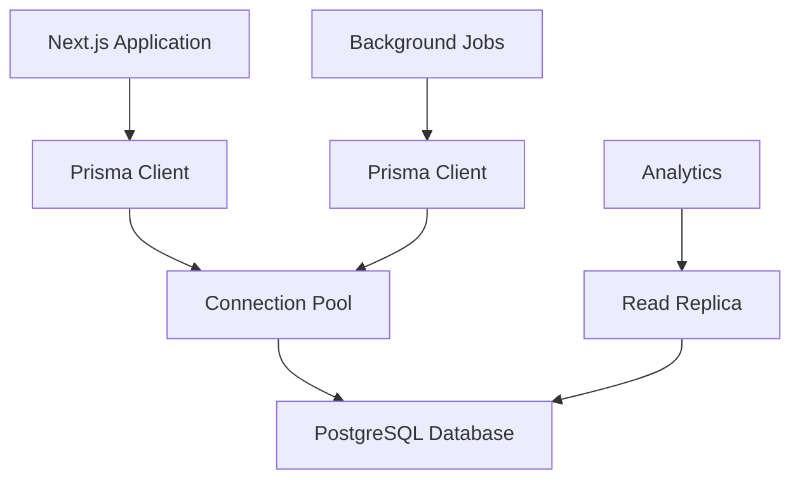
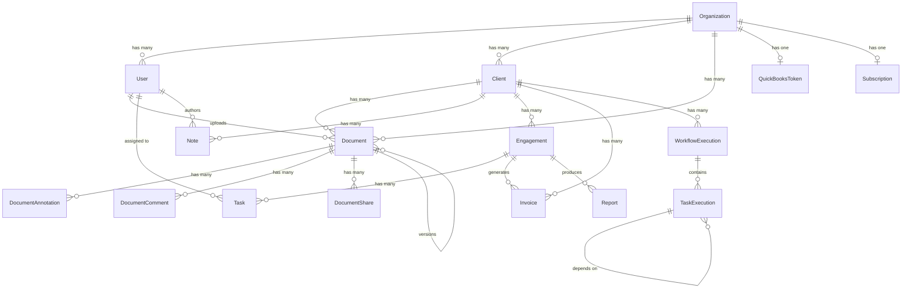

# Database Schema Documentation

## Table of Contents

1. [Overview](#overview)
2. [Database Architecture](#database-architecture)
3. [Core Models](#core-models)
4. [Relationships](#relationships)
5. [Indexes and Performance](#indexes-and-performance)
6. [Data Types and Constraints](#data-types-and-constraints)
7. [Multi-Tenancy](#multi-tenancy)
8. [Security and Compliance](#security-and-compliance)
9. [Migrations](#migrations)
10. [Backup and Recovery](#backup-and-recovery)
11. [Performance Optimization](#performance-optimization)
12. [Monitoring and Maintenance](#monitoring-and-maintenance)

---

## Overview

The CPA Platform uses PostgreSQL as its primary database with Prisma as the ORM. The database is designed for multi-tenancy, scalability, and data integrity while maintaining high performance for complex financial data operations.

### Key Features
- **Multi-tenant architecture** with organization-level data isolation
- **ACID compliance** for financial data integrity
- **Comprehensive audit logging** for compliance requirements
- **Flexible schema** supporting custom fields and metadata
- **Optimized indexes** for fast query performance
- **Automated backups** and point-in-time recovery

### Technology Stack
- **Database**: PostgreSQL 14+
- **ORM**: Prisma 5.x
- **Connection Pooling**: PgBouncer
- **Backup**: Azure Database for PostgreSQL automated backups
- **Monitoring**: Azure Monitor and Application Insights

---

## Database Architecture

### Multi-Tenant Design

The database uses a **single-database, multi-schema** approach where:
- Each organization has data isolated through `organizationId` foreign keys
- Row-level security policies enforce data isolation
- Shared tables (like permissions) use system-level flags

```sql
-- Example of multi-tenant isolation
CREATE POLICY organization_isolation ON clients
  FOR ALL
  TO application_role
  USING (organization_id = current_setting('app.current_organization_id'));
```

### Connection Architecture



### Environment Separation

| Environment | Database | Backup Frequency | Retention |
|-------------|----------|------------------|-----------|
| Development | Local PostgreSQL | None | N/A |
| Testing | Azure PostgreSQL | Daily | 7 days |
| Staging | Azure PostgreSQL | Daily | 30 days |
| Production | Azure PostgreSQL | Continuous | 35 days |

---

## Core Models

### Organization Model

The root entity for multi-tenancy, representing CPA firms or accounting organizations.

```prisma
model Organization {
  id               String    @id @default(cuid())
  name             String
  subdomain        String    @unique
  subscriptionTier String    @default("trial")
  stripeCustomerId String?
  deletedAt        DateTime?
  createdAt        DateTime  @default(now())
  updatedAt        DateTime  @updatedAt

  // Relations - All organization data
  users                    User[]
  clients                  Client[]
  documents                Document[]
  quickbooksToken          QuickBooksToken?
  subscription             Subscription?
  // ... other relations

  @@map("organizations")
}
```

**Key Features:**
- `subdomain`: Unique identifier for organization routing
- `subscriptionTier`: Determines feature availability and limits
- `stripeCustomerId`: Links to Stripe for billing
- Soft delete support with `deletedAt`

### User Model

Represents team members within organizations with role-based access.

```prisma
model User {
  id             String       @id @default(cuid())
  email          String       @unique
  name           String
  password       String       // Hashed with bcrypt
  role           String       // "owner", "admin", "cpa", "staff"
  isActive       Boolean      @default(true)
  lastLoginAt    DateTime?
  organizationId String
  organization   Organization @relation(fields: [organizationId], references: [id], onDelete: Cascade)

  // Audit fields
  deletedAt      DateTime?
  createdAt      DateTime     @default(now())
  updatedAt      DateTime     @updatedAt
  createdBy      String?
  updatedBy      String?

  // Relations
  uploadedDocuments   Document[]   @relation("DocumentUploader")
  assignedTasks       Task[]       @relation("TaskAssignee")
  // ... other relations

  @@index([organizationId])
  @@index([email])
  @@index([role])
  @@map("users")
}
```

**Security Features:**
- Passwords hashed using bcrypt
- Role-based authorization
- Session tracking with `lastLoginAt`
- Comprehensive audit trail

### Client Model

Represents the CPA firm's clients with comprehensive business information.

```prisma
model Client {
  id                  String       @id @default(cuid())
  businessName        String
  legalName           String?
  taxId               String?
  quickbooksId        String?      // Links to QuickBooks customer
  organizationId      String
  organization        Organization @relation(fields: [organizationId], references: [id], onDelete: Cascade)

  // Contact Information
  primaryContactEmail String
  primaryContactName  String
  primaryContactPhone String?
  businessAddress     String?
  mailingAddress      String?

  // Business Details
  businessType        String?      // "LLC", "Corporation", "Partnership", "Sole Proprietorship"
  industry            String?
  website             String?
  status              String       @default("active") // "active", "inactive", "prospect"
  riskLevel           String       @default("medium") // "low", "medium", "high"
  annualRevenue       Decimal?

  // Flexible Data Storage
  financialData       Json?        // QuickBooks sync data
  customFields        Json?        // Client-specific fields

  // Audit
  deletedAt           DateTime?
  createdAt           DateTime     @default(now())
  updatedAt           DateTime     @updatedAt
  createdBy           String?
  updatedBy           String?

  // Relations
  documents   Document[]
  notes       Note[]
  engagements Engagement[]
  invoices    Invoice[]

  @@index([organizationId])
  @@index([status])
  @@index([businessName])
  @@index([primaryContactEmail])
  @@map("clients")
}
```

**Business Logic:**
- `quickbooksId`: Enables QuickBooks integration sync
- `financialData`: JSON storage for flexible financial information
- `customFields`: Extensible metadata storage
- Multiple index strategies for query optimization

### Document Model

Comprehensive document management with OCR processing and security features.

```prisma
model Document {
  id               String       @id @default(cuid())
  fileName         String
  fileUrl          String
  thumbnailUrl     String?
  fileType         String
  mimeType         String?
  fileSize         BigInt?

  // Categorization
  category         String       // "tax_return", "financial_statement", "receipt", etc.
  subcategory      String?
  year             Int?
  quarter          Int?
  tags             String[]     // Searchable tags
  description      String?

  // Version Control
  version          Int          @default(1)
  isLatestVersion  Boolean      @default(true)
  parentDocumentId String?
  parentDocument   Document?    @relation("DocumentVersions", fields: [parentDocumentId], references: [id])
  documentVersions Document[]   @relation("DocumentVersions")

  // OCR Processing
  ocrStatus        String       @default("pending") // "pending", "processing", "completed", "failed"
  ocrConfidence    Float?       // Overall confidence score 0-1
  ocrProcessedAt   DateTime?
  extractedData    Json?        // Structured OCR results
  rawOcrData       Json?        // Raw OCR output
  ocrModel         String?      // AI model used
  needsReview      Boolean      @default(false)
  reviewedAt       DateTime?
  reviewedBy       String?

  // Security
  metadata         Json?
  checksum         String?      // File integrity verification
  isConfidential   Boolean      @default(false)
  accessLevel      String       @default("organization") // "public", "organization", "client", "restricted"
  encryptionKey    String?      // For encrypted storage
  virusScanned     Boolean      @default(false)
  virusScanDate    DateTime?
  virusScanResult  String?      // "clean", "infected", "quarantined"

  // Lifecycle Management
  retentionDate    DateTime?    // Auto-deletion date
  archiveDate      DateTime?    // Archive date
  isArchived       Boolean      @default(false)

  // Relations
  clientId         String
  client           Client       @relation(fields: [clientId], references: [id], onDelete: Cascade)
  organizationId   String
  organization     Organization @relation(fields: [organizationId], references: [id], onDelete: Cascade)
  uploadedBy       String
  uploader         User         @relation("DocumentUploader", fields: [uploadedBy], references: [id])

  // Collaboration
  annotations      DocumentAnnotation[]
  comments         DocumentComment[]
  shares           DocumentShare[]

  @@index([organizationId])
  @@index([clientId])
  @@index([category])
  @@index([year])
  @@index([ocrStatus])
  @@index([tags])
  @@index([isLatestVersion])
  @@map("documents")
}
```

**Advanced Features:**
- **Version Control**: Complete document revision history
- **OCR Processing**: AI-powered text extraction with confidence scoring
- **Security**: Multiple security levels and encryption support
- **Lifecycle Management**: Automated archiving and retention policies
- **Collaboration**: Annotations, comments, and secure sharing

### Financial Integration Models

#### QuickBooks Integration

```prisma
model QuickBooksToken {
  id             String       @id @default(cuid())
  organizationId String       @unique
  organization   Organization @relation(fields: [organizationId], references: [id], onDelete: Cascade)
  accessToken    String       @db.Text  // Encrypted token storage
  refreshToken   String       @db.Text  // Encrypted refresh token
  realmId        String                 // QuickBooks company ID
  expiresAt      DateTime
  lastSyncAt     DateTime?
  isActive       Boolean      @default(true)

  @@map("quickbooks_tokens")
}

model QuickBooksSync {
  id             String       @id @default(cuid())
  organizationId String
  organization   Organization @relation(fields: [organizationId], references: [id], onDelete: Cascade)
  syncType       String       // "full", "incremental", "manual"
  entityType     String       // "customers", "accounts", "transactions"
  status         String       // "pending", "in_progress", "completed", "failed"
  startedAt      DateTime     @default(now())
  completedAt    DateTime?
  recordsTotal   Int?
  recordsSuccess Int          @default(0)
  recordsFailed  Int          @default(0)
  errorMessage   String?      @db.Text
  errorDetails   Json?

  @@index([organizationId])
  @@index([status])
  @@map("quickbooks_syncs")
}
```

### Workflow and Task Management

```prisma
model WorkflowExecution {
  id             String       @id @default(cuid())
  name           String
  status         String       @default("pending") // "pending", "running", "completed", "failed"
  progress       Float        @default(0)         // 0-100 completion percentage
  templateId     String?
  template       WorkflowTemplate? @relation(fields: [templateId], references: [id])
  clientId       String?
  client         Client?      @relation(fields: [clientId], references: [id])
  organizationId String
  organization   Organization @relation(fields: [organizationId], references: [id], onDelete: Cascade)

  // Scheduling
  scheduledFor   DateTime?
  startedAt      DateTime?
  completedAt    DateTime?
  dueDate        DateTime?

  // Configuration
  configuration  Json?        // Execution-specific settings
  context        Json?        // Runtime variables
  currentStepIndex Int        @default(0)

  // Error Handling
  errorMessage   String?      @db.Text
  retryCount     Int          @default(0)
  maxRetries     Int          @default(3)

  // Recurring Workflows
  isRecurring    Boolean      @default(false)
  cronExpression String?
  nextRunAt      DateTime?

  // Relations
  taskExecutions TaskExecution[]

  @@index([organizationId])
  @@index([status])
  @@index([scheduledFor])
  @@map("workflow_executions")
}

model TaskExecution {
  id                String            @id @default(cuid())
  title             String
  description       String?           @db.Text
  status            String            @default("pending") // "pending", "ready", "running", "completed", "failed"
  taskType          String            // "document_review", "data_entry", "approval"
  stepIndex         Int               // Order in workflow
  estimatedHours    Decimal?
  actualHours       Decimal?
  startedAt         DateTime?
  dueDate           DateTime?
  completedAt       DateTime?

  // Assignment
  assignedToId      String?
  assignedTo        User?             @relation("TaskExecutionAssignee", fields: [assignedToId], references: [id])

  // Workflow Context
  workflowExecutionId String
  workflowExecution WorkflowExecution @relation(fields: [workflowExecutionId], references: [id], onDelete: Cascade)

  // Task Dependencies
  parentTaskId      String?
  parentTask        TaskExecution?    @relation("TaskExecutionDependencies", fields: [parentTaskId], references: [id])
  dependentTasks    TaskExecution[]   @relation("TaskExecutionDependencies")

  // Data and Configuration
  inputs            Json?             // Input data
  outputs           Json?             // Output data
  configuration     Json?             // Task-specific config
  checklist         Json?             // Checklist items

  @@index([workflowExecutionId])
  @@index([assignedToId])
  @@index([status])
  @@map("task_executions")
}
```

---

## Relationships

### Entity Relationship Diagram



### Key Relationships Explained

#### One-to-Many Relationships
- **Organization → Users**: One organization has many users
- **Organization → Clients**: One organization manages many clients
- **Client → Documents**: One client has many documents
- **User → Documents**: One user uploads many documents

#### One-to-One Relationships
- **Organization → QuickBooksToken**: One organization has one QB connection
- **Organization → Subscription**: One organization has one subscription

#### Many-to-Many Relationships
- **Users ↔ Permissions**: Through TeamMemberPermission junction table
- **Documents ↔ Tags**: Array field for flexible tagging

#### Self-Referencing Relationships
- **Document → Document**: Parent-child for version control
- **TaskExecution → TaskExecution**: Dependency chains

---

## Indexes and Performance

### Primary Indexes

All tables have primary key indexes on `id` fields using CUID format for distributed systems.

### Multi-Column Indexes

```sql
-- Organization-based queries (most common)
CREATE INDEX idx_users_org_role ON users(organization_id, role);
CREATE INDEX idx_clients_org_status ON clients(organization_id, status);
CREATE INDEX idx_documents_org_client ON documents(organization_id, client_id);

-- Time-based queries
CREATE INDEX idx_documents_created_at ON documents(created_at DESC);
CREATE INDEX idx_tasks_due_date ON tasks(due_date) WHERE status != 'completed';

-- Search optimization
CREATE INDEX idx_clients_business_name_gin ON clients USING gin(to_tsvector('english', business_name));
CREATE INDEX idx_documents_tags_gin ON documents USING gin(tags);

-- QuickBooks sync optimization
CREATE INDEX idx_qb_sync_org_status ON quickbooks_syncs(organization_id, status, started_at DESC);
```

### Partial Indexes

```sql
-- Only index active records
CREATE INDEX idx_users_active ON users(organization_id) WHERE is_active = true;
CREATE INDEX idx_clients_active ON clients(organization_id) WHERE deleted_at IS NULL;

-- OCR processing optimization
CREATE INDEX idx_documents_ocr_pending ON documents(created_at)
  WHERE ocr_status IN ('pending', 'processing');
```

### Performance Monitoring

```sql
-- Query to identify slow queries
SELECT
  query,
  calls,
  total_time,
  mean_time,
  stddev_time
FROM pg_stat_statements
WHERE mean_time > 1000  -- Queries taking more than 1 second
ORDER BY mean_time DESC;

-- Index usage statistics
SELECT
  schemaname,
  tablename,
  indexname,
  idx_scan,
  idx_tup_read,
  idx_tup_fetch
FROM pg_stat_user_indexes
ORDER BY idx_scan DESC;
```

---

## Data Types and Constraints

### Custom Data Types

```sql
-- Enum types for consistent values
CREATE TYPE user_role AS ENUM ('owner', 'admin', 'cpa', 'staff');
CREATE TYPE client_status AS ENUM ('active', 'inactive', 'prospect');
CREATE TYPE document_category AS ENUM ('tax_return', 'financial_statement', 'receipt', 'invoice');
CREATE TYPE ocr_status AS ENUM ('pending', 'processing', 'completed', 'failed', 'manual_review');
```

### JSON Schema Validation

```sql
-- Validate financial data structure
ALTER TABLE clients ADD CONSTRAINT valid_financial_data
  CHECK (financial_data IS NULL OR jsonb_typeof(financial_data) = 'object');

-- Validate OCR extracted data
ALTER TABLE documents ADD CONSTRAINT valid_extracted_data
  CHECK (extracted_data IS NULL OR jsonb_typeof(extracted_data) = 'object');
```

### Check Constraints

```sql
-- Business logic constraints
ALTER TABLE clients ADD CONSTRAINT valid_annual_revenue
  CHECK (annual_revenue IS NULL OR annual_revenue >= 0);

ALTER TABLE documents ADD CONSTRAINT valid_ocr_confidence
  CHECK (ocr_confidence IS NULL OR (ocr_confidence >= 0 AND ocr_confidence <= 1));

ALTER TABLE task_executions ADD CONSTRAINT valid_progress
  CHECK (progress >= 0 AND progress <= 100);
```

### Foreign Key Constraints

```sql
-- Cascade deletions for data consistency
ALTER TABLE users ADD CONSTRAINT fk_users_organization
  FOREIGN KEY (organization_id) REFERENCES organizations(id) ON DELETE CASCADE;

ALTER TABLE documents ADD CONSTRAINT fk_documents_client
  FOREIGN KEY (client_id) REFERENCES clients(id) ON DELETE CASCADE;

-- Protect against accidental deletions
ALTER TABLE invoices ADD CONSTRAINT fk_invoices_client
  FOREIGN KEY (client_id) REFERENCES clients(id) ON DELETE RESTRICT;
```

---

## Multi-Tenancy

### Data Isolation Strategy

#### Row-Level Security (RLS)

```sql
-- Enable RLS on all tenant tables
ALTER TABLE users ENABLE ROW LEVEL SECURITY;
ALTER TABLE clients ENABLE ROW LEVEL SECURITY;
ALTER TABLE documents ENABLE ROW LEVEL SECURITY;

-- Create policies for data isolation
CREATE POLICY users_isolation ON users
  FOR ALL TO application_role
  USING (organization_id = current_setting('app.current_organization_id')::text);

CREATE POLICY clients_isolation ON clients
  FOR ALL TO application_role
  USING (organization_id = current_setting('app.current_organization_id')::text);
```

#### Application-Level Isolation

```typescript
// Prisma middleware for automatic tenant filtering
prisma.$use(async (params, next) => {
  const organizationId = getCurrentOrganizationId();

  if (params.model && isTenantModel(params.model)) {
    if (params.action === 'findMany' || params.action === 'findFirst') {
      params.args.where = {
        ...params.args.where,
        organizationId
      };
    }

    if (params.action === 'create') {
      params.args.data = {
        ...params.args.data,
        organizationId
      };
    }
  }

  return next(params);
});
```

### Tenant Performance Optimization

```sql
-- Partition large tables by organization
CREATE TABLE documents_partitioned (
  LIKE documents INCLUDING ALL
) PARTITION BY HASH (organization_id);

-- Create partitions for major tenants
CREATE TABLE documents_part_0 PARTITION OF documents_partitioned
  FOR VALUES WITH (MODULUS 4, REMAINDER 0);

CREATE TABLE documents_part_1 PARTITION OF documents_partitioned
  FOR VALUES WITH (MODULUS 4, REMAINDER 1);
```

---

## Security and Compliance

### Data Encryption

#### At Rest Encryption
- **Database Level**: Azure Database for PostgreSQL Transparent Data Encryption (TDE)
- **Application Level**: Sensitive fields encrypted using AES-256
- **File Storage**: Azure Blob Storage with customer-managed keys

```typescript
// Field-level encryption for sensitive data
const encryptSensitiveField = (value: string): string => {
  const cipher = crypto.createCipher('aes-256-gcm', process.env.ENCRYPTION_KEY);
  let encrypted = cipher.update(value, 'utf8', 'hex');
  encrypted += cipher.final('hex');
  return encrypted;
};

// Example: Encrypting SSN in client data
const client = await prisma.client.create({
  data: {
    businessName: 'Acme Corp',
    taxId: encryptSensitiveField('12-3456789'),
    // ... other fields
  }
});
```

#### In Transit Encryption
- **Database Connections**: TLS 1.3 for all connections
- **API Communications**: HTTPS with TLS 1.3
- **File Uploads**: Encrypted multipart uploads

### Audit Logging

```prisma
model AuditLog {
  id             String       @id @default(cuid())
  action         String       // "create", "update", "delete", "login", "export"
  entityType     String       // "user", "client", "document", "engagement"
  entityId       String?
  oldValues      Json?        // Previous state for updates
  newValues      Json?        // New state for updates
  metadata       Json?        // Additional context
  ipAddress      String?
  userAgent      String?      @db.Text
  sessionId      String?
  organizationId String
  organization   Organization @relation(fields: [organizationId], references: [id], onDelete: Cascade)
  userId         String?
  user           User?        @relation("AuditLogCreator", fields: [userId], references: [id])
  createdAt      DateTime     @default(now())

  @@index([organizationId])
  @@index([entityType])
  @@index([action])
  @@index([createdAt])
  @@map("audit_logs")
}
```

### Compliance Features

#### Data Retention Policies

```sql
-- Automatic cleanup of old audit logs
CREATE OR REPLACE FUNCTION cleanup_audit_logs()
RETURNS void AS $$
BEGIN
  DELETE FROM audit_logs
  WHERE created_at < NOW() - INTERVAL '7 years';
END;
$$ LANGUAGE plpgsql;

-- Schedule monthly cleanup
SELECT cron.schedule('cleanup-audit-logs', '0 0 1 * *', 'SELECT cleanup_audit_logs();');
```

#### GDPR Compliance

```typescript
// Right to be forgotten implementation
const deletePersonalData = async (userId: string) => {
  await prisma.$transaction([
    // Anonymize user data
    prisma.user.update({
      where: { id: userId },
      data: {
        email: `deleted-${userId}@example.com`,
        name: 'Deleted User',
        deletedAt: new Date()
      }
    }),

    // Remove personal data from audit logs
    prisma.auditLog.updateMany({
      where: { userId },
      data: { userId: null }
    }),

    // Anonymize document metadata
    prisma.document.updateMany({
      where: { uploadedBy: userId },
      data: { uploadedBy: 'deleted-user' }
    })
  ]);
};
```

---

## Migrations

### Migration Strategy

#### Development Migrations
```bash
# Create migration for schema changes
npx prisma migrate dev --name add_client_risk_level

# Reset database (development only)
npx prisma migrate reset
```

#### Production Migrations
```bash
# Deploy migrations to production
npx prisma migrate deploy

# Verify migration status
npx prisma migrate status
```

### Migration Best Practices

#### Safe Schema Changes
```prisma
// ✅ Safe: Adding optional fields
model Client {
  // existing fields...
  newOptionalField String?  // Safe to add
}

// ✅ Safe: Adding indexes
@@index([newField])

// ⚠️ Careful: Dropping columns (requires data migration)
// Remove field only after confirming no application code uses it

// ❌ Unsafe: Changing data types without migration
// Don't change String to Int without data conversion
```

#### Data Migration Examples

```sql
-- Migration: Convert string status to enum
-- Step 1: Add new column
ALTER TABLE clients ADD COLUMN status_new client_status;

-- Step 2: Migrate data
UPDATE clients SET status_new =
  CASE
    WHEN status = 'active' THEN 'active'::client_status
    WHEN status = 'inactive' THEN 'inactive'::client_status
    ELSE 'prospect'::client_status
  END;

-- Step 3: Drop old column and rename new
ALTER TABLE clients DROP COLUMN status;
ALTER TABLE clients RENAME COLUMN status_new TO status;
```

### Migration Rollback Strategy

```bash
# Create rollback migration
npx prisma migrate dev --name rollback_client_changes

# Manual rollback for production
# 1. Create down migration script
# 2. Test in staging environment
# 3. Apply during maintenance window
```

---

## Backup and Recovery

### Automated Backups

#### Azure Database for PostgreSQL
- **Frequency**: Continuous backup with point-in-time recovery
- **Retention**: 35 days for production, 7 days for staging
- **Geographic Redundancy**: Geo-redundant backup storage enabled
- **Recovery Time Objective (RTO)**: < 15 minutes
- **Recovery Point Objective (RPO)**: < 5 minutes

#### Backup Verification
```bash
# Weekly backup restoration test
#!/bin/bash
BACKUP_DATE=$(date -d "7 days ago" +%Y-%m-%d)
RESTORE_DB="cpa_platform_restore_test"

# Restore from point-in-time
az postgres server restore \
  --resource-group cpa-platform-rg \
  --name cpa-platform-test \
  --restore-point-in-time "${BACKUP_DATE}T00:00:00Z" \
  --source-server cpa-platform-prod

# Verify data integrity
psql -h cpa-platform-test.postgres.database.azure.com \
     -U cpa_admin \
     -d $RESTORE_DB \
     -c "SELECT COUNT(*) FROM organizations;"
```

### Disaster Recovery

#### Multi-Region Setup
```yaml
# terraform/azure/main.tf
resource "azurerm_postgresql_server" "primary" {
  name                = "cpa-platform-primary"
  location           = "East US"
  resource_group_name = azurerm_resource_group.main.name

  geo_redundant_backup_enabled = true
  backup_retention_days        = 35
}

resource "azurerm_postgresql_server" "secondary" {
  name                = "cpa-platform-secondary"
  location           = "West US 2"
  resource_group_name = azurerm_resource_group.main.name

  create_mode               = "Replica"
  creation_source_server_id = azurerm_postgresql_server.primary.id
}
```

#### Recovery Procedures
1. **Minor Issues**: Point-in-time recovery (< 15 minutes)
2. **Major Outage**: Failover to read replica (< 30 minutes)
3. **Regional Disaster**: Geo-restore to different region (< 2 hours)

---

## Performance Optimization

### Query Optimization

#### Slow Query Analysis
```sql
-- Enable query logging
ALTER SYSTEM SET log_min_duration_statement = '1000ms';
ALTER SYSTEM SET log_statement = 'all';

-- Analyze query performance
EXPLAIN (ANALYZE, BUFFERS, FORMAT JSON)
SELECT c.*, COUNT(d.id) as document_count
FROM clients c
LEFT JOIN documents d ON c.id = d.client_id
WHERE c.organization_id = $1
GROUP BY c.id
ORDER BY c.business_name;
```

#### Index Optimization
```sql
-- Find unused indexes
SELECT
  schemaname,
  tablename,
  indexname,
  idx_scan,
  pg_size_pretty(pg_relation_size(indexrelid)) as size
FROM pg_stat_user_indexes
WHERE idx_scan = 0
ORDER BY pg_relation_size(indexrelid) DESC;

-- Find missing indexes
SELECT
  query,
  calls,
  total_time,
  mean_time
FROM pg_stat_statements
WHERE query LIKE '%WHERE%'
  AND query NOT LIKE '%INDEX%'
ORDER BY total_time DESC;
```

### Connection Pooling

#### PgBouncer Configuration
```ini
# pgbouncer.ini
[databases]
cpa_platform = host=localhost port=5432 dbname=cpa_platform

[pgbouncer]
pool_mode = transaction
max_client_conn = 100
default_pool_size = 25
reserve_pool_size = 5
server_idle_timeout = 600
```

#### Prisma Connection Management
```typescript
// lib/db.ts
import { PrismaClient } from '@prisma/client';

const globalForPrisma = globalThis as unknown as {
  prisma: PrismaClient | undefined;
};

export const prisma = globalForPrisma.prisma ?? new PrismaClient({
  log: ['query', 'info', 'warn', 'error'],
  datasources: {
    db: {
      url: process.env.DATABASE_URL,
    },
  },
});

if (process.env.NODE_ENV !== 'production') globalForPrisma.prisma = prisma;
```

### Caching Strategy

#### Redis Integration
```typescript
// lib/cache.ts
import Redis from 'ioredis';

const redis = new Redis(process.env.REDIS_URL);

export const cacheClient = async (organizationId: string): Promise<Client[]> => {
  const cacheKey = `clients:${organizationId}`;
  const cached = await redis.get(cacheKey);

  if (cached) {
    return JSON.parse(cached);
  }

  const clients = await prisma.client.findMany({
    where: { organizationId }
  });

  await redis.setex(cacheKey, 300, JSON.stringify(clients)); // 5 minute cache
  return clients;
};
```

---

## Monitoring and Maintenance

### Performance Monitoring

#### Key Metrics to Track
- **Query Performance**: Average query time, slow queries
- **Connection Usage**: Active connections, connection pool utilization
- **Storage**: Database size growth, table sizes
- **Index Usage**: Index hit ratio, unused indexes
- **Replication Lag**: Secondary database synchronization

#### Azure Monitor Integration
```typescript
// lib/monitoring.ts
import { DefaultAzureCredential } from '@azure/identity';
import { MonitorQueryClient } from '@azure/monitor-query';

const credential = new DefaultAzureCredential();
const client = new MonitorQueryClient(credential);

export const trackDatabaseMetrics = async () => {
  const metrics = await client.queryLogs(
    process.env.AZURE_LOG_ANALYTICS_WORKSPACE_ID!,
    `
    AzureMetrics
    | where ResourceProvider == "MICROSOFT.DBFORPOSTGRESQL"
    | where MetricName in ("cpu_percent", "memory_percent", "connections_active")
    | summarize avg(Average) by MetricName, bin(TimeGenerated, 5m)
    `,
    { duration: "PT1H" }
  );

  return metrics;
};
```

### Maintenance Tasks

#### Automated Maintenance
```sql
-- Weekly statistics update
CREATE OR REPLACE FUNCTION update_statistics()
RETURNS void AS $$
DECLARE
  table_name text;
BEGIN
  FOR table_name IN
    SELECT tablename FROM pg_tables WHERE schemaname = 'public'
  LOOP
    EXECUTE format('ANALYZE %I', table_name);
  END LOOP;
END;
$$ LANGUAGE plpgsql;

-- Schedule weekly maintenance
SELECT cron.schedule('update-stats', '0 2 * * 0', 'SELECT update_statistics();');
```

#### Manual Maintenance Procedures
```bash
#!/bin/bash
# Monthly maintenance script

# 1. Update table statistics
psql -c "ANALYZE;"

# 2. Reindex tables with high fragmentation
psql -c "REINDEX INDEX CONCURRENTLY idx_documents_created_at;"

# 3. Clean up old audit logs
psql -c "DELETE FROM audit_logs WHERE created_at < NOW() - INTERVAL '2 years';"

# 4. Vacuum analyze large tables
psql -c "VACUUM ANALYZE documents;"
psql -c "VACUUM ANALYZE audit_logs;"

# 5. Check for unused indexes
psql -f scripts/check_unused_indexes.sql
```

### Health Checks

```typescript
// lib/health-check.ts
export const databaseHealthCheck = async (): Promise<{
  status: 'healthy' | 'unhealthy';
  metrics: {
    connectionCount: number;
    averageQueryTime: number;
    diskUsage: number;
  };
}> => {
  try {
    // Test basic connectivity
    await prisma.$queryRaw`SELECT 1`;

    // Get connection count
    const [{ count: connectionCount }] = await prisma.$queryRaw<[{ count: number }]>`
      SELECT count(*) FROM pg_stat_activity WHERE state = 'active'
    `;

    // Get average query time
    const [{ avg_time: averageQueryTime }] = await prisma.$queryRaw<[{ avg_time: number }]>`
      SELECT COALESCE(avg(mean_time), 0) as avg_time
      FROM pg_stat_statements
      WHERE calls > 10
    `;

    // Get disk usage
    const [{ disk_usage: diskUsage }] = await prisma.$queryRaw<[{ disk_usage: number }]>`
      SELECT pg_database_size(current_database()) as disk_usage
    `;

    return {
      status: 'healthy',
      metrics: {
        connectionCount,
        averageQueryTime,
        diskUsage
      }
    };
  } catch (error) {
    return {
      status: 'unhealthy',
      metrics: {
        connectionCount: 0,
        averageQueryTime: 0,
        diskUsage: 0
      }
    };
  }
};
```

---

## Best Practices

### Development Guidelines

1. **Always Use Transactions**: For multi-table operations
2. **Implement Soft Deletes**: Use `deletedAt` instead of hard deletes
3. **Add Proper Indexes**: For all foreign keys and query patterns
4. **Use Database Constraints**: Enforce business rules at DB level
5. **Implement Audit Logging**: Track all data changes
6. **Test Migrations**: Always test in staging before production
7. **Monitor Performance**: Set up alerts for slow queries
8. **Backup Verification**: Regularly test backup restoration

### Security Guidelines

1. **Encrypt Sensitive Data**: Use field-level encryption for PII
2. **Implement RLS**: Use row-level security for multi-tenancy
3. **Least Privilege**: Grant minimal required permissions
4. **Regular Updates**: Keep PostgreSQL and dependencies updated
5. **Monitor Access**: Log and monitor all database access
6. **Secure Connections**: Always use TLS for connections
7. **Input Validation**: Validate all data before storage
8. **Regular Audits**: Perform security audits quarterly

---

*This documentation serves as a comprehensive reference for the CPA Platform database schema and should be updated as the system evolves.*