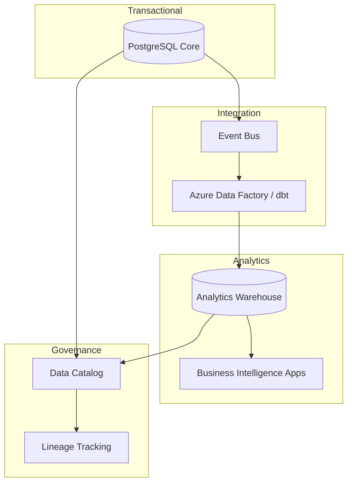

# AdvisorOS Data Platform Guide

> [!TIP]
> Use this guide to translate data stewardship into a differentiator—giving advisors intelligence with confidence and compliance teams calm certainty.

## Overview

| Field | Guidance |
| --- | --- |
| **Purpose** | Document the core relational schema, operational data flows, and governance controls behind AdvisorOS. |
| **Audience** | Data engineers, analytics leaders, solution architects, and compliance partners versed in SQL, ETL/ELT, and data governance tooling. |
| **Context** | Covers transactional stores, analytics layers, and supporting services required to keep advisory insights timely and trusted. |

> [!NOTE]
> Our data layer is the silent partner that lets every advisor bring the right insight to the right client at the right time.

## Business Value & ROI

| Outcome | Narrative | Leading Indicators |
| --- | --- | --- |
| Revenue / Growth | Activate cross-sell intelligence and premium analytics products. | Uptake of data-driven playbooks, analytics subscription revenue |
| Efficiency | Automate reconciliations and reporting, reducing manual spreadsheet effort. | Hours saved per reporting cycle, automated report coverage |
| Risk & Trust | Enforce data lineage, quality, and retention policies demanded by regulators. | Data quality score, number of policy exceptions |

> [!IMPORTANT]
> - Finance teams leverage trusted datasets to package higher-margin advisory insights.
> - Operations eliminate manual reconciliations by leaning into curated, automation-ready tables.
> - Compliance maintains provable lineage and retention across every client record.

## Key Connectors/Dependencies

- **AdvisorOS Modules**
  - _Application Services_ — Microservices publish domain events processed into the warehouse; align with [ARCHITECTURE.md](ARCHITECTURE.md#implementation-guidance).
  - _Deployment Automation_ — Database migrations run via `npm run db:migrate`; see [DEPLOYMENT.md](DEPLOYMENT.md#implementation-guidance).
  - _Analytics Consumers_ — Dashboards and reporting apps reference curated marts described in [FEATURES.md](FEATURES.md#analytics-and-insights).
- **External Services**
  - _Azure PostgreSQL Flexible Server_ — Primary transactional store with high availability.
  - _Azure Data Factory / dbt_ — ELT pipelines transforming events into dimensional models.
  - _Azure Blob Storage_ — Landing zone for document metadata and large datasets.
- **Operational Readiness Checklist**
  - [ ] Backups executed (hourly WAL, nightly full) and verified via [`scripts/db-backup.sh`](../scripts/db-backup.sh).
  - [ ] Data retention schedule approved (reference [SECURITY_COMPLIANCE_REPORT.md](../SECURITY_COMPLIANCE_REPORT.md)).
  - [ ] Access reviews completed with principle of least privilege in Azure AD groups.

## Implementation Guidance

> [!TIP]
> Start with the schema overview, then expand into lifecycle management and analytics enablement using the collapsible tracks below.

### Architecture Snapshot

### Schema Overview

<strong>Core Entities</strong> — Understand the tables that drive AdvisorOS

| Table | Description | Key Fields |
| --- | --- | --- |
| `clients` | Primary client record with demographic and relationship data. | `id`, `advisor_id`, `lifecycle_stage`, `created_at` |
| `engagements` | Tracks advisory mandates and contractual details. | `id`, `client_id`, `service_tier`, `status`, `start_date` |
| `documents` | Stores metadata and classification for uploaded content. | `id`, `client_id`, `category`, `classification_score`, `stored_url` |
| `billing_invoices` | Records invoice generation and settlement state. | `id`, `engagement_id`, `stripe_invoice_id`, `amount`, `status` |

<strong>Reference Data</strong> — Keep taxonomy aligned across the platform

- Enumerations (`service_tier`, `document_category`) synchronized via migrations.
- Lookup tables maintained through [`database-test-report.json`](../database-test-report.json) validations.
- Change requests governed by the data council; log updates in [`docs/architecture/adrs`](architecture/adrs/).

### Lifecycle Management

<strong>Migrations</strong> — Ship schema updates responsibly

1. Author migrations using Prisma or SQL migrations stored under `packages/database`.
2. Test locally with `npm run db:migrate` followed by `npm run db:seed` when required.
3. Promote via deployment pipeline; monitor logs using [`scripts/database/production-migration.sql`](../scripts/database/production-migration.sql) as reference for rollout order.

<strong>Data Quality</strong> — Safeguard trust in analytics

- Schedule validation scripts (see [`database-test-report.json`](../database-test-report.json)) as part of CI.
- Use `test-database-connection.js` for connection health checks across environments.
- Publish quality dashboards summarizing null rates, freshness, and anomaly detection.

### Analytics Enablement

<strong>Warehouse Modeling</strong> — Turn raw events into decision-ready views

- Stage tables by mirroring event payloads (landing schema).
- Transform into dimensional models (star schema) powering revenue, efficiency, and risk dashboards.
- Document metrics with clear lineage in the data catalog and expose via Looker or Power BI.

<strong>Access & Governance</strong> — Balance openness with control

- Provision reader vs. analyst roles through Azure AD groups.
- Apply row-level security for multi-tenant datasets.
- Audit queries using pgAudit extensions and log anomalies into the security monitoring stack.

### Quality Gates & Monitoring
- **Alerting** — Configure PgBouncer, replication lag, and storage threshold alerts.
- **Usage Analytics** — Track query performance and warehouse cost-to-serve metrics.
- **Data Catalog** — Update lineage and stewardship metadata after every schema change.

## Future Enhancements

| Theme | Description | Owner / ETA |
| --- | --- | --- |
| Optimization | Introduce automatic partitioning and tiered storage for historical data. | Data Engineering / Q3 |
| Innovation | Deploy AI-assisted anomaly detection for advisory KPIs. | Data Science / Pilot in Q4 |
| Risk Mitigation | Expand immutable backup strategy with cross-region replicas. | Infrastructure & Security / In Planning |

> [!CAUTION]
> Advancing these initiatives requires budget alignment for storage growth and close partnership with compliance to refresh retention policies.

## Cross-References

- [ARCHITECTURE.md](ARCHITECTURE.md) — Understand how services interact with the data platform.
- [DEPLOYMENT.md](DEPLOYMENT.md) — Coordinate schema releases with infrastructure changes.
- [INTEGRATION_GUIDES.md](INTEGRATION_GUIDES.md) — Align external data feeds with approved ingestion practices.
- [SECURITY_COMPLIANCE_REPORT.md](../SECURITY_COMPLIANCE_REPORT.md) — Confirm policy obligations tied to data stewardship.
