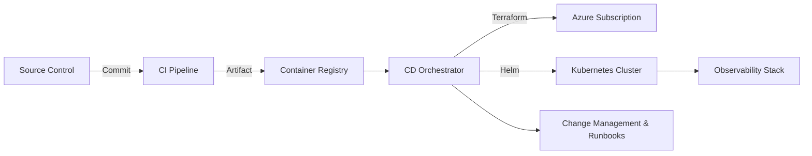

# AdvisorOS Deployment Playbook

> [!TIP]
> Lean on this playbook to keep every release feeling like a concierge experience for stakeholders while preserving rigorous controls.

## Overview

| Field | Guidance |
| --- | --- |
| **Purpose** | Provide a prescriptive, automation-friendly guide for deploying AdvisorOS across environments. |
| **Audience** | DevOps engineers, site reliability teams, implementation partners, and program leads familiar with infrastructure-as-code, CI/CD, and cloud governance. |
| **Context** | Supports multi-environment delivery (sandbox, staging, production) with zero-downtime expectations and regulator-ready change management. |

> [!NOTE]
> Our deployment motion mirrors the poise of our advisory engagements—confident, transparent, and ready for executive review at any moment.

## Business Value & ROI

| Outcome | Narrative | Leading Indicators |
| --- | --- | --- |
| Revenue / Growth | Accelerate feature velocity so advisory teams can launch offerings on schedule. | Releases per quarter, feature lead time |
| Efficiency | Automate infrastructure rollouts and validation to shrink manual effort. | Deployment labor hours saved, automation coverage |
| Risk & Trust | Embed compliance and rollback patterns to satisfy audit and continuity mandates. | Change success rate, number of unplanned rollbacks |

> [!IMPORTANT]
> - Finance can attribute reduced change windows to improved revenue capture.
> - Operations showcase automation-driven labor savings and fewer overnight fire drills.
> - Compliance highlights end-to-end traceability for every release decision.

## Key Connectors/Dependencies

- **AdvisorOS Modules**
  - _Infrastructure as Code_ — Terraform stacks stored in [`infrastructure/`](../infrastructure/) orchestrate core services and networking.
  - _Application Services_ — Node.js services sourced from `packages/` deploy via container images defined in [`docker-compose.yml`](../docker-compose.yml).
  - _Data Stores_ — PostgreSQL and Redis initialization scripts located in [`scripts/database/`](../scripts/database/).
- **External Services**
  - _Cloud Provider_ — Azure subscription with RBAC-aligned service principals.
  - _CI/CD Platform_ — GitHub Actions workflows orchestrating build, test, and release gates.
  - _Secrets Management_ — Azure Key Vault or HashiCorp Vault integrated via GitHub OIDC.
- **Operational Readiness Checklist**
  - [ ] Change request logged in the enterprise ITSM platform with executive visibility.
  - [ ] Backups validated using [`scripts/db-backup.sh`](../scripts/db-backup.sh) and restore tested via [`scripts/db-restore.sh`](../scripts/db-restore.sh).
  - [ ] Observability endpoints confirmed (Grafana dashboards, PagerDuty services) per [operations/DEPLOYMENT_GUIDE.md](operations/DEPLOYMENT_GUIDE.md#observability).

## Implementation Guidance

> [!TIP]
> Navigate the release journey in three acts—prepare, deploy, validate—using the expandable tracks below.

### Architecture Snapshot

### Step-by-Step Playbooks

<strong>Act I — Prepare</strong> — Set the stage for a reliable release

1. **Branch Hygiene** — Ensure feature branches are rebased on `main` and pass quality checks (`npm run lint`, `npm run build`).
2. **Configuration Review** — Validate environment manifests in [`apps`](../apps) via `npm run format` (dry run) and peer review secrets.
3. **Dry Run** — Execute `terraform plan` from [`infrastructure/`](../infrastructure/) targeting the destination workspace.

<strong>Act II — Deploy</strong> — Execute with precision

1. **Trigger Pipeline** — Tag the release; GitHub Actions workflow `deploy.yml` packages containers and applies Terraform.
2. **Database Migration** — Apply schema changes with `npm run db:migrate` (wraps the platform migration engine with transactional safety).
3. **Feature Flags** — Use the admin console to stage new features off by default; follow the toggles documented in [FEATURES.md](FEATURES.md#feature-flags).

<strong>Act III — Validate</strong> — Confirm the experience feels effortless

1. **Smoke Tests** — Run `npm run build` followed by targeted scenario validation using [`test-integrations.js`](../test-integrations.js).
2. **Observability Sweep** — Confirm healthy metrics and zero alerts via Grafana dashboards linked in [operations/DEPLOYMENT_GUIDE.md](operations/DEPLOYMENT_GUIDE.md#dashboards).
3. **Stakeholder Playback** — Capture executive sign-off in the deployment record; note any follow-up actions in [POST_LAUNCH_SUPPORT_OPTIMIZATION.md](../POST_LAUNCH_SUPPORT_OPTIMIZATION.md).

### Quality Gates & Monitoring
- **Pre-Flight Checklist** — Use GitHub issue templates under [`docs/operations`](operations/) to certify readiness.
- **Rollbacks** — Follow [PRODUCTION_ROLLBACK_PROCEDURES.md](../PRODUCTION_ROLLBACK_PROCEDURES.md) for controlled reversions.
- **Runtime Metrics** — Monitor Apdex, error rate, and cost-to-serve dashboards as described in [COST_OPTIMIZATION_STRATEGY.md](../COST_OPTIMIZATION_STRATEGY.md).

## Future Enhancements

| Theme | Description | Owner / ETA |
| --- | --- | --- |
| Optimization | Expand canary automation with progressive delivery (Argo Rollouts). | Platform Engineering / Q2 |
| Innovation | Introduce predictive scaling using ML signals from advisory workload forecasts. | Data Science / Pilot in Q3 |
| Risk Mitigation | Implement continuous compliance drift detection aligned with SOC 2 controls. | Security & Compliance / In Flight |

> [!CAUTION]
> These improvements require incremental investment in pipeline observability and executive sponsorship for change governance updates.

## Cross-References

- [operations/DEPLOYMENT_GUIDE.md](operations/DEPLOYMENT_GUIDE.md) — Day-of deployment runbook and observability maps.
- [DATABASE.md](DATABASE.md) — Coordinate migration timing and data validation steps.
- [ARCHITECTURE.md](ARCHITECTURE.md) — Ensure infrastructure aligns with the target state design.
- [PRODUCTION_READINESS_CHECKLIST.md](../PRODUCTION_READINESS_CHECKLIST.md) — Validate readiness gates before go-live.
