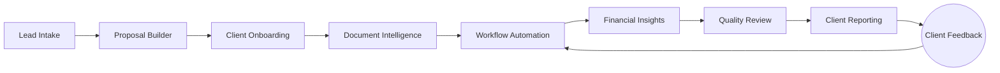

# Product Capability Map

> [!SUMMARY]
> Use this page as the briefing deck for demos, roadmap discussions, and enablement. It distills the platform pillars, highlights where AdvisorOS wins, and links straight into the deeper specs that live in this repo.

## Capability Pillars

| Pillar | What to Spotlight | Proof Points |
| --- | --- | --- |
| Client Experience | Unified client workspace, secure messaging, branded portal | [Client Portal Guide](CLIENT_PORTAL_GUIDE.md), [User Guide](USER_GUIDE_COMPREHENSIVE.md) |
| Operational Automation | Workflow templates, task routing, SLA monitoring | [CPA Workflow Optimization](../CPA_WORKFLOW_OPTIMIZATION_SUMMARY.md), [Testing Automation Framework](../TESTING_AUTOMATION_FRAMEWORK.md) |
| Financial Intelligence | Real-time dashboards, anomaly detection, scenario planning | [Financial Analytics Implementation](../FINANCIAL_ANALYTICS_IMPLEMENTATION.md), [Revenue Intelligence System](../REVENUE_INTELLIGENCE_SYSTEM.md) |
| Compliance & Trust | Role-based access, audit trails, encryption posture | [Comprehensive Security Audit](../COMPREHENSIVE_SECURITY_AUDIT_REPORT.md), [Security Compliance Report](../SECURITY_COMPLIANCE_REPORT.md) |
| Integration & Extensibility | QuickBooks sync, API toolkit, data export | [Integration Guides](INTEGRATION_GUIDES.md), [API Reference](API_REFERENCE.md) |

## Adoption Lens

- **Who benefits first?** Start with firms drowning in email + spreadsheets. The [Market Intelligence Analysis](../COMPREHENSIVE_MARKET_INTELLIGENCE_ANALYSIS.md) surfaces the trigger events.
- **What metrics move?** Track automation coverage, cycle time, and client NPS using the [Success Metrics Framework](../PRODUCTION_SUCCESS_METRICS_FRAMEWORK.md).
- **Where to focus enablement?** Pull enablement checkpoints from the [Implementation Runbook](README_USER.md) and align them with each capability pillar above.

## Automation Flow

Use this map during demos to narrate how AdvisorOS eliminates swivel-chair work. Each node lines up with a deeper dive section below.

## Demo Storyline

1. Open on the **Executive Dashboard** (see [Financial Analytics Dashboard](../REVENUE_INTELLIGENCE_SYSTEM.md)) and highlight automation coverage.
2. Jump into a **Client Workspace** to demonstrate collaborative document review using the [Document Management](#document-management) features.
3. Showcase **Workflow Automation** with SLA tracking from the [Task Management](#task-management) section.
4. Close with the **Compliance cockpit**, referencing audit trails and encryption from [Security and Compliance](#security-and-compliance).

---
## Core Platform Features

### Multi-Tenant Architecture
- **Organization Isolation**: Complete data separation between firms
- **Subdomain Routing**: Custom URLs for each organization
- **Scalable Infrastructure**: Auto-scaling based on usage
- **Role-Based Access**: Granular permission controls
- **White-Label Options**: Custom branding and themes

### Modern Technology Stack
- **Next.js 15**: Latest React framework with app router
- **TypeScript**: Type-safe development environment
- **Prisma ORM**: Type-safe database operations
- **PostgreSQL**: Robust relational database
- **Azure Cloud**: Enterprise-grade cloud infrastructure

### User Experience
- **Responsive Design**: Works on all devices and screen sizes
- **Dark/Light Themes**: User preference customization
- **Intuitive Navigation**: Easy-to-use interface design
- **Fast Performance**: Optimized loading and response times
- **Accessibility**: WCAG 2.1 AA compliance

---

## Client Management

### Comprehensive Client Profiles
- **Business Information**: Complete business details and structure
- **Contact Management**: Multiple contacts per client with roles
- **Financial Overview**: Real-time financial data and metrics
- **Service History**: Complete engagement and service records
- **Custom Fields**: Flexible data storage for unique requirements

### Client Portal Access
- **Secure Login**: Multi-factor authentication support
- **Document Sharing**: Secure file exchange capabilities
- **Real-Time Updates**: Live status updates on work progress
- **Mobile Access**: Full mobile app functionality
- **Communication Hub**: Direct messaging with CPA team

### Client Categorization
- **Business Types**: LLC, Corporation, Partnership, Sole Proprietorship
- **Industry Classification**: Comprehensive industry categories
- **Risk Assessment**: Automated risk level calculations
- **Service Tiers**: Different service levels and pricing
- **Status Management**: Active, prospect, inactive classifications

### Relationship Management
- **Communication History**: Complete interaction timeline
- **Meeting Scheduling**: Integrated calendar management
- **Follow-up Tracking**: Automated reminder systems
- **Referral Tracking**: Source attribution and management
- **Satisfaction Monitoring**: Client feedback and ratings

---

## Document Management

### Advanced Upload System
- **Drag-and-Drop Interface**: Easy bulk file uploads
- **Smart Categorization**: AI-powered document classification
- **Batch Processing**: Handle multiple files simultaneously
- **Progress Tracking**: Real-time upload status monitoring
- **Error Handling**: Robust error recovery and reporting

### OCR and Data Extraction
- **Intelligent OCR**: Advanced optical character recognition
- **Form Recognition**: Specialized tax form processing
- **Data Validation**: Automated accuracy checking
- **Confidence Scoring**: Quality assessment for extracted data
- **Manual Review**: Human verification for low-confidence items

### Document Organization
- **Hierarchical Folders**: Flexible folder structure
- **Smart Search**: Full-text search across all documents
- **Advanced Filtering**: Multiple filter criteria support
- **Tagging System**: Custom tags for categorization
- **Version Control**: Complete revision history tracking

### Security and Compliance
- **Encryption**: AES-256 encryption at rest and in transit
- **Access Controls**: Role-based document permissions
- **Audit Trails**: Complete access and modification logs
- **Retention Policies**: Automated archiving and deletion
- **Compliance**: SOX, GDPR, and industry standard compliance

### Document Processing
- **Automated Workflows**: Trigger actions based on document type
- **Quality Assurance**: Multi-level review processes
- **Integration**: Connect to accounting and tax software
- **Notifications**: Real-time alerts for important documents
- **Approval Workflows**: Structured review and sign-off processes

---

## Financial Management

### Real-Time Financial Dashboard
- **Interactive Charts**: Powered by Tremor UI components
- **Key Metrics**: Customizable KPI displays
- **Trend Analysis**: Historical and predictive analytics
- **Drill-Down Capability**: Detailed transaction exploration
- **Export Options**: Data export in multiple formats

### QuickBooks Integration
- **Bi-Directional Sync**: Real-time data synchronization
- **Chart of Accounts**: Complete account structure import
- **Transaction History**: Full transaction detail access
- **Report Generation**: Native QuickBooks report access
- **Error Handling**: Robust sync error management

### Financial Reporting
- **Standard Reports**: P&L, Balance Sheet, Cash Flow
- **Custom Reports**: Flexible report builder
- **Comparative Analysis**: Period-over-period comparisons
- **Variance Reports**: Budget vs. actual analysis
- **Consolidated Reporting**: Multi-entity consolidation

### Accounts Management
- **Receivables Tracking**: Invoice aging and collection
- **Payables Management**: Bill payment scheduling
- **Cash Flow Forecasting**: Predictive cash flow analysis
- **Budget Management**: Budget creation and monitoring
- **Cost Center Analysis**: Department and project tracking

---

## Workflow Automation

### Workflow Designer
- **Visual Builder**: Drag-and-drop workflow creation
- **Template Library**: Pre-built workflow templates
- **Conditional Logic**: Smart branching and decision points
- **Integration Points**: Connect with external systems
- **Testing Tools**: Workflow validation and testing

### Task Management
- **Automated Task Creation**: Workflow-driven task generation
- **Assignment Rules**: Intelligent task assignment
- **Dependency Management**: Task sequencing and prerequisites
- **Progress Tracking**: Real-time completion monitoring
- **Escalation Rules**: Automated deadline management

### Business Process Automation
- **Client Onboarding**: Automated new client setup
- **Tax Season Workflows**: Streamlined tax preparation
- **Monthly Closing**: Automated month-end procedures
- **Compliance Tracking**: Regulatory deadline management
- **Document Processing**: Automated document workflows

### Workflow Templates
- **Industry-Specific**: Templates for different industries
- **Service-Based**: Templates for specific services
- **Customizable**: Modify templates to fit unique needs
- **Versioning**: Template version control and updates
- **Sharing**: Share templates across organization

---

## Reporting and Analytics

### Interactive Dashboards
- **Customizable Widgets**: Drag-and-drop dashboard builder
- **Real-Time Data**: Live data updates and refreshing
- **Responsive Design**: Optimized for all screen sizes
- **Export Capabilities**: PDF, Excel, and image exports
- **Sharing Options**: Secure dashboard sharing

### Report Builder
- **Visual Report Designer**: No-code report creation
- **Data Source Integration**: Multiple data source support
- **Chart Library**: Comprehensive visualization options
- **Formatting Tools**: Professional report formatting
- **Template System**: Reusable report templates

### Scheduled Reporting
- **Automated Delivery**: Email and portal delivery
- **Flexible Scheduling**: Custom frequency options
- **Recipient Management**: Targeted delivery lists
- **Format Options**: Multiple output formats
- **Delivery Tracking**: Confirmation and status tracking

### Analytics Engine
- **Predictive Analytics**: Machine learning insights
- **Trend Analysis**: Historical pattern recognition
- **Performance Metrics**: KPI tracking and analysis
- **Benchmarking**: Industry comparison capabilities
- **Alerts System**: Automated threshold monitoring

---

## Integration Capabilities

### Accounting Software
- **QuickBooks Online/Desktop**: Full bidirectional sync
- **Xero**: Complete integration support
- **Sage**: Data import and export capabilities
- **Generic Imports**: CSV and Excel import tools
- **API Connections**: Custom integration development

### Third-Party Services
- **Stripe Integration**: Payment processing and billing
- **Azure Services**: Cloud storage and AI capabilities
- **Email Providers**: SMTP and email service integration
- **Calendar Systems**: Meeting and deadline synchronization
- **CRM Systems**: Customer relationship management

### API Framework
- **RESTful APIs**: Standard REST API endpoints
- **GraphQL Support**: Flexible data querying
- **Webhook System**: Real-time event notifications
- **Rate Limiting**: API usage control and monitoring
- **Documentation**: Comprehensive API documentation

### Data Exchange
- **Import/Export**: Bulk data transfer capabilities
- **Format Support**: Multiple file format handling
- **Data Mapping**: Flexible field mapping tools
- **Validation Rules**: Data quality assurance
- **Error Handling**: Robust error management

---

## Security and Compliance

### Data Security
- **Encryption**: AES-256 encryption throughout
- **Secure Transmission**: TLS 1.3 for all communications
- **Key Management**: Enterprise key management system
- **Data Backups**: Automated and encrypted backups
- **Disaster Recovery**: Comprehensive recovery procedures

### Access Control
- **Multi-Factor Authentication**: TOTP and SMS support
- **Single Sign-On**: SAML and OAuth integration
- **Role-Based Permissions**: Granular access controls
- **Session Management**: Secure session handling
- **IP Restrictions**: Geographic and IP-based access controls

### Compliance Framework
- **SOC 2 Type II**: Audited security controls
- **GDPR Compliance**: European data protection standards
- **HIPAA Ready**: Healthcare information protection
- **PCI Compliance**: Payment card industry standards
- **Professional Standards**: CPA and accounting firm requirements

### Audit and Monitoring
- **Comprehensive Logging**: All system activity tracking
- **Real-Time Monitoring**: 24/7 security monitoring
- **Intrusion Detection**: Advanced threat detection
- **Compliance Reporting**: Automated compliance reports
- **Incident Response**: Structured incident management

---

## Collaboration Tools

### Team Communication
- **Internal Messaging**: Secure team communication
- **Client Communication**: Portal-based client messaging
- **File Sharing**: Secure document sharing
- **Video Conferencing**: Integrated meeting capabilities
- **Discussion Threads**: Organized conversation tracking

### Document Collaboration
- **Real-Time Editing**: Collaborative document editing
- **Comment System**: Document annotation and discussion
- **Version Control**: Track changes and revisions
- **Approval Workflows**: Structured review processes
- **Change Notifications**: Real-time update alerts

### Project Management
- **Team Assignments**: Multi-user task assignment
- **Progress Tracking**: Visual progress indicators
- **Milestone Management**: Project milestone tracking
- **Resource Planning**: Team capacity management
- **Time Tracking**: Detailed time and billing tracking

### Knowledge Management
- **Document Library**: Centralized knowledge base
- **Best Practices**: Shared procedures and guidelines
- **Training Materials**: Integrated training resources
- **Search Capabilities**: Powerful knowledge search
- **Template Sharing**: Reusable template library

---

## AI and Automation

### Machine Learning Features
- **Document Classification**: Intelligent document categorization
- **Data Extraction**: Advanced OCR and form recognition
- **Anomaly Detection**: Unusual transaction identification
- **Predictive Analytics**: Future trend predictions
- **Natural Language Processing**: Text analysis and understanding

### Intelligent Automation
- **Smart Routing**: Automated task and document routing
- **Exception Handling**: Intelligent error resolution
- **Quality Assurance**: Automated quality checking
- **Process Optimization**: Workflow efficiency improvements
- **Decision Support**: AI-powered recommendations

### Cognitive Services
- **Text Analytics**: Sentiment and key phrase extraction
- **Computer Vision**: Image and document analysis
- **Language Detection**: Multi-language support
- **Content Moderation**: Automated content screening
- **Custom Models**: Organization-specific AI training

### Robotic Process Automation
- **Data Entry Automation**: Reduce manual data input
- **Report Generation**: Automated report creation
- **Compliance Checking**: Automated compliance verification
- **Workflow Triggers**: Smart workflow initiation
- **Integration Automation**: Seamless system connections

---

## Mobile and Accessibility

### Mobile Applications
- **Native iOS App**: Full-featured iPhone and iPad app
- **Native Android App**: Complete Android functionality
- **Progressive Web App**: Browser-based mobile experience
- **Offline Capabilities**: Limited offline functionality
- **Push Notifications**: Real-time mobile alerts

### Mobile Features
- **Document Camera**: High-quality document scanning
- **Voice Notes**: Audio recording and transcription
- **GPS Integration**: Location-based features
- **Biometric Login**: Fingerprint and face recognition
- **Mobile Workflows**: Touch-optimized task management

### Accessibility
- **WCAG 2.1 AA**: Web Content Accessibility Guidelines
- **Screen Reader Support**: Compatible with assistive technologies
- **Keyboard Navigation**: Full keyboard accessibility
- **High Contrast**: Visual accessibility options
- **Font Scaling**: Adjustable text sizing

### Responsive Design
- **Mobile-First**: Optimized for mobile devices
- **Tablet Support**: Enhanced tablet experience
- **Desktop Optimization**: Full desktop functionality
- **Cross-Browser**: Compatible with all major browsers
- **Performance**: Optimized loading and response times

---

## Administration

### Organization Management
- **Multi-Organization**: Support for multiple firms
- **Branding Customization**: Logo and theme customization
- **Subscription Management**: Plan and billing administration
- **Usage Analytics**: Organization usage tracking
- **Feature Configuration**: Enable/disable features

### User Administration
- **User Lifecycle**: Complete user management
- **Role Management**: Custom role creation and assignment
- **Permission Controls**: Granular permission settings
- **Bulk Operations**: Mass user operations
- **Activity Monitoring**: User activity tracking

### System Configuration
- **Environment Management**: Development, staging, production
- **Feature Flags**: Gradual feature rollout
- **Performance Tuning**: System optimization tools
- **Monitoring Dashboard**: System health monitoring
- **Backup Management**: Automated backup configuration

### Maintenance Tools
- **Database Management**: Query tools and optimization
- **Log Analysis**: System log analysis tools
- **Performance Metrics**: Detailed performance tracking
- **Health Checks**: Automated system health verification
- **Update Management**: Controlled system updates

---

## Subscription Tiers

### Trial Plan (14 days)
- ✅ Up to 5 users
- ✅ Basic client management
- ✅ Document upload (1GB storage)
- ✅ Standard reports
- ✅ Email support

### Starter Plan
- ✅ Up to 10 users
- ✅ Full client management
- ✅ Document management (10GB storage)
- ✅ QuickBooks integration
- ✅ Basic workflows
- ✅ Standard reports
- ✅ Email and chat support

### Professional Plan
- ✅ Up to 50 users
- ✅ Advanced workflows
- ✅ Document management (100GB storage)
- ✅ Custom reporting
- ✅ API access
- ✅ Advanced integrations
- ✅ Priority support
- ✅ Training sessions

### Enterprise Plan
- ✅ Unlimited users
- ✅ Custom workflows
- ✅ Unlimited storage
- ✅ Advanced analytics
- ✅ Custom integrations
- ✅ Dedicated support
- ✅ SLA guarantees
- ✅ On-site training

---

## Platform Benefits

### For CPA Firms
- **Efficiency**: 40% reduction in manual tasks
- **Accuracy**: 95% reduction in data entry errors
- **Client Satisfaction**: Improved client communication
- **Scalability**: Easy firm growth support
- **Compliance**: Automated compliance tracking

### For Clients
- **Transparency**: Real-time project visibility
- **Convenience**: 24/7 portal access
- **Security**: Bank-level data protection
- **Communication**: Direct CPA access
- **Efficiency**: Faster turnaround times

### Return on Investment
- **Time Savings**: Average 20 hours per week saved
- **Cost Reduction**: 30% reduction in operational costs
- **Revenue Growth**: 25% increase in billable hours
- **Client Retention**: 15% improvement in retention
- **Error Reduction**: 90% fewer compliance errors

---

*This comprehensive feature overview demonstrates the platform's capabilities. For detailed implementation guidance, refer to the technical documentation and setup guides.*
