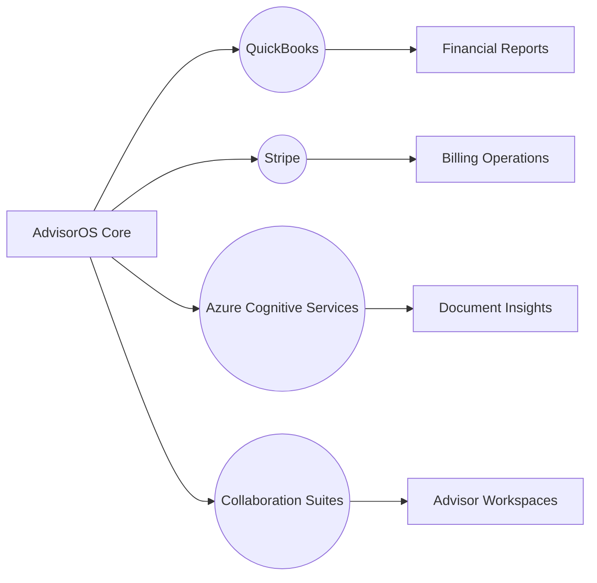

# AdvisorOS Integration Guides

> [!TIP]
> These guides are your concierge for weaving AdvisorOS into the broader advisory ecosystem with poise, predictability, and measurable upside.

## Overview

| Field | Guidance |
| --- | --- |
| **Purpose** | Curate end-to-end integration playbooks for accounting, billing, document intelligence, and collaboration partners. |
| **Audience** | Integration architects, partner engineers, business analysts, and engagement leads comfortable with REST, webhooks, and SaaS administration. |
| **Context** | Focuses on the connectors most critical to AdvisorOS revenue, efficiency, and compliance outcomes. |

> [!NOTE]
> Each integration is framed to help you articulate the "why" to stakeholders before you dive into the "how" with your delivery teams.

## Business Value & ROI

| Outcome | Narrative | Leading Indicators |
| --- | --- | --- |
| Revenue / Growth | Unlock bundled services and co-marketing motions with strategic partners. | Partner-sourced pipeline, upsell revenue tied to integrations |
| Efficiency | Automate data sync and eliminate duplicate entry across finance and operations. | Manual entry avoided, task cycle time |
| Risk & Trust | Maintain single source of truth and auditable data movement. | Integration incident rate, reconciliation effort |

> [!IMPORTANT]
> - Growth teams can speak to new advisory offerings launched with partner platforms.
> - Operations teams can spotlight time saved by eliminating swivel-chair tasks.
> - Compliance retains confidence thanks to deterministic data flows and audit trails.

## Key Connectors/Dependencies

- **AdvisorOS Modules**
  - _API Platform_ — Endpoints catalogued in [API_REFERENCE.md](API_REFERENCE.md) drive all integrations.
  - _Data Platform_ — Mirror data structures documented in [DATABASE.md](DATABASE.md) to ensure mapping fidelity.
  - _Deployment Pipeline_ — Coordinate release windows via [DEPLOYMENT.md](DEPLOYMENT.md) to minimize downtime.
- **External Services**
  - _QuickBooks Online_ — Accounting automation.
  - _Stripe Billing_ — Revenue operations.
  - _Azure Cognitive Services_ — Document intelligence.
  - _Microsoft 365 / Google Workspace_ — Calendar and collaboration sync.
- **Operational Readiness Checklist**
  - [ ] Partner contracts updated to cover data residency, SLAs, and incident response.
  - [ ] API credentials secured and rotated per [COMPREHENSIVE_SECURITY_AUDIT_REPORT.md](../COMPREHENSIVE_SECURITY_AUDIT_REPORT.md).
  - [ ] Support playbooks updated in [POST_LAUNCH_SUPPORT_OPTIMIZATION.md](../POST_LAUNCH_SUPPORT_OPTIMIZATION.md) with integration-specific flows.

## Implementation Guidance

> [!TIP]
> Expand each integration track below to reveal onboarding, validation, and troubleshooting details.

### Architecture Snapshot

### Integration Tracks

<strong>QuickBooks Online</strong> — Harmonize accounting flows

1. **Authorize** — Admin grants AdvisorOS access via OAuth 2.0; capture refresh token in secure vault.
2. **Configure** — Map chart of accounts to AdvisorOS engagement categories; see mapping table in [`integration-readiness-report.json`](../integration-readiness-report.json).
3. **Validate** — Run `node test-quickbooks-integration.js` to confirm invoice sync and error handling.
4. **Monitor** — Subscribe to webhook health alerts in the AdvisorOS admin console and log events alongside [FINANCIAL_ANALYTICS_IMPLEMENTATION.md](../FINANCIAL_ANALYTICS_IMPLEMENTATION.md) dashboards.

<strong>Stripe Billing</strong> — Orchestrate revenue operations

1. **Authorize** — Generate restricted API keys and configure webhook signing secrets.
2. **Configure** — Align product catalog and pricing with AdvisorOS service tiers; reference [`master-integration-report.json`](../master-integration-report.json).
3. **Validate** — Run `node test-integrations.js` and confirm Stripe checks report `PASS` status.
4. **Monitor** — Route Stripe alerts into PagerDuty per [operations/DEPLOYMENT_GUIDE.md](operations/DEPLOYMENT_GUIDE.md#observability).

<strong>Azure Cognitive Services</strong> — Elevate document intelligence

1. **Provision** — Deploy Form Recognizer resources in the target region; capture endpoint and key.
2. **Configure** — Map models to document categories in AdvisorOS; update AI model registry captured in [`integration-test-report.js`](../integration-test-report.js).
3. **Validate** — Use `node test-integrations.js` to confirm AI classification tests remain within expected confidence bands.
4. **Monitor** — Review inference metrics and error logs; align with governance in [ARCHITECTURE.md](ARCHITECTURE.md#implementation-guidance).

<strong>Collaboration Suites</strong> — Sync advisor workflows

1. **Authorize** — Configure OAuth consent for Microsoft 365 or Google Workspace with calendar scopes.
2. **Configure** — Map shared mailboxes and calendars to AdvisorOS engagement teams.
3. **Validate** — Trigger sample meeting syncs and review `node test-integrations.js` output to verify collaboration checks succeed.
4. **Monitor** — Update incident routing in [CLIENT_SUCCESS_SYSTEM.md](../CLIENT_SUCCESS_SYSTEM.md) to include collaboration connectors.

### Quality Gates & Monitoring
- **Automated Tests** — Execute [`verify-all-integrations.js`](../verify-all-integrations.js) pre-release.
- **Runbook Alignment** — Ensure integration-specific runbooks in [`docs/operations`](operations/) are current.
- **Analytics Feedback Loop** — Feed integration KPIs into revenue and efficiency dashboards maintained in [FEATURES.md](FEATURES.md#analytics-and-insights).

## Future Enhancements

| Theme | Description | Owner / ETA |
| --- | --- | --- |
| Optimization | Expand retry/backoff policies with adaptive throttling across connectors. | Integrations Team / Q2 |
| Innovation | Launch partner marketplace listings with guided provisioning flows. | Product Marketing & Alliances / Pilot in Q3 |
| Risk Mitigation | Automate incident correlation across integrations using centralized observability. | SRE & Support / In Roadmap |

> [!CAUTION]
> Prioritize partner communications and legal review before rolling out these enhancements to maintain trust and compliance.

## Cross-References

- [API_REFERENCE.md](API_REFERENCE.md) — Endpoint specifics powering each connector.
- [DEPLOYMENT.md](DEPLOYMENT.md) — Schedule integration releases within broader deployment windows.
- [DATABASE.md](DATABASE.md) — Confirm data mapping and governance requirements.
- [POST_LAUNCH_SUPPORT_OPTIMIZATION.md](../POST_LAUNCH_SUPPORT_OPTIMIZATION.md) — Align customer success motions post-integration.
