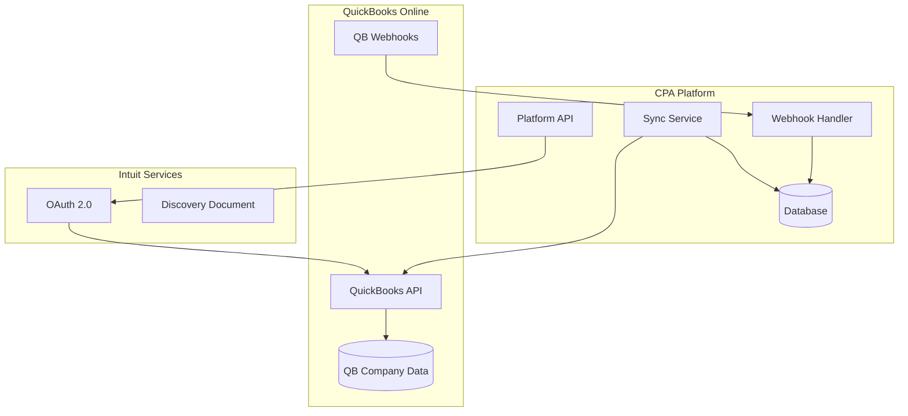

# QuickBooks Integration Setup Guide

## Table of Contents

1. [Overview](#overview)
2. [Prerequisites](#prerequisites)
3. [QuickBooks App Setup](#quickbooks-app-setup)
4. [Platform Configuration](#platform-configuration)
5. [Client Connection Process](#client-connection-process)
6. [Data Synchronization](#data-synchronization)
7. [Webhook Configuration](#webhook-configuration)
8. [Testing Integration](#testing-integration)
9. [Production Deployment](#production-deployment)
10. [Troubleshooting](#troubleshooting)
11. [Best Practices](#best-practices)
12. [Support and Resources](#support-and-resources)

---

## Overview

The CPA Platform integrates with QuickBooks Online using Intuit's OAuth 2.0 API to provide seamless synchronization of financial data. This integration allows CPAs to:

- Import client financial data automatically
- Sync chart of accounts, customers, and transactions
- Generate reports using real-time QuickBooks data
- Maintain data consistency between platforms

### Integration Features

- **Real-time Synchronization**: Automatic data sync with configurable frequency
- **Selective Sync**: Choose which data types and date ranges to synchronize
- **Webhook Support**: Real-time notifications of QuickBooks data changes
- **Error Handling**: Robust error handling with retry mechanisms
- **Audit Trail**: Complete logging of sync activities and data changes

### Architecture Overview



---

## Prerequisites

### Intuit Developer Account

1. **Create Intuit Developer Account**:
   - Visit [https://developer.intuit.com](https://developer.intuit.com)
   - Sign up for a developer account using your Intuit ID
   - Complete the developer profile setup

2. **Verify Your Account**:
   - Confirm your email address
   - Complete any required verification steps
   - Access the Intuit Developer Dashboard

### Technical Requirements

```bash
# Required software versions
Node.js: 18.x or higher
npm: 10.x or higher
OpenSSL: For SSL certificate generation (development)

# Required knowledge
OAuth 2.0 flow understanding
REST API development experience
Webhook handling concepts
```

### Platform Requirements

- Active CPA Platform deployment
- SSL certificate for webhook endpoints
- Database access for storing QuickBooks data
- Admin access to configure integration settings

---

## QuickBooks App Setup

### Create New App

1. **Access Developer Dashboard**:
   ```
   https://developer.intuit.com/app/developer/myapps
   ```

2. **Create New App**:
   - Click "Create an app"
   - Choose "QuickBooks Online and Payments"
   - Select appropriate scopes:
     - `com.intuit.quickbooks.accounting` (Required)
     - `com.intuit.quickbooks.payment` (If using payments)

3. **App Configuration**:
   ```yaml
   App Name: "CPA Platform Integration"
   App Description: "Professional accounting platform for CPA firms"
   App Logo: Upload your platform logo (recommended: 256x256 px)
   Website URL: "https://your-cpa-platform.com"
   ```

### Configure OAuth Settings

1. **Development Settings**:
   ```yaml
   Redirect URIs:
     - https://localhost:3000/api/auth/quickbooks/callback
     - https://your-domain.com/api/auth/quickbooks/callback

   Logout URL: https://your-domain.com/logout

   Webhooks URL: https://your-domain.com/api/webhooks/quickbooks
   ```

2. **Production Settings**:
   ```yaml
   Redirect URIs:
     - https://your-production-domain.com/api/auth/quickbooks/callback

   Logout URL: https://your-production-domain.com/logout

   Webhooks URL: https://your-production-domain.com/api/webhooks/quickbooks
   ```

### Obtain App Credentials

1. **Development Credentials**:
   ```bash
   # Navigate to App Keys & OAuth in your app settings
   Client ID: Your sandbox client ID
   Client Secret: Your sandbox client secret
   Environment: Sandbox
   Discovery Document: https://developer.api.intuit.com/.well-known/connect_uri_sandbox
   ```

2. **Production Credentials**:
   ```bash
   # Production keys (available after app review)
   Client ID: Your production client ID
   Client Secret: Your production client secret
   Environment: Production
   Discovery Document: https://developer.api.intuit.com/.well-known/connect_uri
   ```

### App Submission for Production

1. **Prepare for Review**:
   - Complete all required app information
   - Test thoroughly in sandbox environment
   - Prepare app review materials:
     - Demo video showing integration
     - Privacy policy URL
     - Terms of service URL
     - Support contact information

2. **Submit for Review**:
   - Click "Submit for Review" in developer dashboard
   - Provide detailed description of data usage
   - Wait for Intuit's approval (typically 5-10 business days)

---

## Platform Configuration

### Environment Variables

```bash
# Add to your .env.local (development) or production environment
QUICKBOOKS_CLIENT_ID=your_sandbox_client_id
QUICKBOOKS_CLIENT_SECRET=your_sandbox_client_secret
QUICKBOOKS_ENVIRONMENT=sandbox
QUICKBOOKS_DISCOVERY_DOCUMENT=https://developer.api.intuit.com/.well-known/connect_uri_sandbox

# Production
QUICKBOOKS_CLIENT_ID=your_production_client_id
QUICKBOOKS_CLIENT_SECRET=your_production_client_secret
QUICKBOOKS_ENVIRONMENT=production
QUICKBOOKS_DISCOVERY_DOCUMENT=https://developer.api.intuit.com/.well-known/connect_uri

# Webhook configuration
QUICKBOOKS_WEBHOOK_VERIFIER_TOKEN=your_webhook_verifier_token
```

### Database Schema Updates

The platform includes QuickBooks-specific database tables. Ensure they're properly migrated:

```bash
# Run database migrations
npx prisma migrate deploy

# Verify QuickBooks tables exist
npx prisma studio
# Check for: quickbooks_tokens, quickbooks_syncs, quickbooks_webhook_events
```

### Service Configuration

1. **QuickBooks Service Configuration**:
   ```typescript
   // lib/services/quickbooks.service.ts
   const config = {
     sandbox: {
       discoveryDocument: 'https://developer.api.intuit.com/.well-known/connect_uri_sandbox',
       baseUrl: 'https://sandbox-quickbooks.api.intuit.com'
     },
     production: {
       discoveryDocument: 'https://developer.api.intuit.com/.well-known/connect_uri',
       baseUrl: 'https://quickbooks.api.intuit.com'
     }
   };
   ```

2. **OAuth Configuration**:
   ```typescript
   // lib/auth/quickbooks-oauth.ts
   const oauthConfig = {
     client_id: process.env.QUICKBOOKS_CLIENT_ID,
     client_secret: process.env.QUICKBOOKS_CLIENT_SECRET,
     redirect_uri: `${process.env.NEXTAUTH_URL}/api/auth/quickbooks/callback`,
     scope: 'com.intuit.quickbooks.accounting',
     state: generateRandomState(), // CSRF protection
   };
   ```

---

## Client Connection Process

### OAuth Flow Implementation

1. **Initiate Connection**:
   ```typescript
   // app/api/quickbooks/connect/route.ts
   import { NextRequest, NextResponse } from 'next/server';
   import { generateAuthUrl } from '@/lib/services/quickbooks-oauth.service';

   export async function POST(request: NextRequest) {
     try {
       const { organizationId } = await request.json();

       const authUrl = await generateAuthUrl({
         organizationId,
         scope: 'com.intuit.quickbooks.accounting',
         state: generateSecureState(organizationId)
       });

       return NextResponse.json({ authUrl });
     } catch (error) {
       return NextResponse.json(
         { error: 'Failed to generate auth URL' },
         { status: 500 }
       );
     }
   }
   ```

2. **Handle OAuth Callback**:
   ```typescript
   // app/api/auth/quickbooks/callback/route.ts
   export async function GET(request: NextRequest) {
     const { searchParams } = new URL(request.url);
     const code = searchParams.get('code');
     const state = searchParams.get('state');
     const realmId = searchParams.get('realmId');

     try {
       // Verify state parameter
       const { organizationId } = verifyState(state);

       // Exchange code for tokens
       const tokens = await exchangeCodeForTokens(code, realmId);

       // Store tokens securely
       await storeQuickBooksTokens(organizationId, tokens, realmId);

       // Trigger initial sync
       await initiateInitialSync(organizationId);

       return NextResponse.redirect('/settings/integrations?status=connected');
     } catch (error) {
       return NextResponse.redirect('/settings/integrations?status=error');
     }
   }
   ```

### Token Management

1. **Store Tokens Securely**:
   ```typescript
   async function storeQuickBooksTokens(
     organizationId: string,
     tokens: TokenResponse,
     realmId: string
   ) {
     const encryptedAccessToken = await encrypt(tokens.access_token);
     const encryptedRefreshToken = await encrypt(tokens.refresh_token);

     await prisma.quickBooksToken.upsert({
       where: { organizationId },
       create: {
         organizationId,
         accessToken: encryptedAccessToken,
         refreshToken: encryptedRefreshToken,
         realmId,
         expiresAt: new Date(Date.now() + tokens.expires_in * 1000),
         isActive: true
       },
       update: {
         accessToken: encryptedAccessToken,
         refreshToken: encryptedRefreshToken,
         expiresAt: new Date(Date.now() + tokens.expires_in * 1000),
         isActive: true
       }
     });
   }
   ```

2. **Token Refresh**:
   ```typescript
   async function refreshTokenIfNeeded(organizationId: string) {
     const tokenRecord = await prisma.quickBooksToken.findUnique({
       where: { organizationId }
     });

     if (!tokenRecord || tokenRecord.expiresAt < new Date()) {
       const refreshedTokens = await refreshAccessToken(tokenRecord.refreshToken);
       await storeQuickBooksTokens(organizationId, refreshedTokens, tokenRecord.realmId);
       return refreshedTokens;
     }

     return {
       access_token: await decrypt(tokenRecord.accessToken),
       realm_id: tokenRecord.realmId
     };
   }
   ```

### User Interface Integration

1. **Connection Button Component**:
   ```tsx
   // components/integrations/QuickBooksConnectButton.tsx
   import { useState } from 'react';
   import { Button } from '@/components/ui/button';

   export function QuickBooksConnectButton({ organizationId }: { organizationId: string }) {
     const [isConnecting, setIsConnecting] = useState(false);

     const handleConnect = async () => {
       setIsConnecting(true);
       try {
         const response = await fetch('/api/quickbooks/connect', {
           method: 'POST',
           headers: { 'Content-Type': 'application/json' },
           body: JSON.stringify({ organizationId })
         });

         const { authUrl } = await response.json();
         window.location.href = authUrl;
       } catch (error) {
         console.error('Connection failed:', error);
         setIsConnecting(false);
       }
     };

     return (
       <Button
         onClick={handleConnect}
         disabled={isConnecting}
         className="bg-blue-600 hover:bg-blue-700"
       >
         {isConnecting ? 'Connecting...' : 'Connect to QuickBooks'}
       </Button>
     );
   }
   ```

2. **Connection Status Display**:
   ```tsx
   // components/integrations/QuickBooksStatus.tsx
   export function QuickBooksStatus({ organizationId }: { organizationId: string }) {
     const { data: status } = useSWR(
       `/api/quickbooks/status/${organizationId}`,
       fetcher
     );

     if (!status) return <div>Loading...</div>;

     return (
       <div className="space-y-4">
         <div className="flex items-center justify-between">
           <span>QuickBooks Connection</span>
           <Badge variant={status.isConnected ? 'success' : 'secondary'}>
             {status.isConnected ? 'Connected' : 'Not Connected'}
           </Badge>
         </div>

         {status.isConnected && (
           <div className="text-sm text-gray-600">
             <p>Company: {status.companyName}</p>
             <p>Last Sync: {formatDate(status.lastSyncAt)}</p>
             <p>Next Sync: {formatDate(status.nextSyncAt)}</p>
           </div>
         )}
       </div>
     );
   }
   ```

---

## Data Synchronization

### Sync Service Implementation

1. **Core Sync Service**:
   ```typescript
   // lib/services/quickbooks-sync.service.ts
   export class QuickBooksSyncService {
     private qbApi: QuickBooksAPIService;

     constructor() {
       this.qbApi = new QuickBooksAPIService();
     }

     async performSync(organizationId: string, options: SyncOptions = {}) {
       const syncRecord = await this.createSyncRecord(organizationId, options);

       try {
         await this.updateSyncStatus(syncRecord.id, 'in_progress');

         // Sync in priority order
         const results = await Promise.allSettled([
           this.syncCompanyInfo(organizationId),
           this.syncChartOfAccounts(organizationId),
           this.syncCustomers(organizationId),
           this.syncItems(organizationId),
           this.syncTransactions(organizationId, options.dateRange)
         ]);

         const summary = this.processSyncResults(results);
         await this.updateSyncStatus(syncRecord.id, 'completed', summary);

         return summary;
       } catch (error) {
         await this.updateSyncStatus(syncRecord.id, 'failed', { error: error.message });
         throw error;
       }
     }

     private async syncCustomers(organizationId: string) {
       const customers = await this.qbApi.getCustomers(organizationId);
       const processed = [];

       for (const customer of customers) {
         try {
           const clientData = this.mapCustomerToClient(customer);
           const client = await this.upsertClient(organizationId, clientData);
           processed.push({ id: customer.Id, status: 'success', clientId: client.id });
         } catch (error) {
           processed.push({ id: customer.Id, status: 'error', error: error.message });
         }
       }

       return processed;
     }

     private mapCustomerToClient(customer: any) {
       return {
         businessName: customer.Name,
         legalName: customer.CompanyName || customer.Name,
         primaryContactEmail: customer.PrimaryEmailAddr?.Address,
         primaryContactName: customer.PrimaryPhone?.FreeFormNumber,
         businessAddress: this.formatAddress(customer.BillAddr),
         quickbooksId: customer.Id,
         financialData: {
           balance: customer.Balance,
           creditLimit: customer.CreditLimit,
           taxable: customer.Taxable
         }
       };
     }
   }
   ```

2. **Incremental Sync**:
   ```typescript
   async function performIncrementalSync(organizationId: string) {
     const lastSync = await getLastSyncTimestamp(organizationId);
     const changedSince = lastSync || new Date(Date.now() - 30 * 24 * 60 * 60 * 1000); // 30 days ago

     const entities = ['Customer', 'Item', 'Account', 'Invoice', 'Payment'];

     for (const entity of entities) {
       const changes = await this.qbApi.getChangedEntities(
         organizationId,
         entity,
         changedSince
       );

       await this.processEntityChanges(organizationId, entity, changes);
     }

     await updateLastSyncTimestamp(organizationId, new Date());
   }
   ```

### Data Mapping

1. **Customer to Client Mapping**:
   ```typescript
   interface CustomerMapping {
     qbField: string;
     platformField: string;
     transform?: (value: any) => any;
   }

   const customerMappings: CustomerMapping[] = [
     { qbField: 'Name', platformField: 'businessName' },
     { qbField: 'CompanyName', platformField: 'legalName' },
     { qbField: 'PrimaryEmailAddr.Address', platformField: 'primaryContactEmail' },
     { qbField: 'PrimaryPhone.FreeFormNumber', platformField: 'primaryContactPhone' },
     {
       qbField: 'BillAddr',
       platformField: 'businessAddress',
       transform: (addr) => formatAddress(addr)
     }
   ];
   ```

2. **Chart of Accounts Mapping**:
   ```typescript
   const accountMappings = {
     'Asset': 'assets',
     'Liability': 'liabilities',
     'Equity': 'equity',
     'Income': 'revenue',
     'Expense': 'expenses',
     'Cost of Goods Sold': 'cogs'
   };

   function mapQBAccountType(qbType: string): string {
     return accountMappings[qbType] || 'other';
   }
   ```

### Sync Scheduling

1. **Automated Sync Jobs**:
   ```typescript
   // lib/jobs/quickbooks-sync.job.ts
   import cron from 'node-cron';

   // Daily sync at 2 AM
   cron.schedule('0 2 * * *', async () => {
     const organizations = await getOrganizationsWithQBIntegration();

     for (const org of organizations) {
       try {
         await performIncrementalSync(org.id);
       } catch (error) {
         console.error(`Sync failed for organization ${org.id}:`, error);
         await notifyAdmins(org.id, error);
       }
     }
   });

   // Hourly sync for high-priority organizations
   cron.schedule('0 * * * *', async () => {
     const priorityOrgs = await getPriorityOrganizations();

     for (const org of priorityOrgs) {
       await performIncrementalSync(org.id);
     }
   });
   ```

2. **Manual Sync Trigger**:
   ```typescript
   // app/api/quickbooks/sync/route.ts
   export async function POST(request: NextRequest) {
     const { organizationId, syncType = 'incremental' } = await request.json();

     try {
       const syncJob = await queueSyncJob(organizationId, syncType);

       return NextResponse.json({
         success: true,
         syncId: syncJob.id,
         estimatedCompletion: syncJob.estimatedCompletion
       });
     } catch (error) {
       return NextResponse.json(
         { error: 'Failed to start sync' },
         { status: 500 }
       );
     }
   }
   ```

---

## Webhook Configuration

### Webhook Setup

1. **Webhook Endpoint**:
   ```typescript
   // app/api/webhooks/quickbooks/route.ts
   import { NextRequest, NextResponse } from 'next/server';
   import crypto from 'crypto';

   export async function POST(request: NextRequest) {
     try {
       const payload = await request.text();
       const signature = request.headers.get('intuit-signature');

       // Verify webhook signature
       if (!verifyWebhookSignature(payload, signature)) {
         return NextResponse.json({ error: 'Invalid signature' }, { status: 401 });
       }

       const webhookData = JSON.parse(payload);
       await processWebhookEvents(webhookData);

       return NextResponse.json({ success: true });
     } catch (error) {
       console.error('Webhook processing failed:', error);
       return NextResponse.json({ error: 'Processing failed' }, { status: 500 });
     }
   }

   function verifyWebhookSignature(payload: string, signature: string): boolean {
     const expectedSignature = crypto
       .createHmac('sha256', process.env.QUICKBOOKS_WEBHOOK_VERIFIER_TOKEN!)
       .update(payload)
       .digest('base64');

     return signature === expectedSignature;
   }
   ```

2. **Event Processing**:
   ```typescript
   async function processWebhookEvents(webhookData: any) {
     const { eventNotifications } = webhookData;

     for (const notification of eventNotifications) {
       for (const dataChangeEvent of notification.dataChangeEvent) {
         await processDataChangeEvent(notification.realmId, dataChangeEvent);
       }
     }
   }

   async function processDataChangeEvent(realmId: string, event: any) {
     const { operation, name, id, lastUpdated } = event;

     // Store webhook event for processing
     await prisma.quickBooksWebhookEvent.create({
       data: {
         eventId: `${realmId}-${name}-${id}-${lastUpdated}`,
         eventType: operation,
         entityName: name,
         entityId: id,
         realmId,
         eventTime: new Date(lastUpdated),
         status: 'pending',
         payload: event
       }
     });

     // Queue for async processing
     await queueWebhookProcessing(realmId, event);
   }
   ```

### Webhook Processing

1. **Async Event Processing**:
   ```typescript
   async function processWebhookEvent(eventId: string) {
     const event = await prisma.quickBooksWebhookEvent.findUnique({
       where: { eventId }
     });

     if (!event || event.status !== 'pending') return;

     try {
       await prisma.quickBooksWebhookEvent.update({
         where: { eventId },
         data: { status: 'processing' }
       });

       switch (event.entityName) {
         case 'Customer':
           await handleCustomerChange(event);
           break;
         case 'Invoice':
           await handleInvoiceChange(event);
           break;
         case 'Payment':
           await handlePaymentChange(event);
           break;
         default:
           console.log(`Unhandled entity type: ${event.entityName}`);
       }

       await prisma.quickBooksWebhookEvent.update({
         where: { eventId },
         data: {
           status: 'processed',
           processedAt: new Date()
         }
       });
     } catch (error) {
       await prisma.quickBooksWebhookEvent.update({
         where: { eventId },
         data: {
           status: 'failed',
           errorMessage: error.message,
           retryCount: { increment: 1 }
         }
       });
     }
   }
   ```

2. **Entity-Specific Handlers**:
   ```typescript
   async function handleCustomerChange(event: QuickBooksWebhookEvent) {
     const organization = await findOrganizationByRealmId(event.realmId);
     if (!organization) return;

     switch (event.eventType) {
       case 'CREATE':
       case 'UPDATE':
         await syncSpecificCustomer(organization.id, event.entityId);
         break;
       case 'DELETE':
         await handleCustomerDeletion(organization.id, event.entityId);
         break;
     }
   }

   async function syncSpecificCustomer(organizationId: string, customerId: string) {
     const customer = await qbApi.getCustomer(organizationId, customerId);
     const clientData = mapCustomerToClient(customer);
     await upsertClient(organizationId, clientData);
   }
   ```

---

## Testing Integration

### Development Testing

1. **Sandbox Environment Setup**:
   ```bash
   # Use QuickBooks Sandbox credentials
   QUICKBOOKS_ENVIRONMENT=sandbox
   QUICKBOOKS_CLIENT_ID=your_sandbox_client_id
   QUICKBOOKS_CLIENT_SECRET=your_sandbox_client_secret
   QUICKBOOKS_DISCOVERY_DOCUMENT=https://developer.api.intuit.com/.well-known/connect_uri_sandbox
   ```

2. **Create Test Company**:
   - Log into QuickBooks Sandbox
   - Create test company with sample data
   - Add various entity types (customers, items, invoices)
   - Test different scenarios (active/inactive entities, various data types)

### Integration Tests

1. **OAuth Flow Test**:
   ```typescript
   // tests/integration/quickbooks-oauth.test.ts
   describe('QuickBooks OAuth Integration', () => {
     it('should generate valid auth URL', async () => {
       const authUrl = await generateAuthUrl({
         organizationId: 'test-org',
         scope: 'com.intuit.quickbooks.accounting'
       });

       expect(authUrl).toContain('https://appcenter.intuit.com/connect/oauth2');
       expect(authUrl).toContain('client_id=');
       expect(authUrl).toContain('scope=com.intuit.quickbooks.accounting');
     });

     it('should handle OAuth callback correctly', async () => {
       const mockCallback = {
         code: 'test-auth-code',
         state: 'test-state',
         realmId: 'test-realm-id'
       };

       const result = await handleOAuthCallback(mockCallback);
       expect(result.success).toBe(true);
     });
   });
   ```

2. **Sync Test**:
   ```typescript
   // tests/integration/quickbooks-sync.test.ts
   describe('QuickBooks Data Sync', () => {
     beforeEach(async () => {
       await setupTestDatabase();
       await createTestOrganization();
     });

     it('should sync customers successfully', async () => {
       const syncResult = await syncCustomers('test-org-id');

       expect(syncResult.recordsProcessed).toBeGreaterThan(0);
       expect(syncResult.recordsSuccess).toEqual(syncResult.recordsProcessed);

       const clients = await getClients('test-org-id');
       expect(clients.length).toBeGreaterThan(0);
     });

     it('should handle sync errors gracefully', async () => {
       // Mock API error
       jest.spyOn(qbApi, 'getCustomers').mockRejectedValue(new Error('API Error'));

       const syncResult = await syncCustomers('test-org-id');
       expect(syncResult.recordsFailed).toBeGreaterThan(0);
     });
   });
   ```

### End-to-End Testing

1. **Complete Flow Test**:
   ```typescript
   // tests/e2e/quickbooks-integration.spec.ts
   test('complete QuickBooks integration flow', async ({ page }) => {
     // Login to platform
     await page.goto('/login');
     await page.fill('[data-testid=email]', 'admin@testfirm.com');
     await page.fill('[data-testid=password]', 'password123');
     await page.click('[data-testid=login-button]');

     // Navigate to integrations
     await page.goto('/settings/integrations');

     // Start QuickBooks connection
     await page.click('[data-testid=connect-quickbooks]');

     // Handle QuickBooks OAuth (in new tab)
     const [qbPage] = await Promise.all([
       page.waitForEvent('popup'),
       page.click('[data-testid=connect-quickbooks]')
     ]);

     // Complete OAuth in QuickBooks
     await qbPage.fill('#email', 'sandbox-user@example.com');
     await qbPage.fill('#password', 'sandbox-password');
     await qbPage.click('#signin');
     await qbPage.click('#authorizeBtn');

     // Verify connection back in platform
     await page.waitForSelector('[data-testid=qb-connected]');
     expect(await page.textContent('[data-testid=qb-status]')).toBe('Connected');
   });
   ```

### Load Testing

1. **Sync Performance Test**:
   ```typescript
   // tests/load/quickbooks-sync.load.test.ts
   describe('QuickBooks Sync Performance', () => {
     it('should handle large dataset sync', async () => {
       const startTime = Date.now();

       // Sync large test dataset (1000+ records)
       const result = await performFullSync('test-org-id');

       const duration = Date.now() - startTime;
       const throughput = result.recordsProcessed / (duration / 1000);

       expect(throughput).toBeGreaterThan(10); // Records per second
       expect(result.recordsSuccess / result.recordsProcessed).toBeGreaterThan(0.95); // 95% success rate
     });
   });
   ```

---

## Production Deployment

### Pre-Production Checklist

1. **App Review Completion**:
   - [ ] Intuit app review approved
   - [ ] Production credentials obtained
   - [ ] Privacy policy and terms of service published
   - [ ] Support documentation completed

2. **Security Review**:
   - [ ] SSL certificates installed and verified
   - [ ] Webhook endpoints secured
   - [ ] Token encryption implemented
   - [ ] Access logging enabled
   - [ ] Rate limiting configured

3. **Performance Testing**:
   - [ ] Load testing completed
   - [ ] Sync performance benchmarks established
   - [ ] Error handling tested
   - [ ] Webhook processing tested

### Production Configuration

1. **Environment Variables**:
   ```bash
   # Production environment
   QUICKBOOKS_ENVIRONMENT=production
   QUICKBOOKS_CLIENT_ID=your_production_client_id
   QUICKBOOKS_CLIENT_SECRET=your_production_client_secret
   QUICKBOOKS_DISCOVERY_DOCUMENT=https://developer.api.intuit.com/.well-known/connect_uri
   QUICKBOOKS_WEBHOOK_VERIFIER_TOKEN=your_production_webhook_token
   ```

2. **Rate Limiting**:
   ```typescript
   const rateLimits = {
     production: {
       requestsPerMinute: 450, // QB limit is 500/minute
       burstLimit: 100,
       retryAfter: 60000
     },
     sandbox: {
       requestsPerMinute: 100,
       burstLimit: 50,
       retryAfter: 30000
     }
   };
   ```

### Monitoring Setup

1. **Sync Monitoring**:
   ```typescript
   // Monitor sync performance and errors
   async function monitorSyncHealth() {
     const last24Hours = new Date(Date.now() - 24 * 60 * 60 * 1000);

     const syncStats = await prisma.quickBooksSync.aggregate({
       where: {
         startedAt: { gte: last24Hours }
       },
       _count: true,
       _avg: {
         recordsProcessed: true,
         recordsSuccess: true
       }
     });

     const errorRate = 1 - (syncStats._avg.recordsSuccess / syncStats._avg.recordsProcessed);

     if (errorRate > 0.05) { // 5% error threshold
       await sendAlert('High QuickBooks sync error rate', { errorRate, stats: syncStats });
     }
   }
   ```

2. **API Health Monitoring**:
   ```typescript
   // Regular health checks
   setInterval(async () => {
     try {
       const response = await fetch('https://quickbooks.api.intuit.com/health');
       if (!response.ok) {
         await sendAlert('QuickBooks API health check failed', { status: response.status });
       }
     } catch (error) {
       await sendAlert('QuickBooks API unreachable', { error: error.message });
     }
   }, 5 * 60 * 1000); // Every 5 minutes
   ```

---

## Troubleshooting

### Common Issues

1. **Authentication Errors**:
   ```
   Error: "invalid_grant"
   Solution: Token has expired. Implement automatic token refresh.

   Error: "unauthorized_client"
   Solution: Check client ID and secret are correct for environment.

   Error: "invalid_scope"
   Solution: Ensure requested scopes match app configuration.
   ```

2. **API Errors**:
   ```
   Error: Rate limit exceeded (429)
   Solution: Implement exponential backoff and retry logic.

   Error: Invalid company ID (403)
   Solution: Verify realmId matches connected company.

   Error: Entity not found (404)
   Solution: Handle deleted entities in QuickBooks.
   ```

3. **Sync Issues**:
   ```
   Error: Partial sync completion
   Solution: Check for data validation errors and handle individually.

   Error: Webhook delivery failures
   Solution: Verify webhook URL accessibility and signature verification.

   Error: Data inconsistencies
   Solution: Implement conflict resolution and manual review process.
   ```

### Debug Tools

1. **Sync Status Dashboard**:
   ```tsx
   // components/admin/QuickBooksSyncDashboard.tsx
   export function QuickBooksSyncDashboard() {
     const { data: syncStats } = useSWR('/api/admin/quickbooks/sync-stats', fetcher);

     return (
       <div className="space-y-6">
         <div className="grid grid-cols-4 gap-4">
           <MetricCard title="Active Connections" value={syncStats?.activeConnections} />
           <MetricCard title="Daily Syncs" value={syncStats?.dailySyncs} />
           <MetricCard title="Success Rate" value={`${syncStats?.successRate}%`} />
           <MetricCard title="Avg Sync Time" value={`${syncStats?.avgSyncTime}s`} />
         </div>

         <SyncHistory syncs={syncStats?.recentSyncs} />
         <ErrorLog errors={syncStats?.recentErrors} />
       </div>
     );
   }
   ```

2. **API Test Tool**:
   ```typescript
   // tools/quickbooks-api-tester.ts
   export class QuickBooksAPITester {
     async testConnection(organizationId: string) {
       try {
         const companyInfo = await this.qbApi.getCompanyInfo(organizationId);
         return { success: true, companyInfo };
       } catch (error) {
         return { success: false, error: error.message };
       }
     }

     async testEntitySync(organizationId: string, entityType: string) {
       try {
         const entities = await this.qbApi.getEntities(organizationId, entityType, { limit: 5 });
         return { success: true, count: entities.length, sample: entities[0] };
       } catch (error) {
         return { success: false, error: error.message };
       }
     }
   }
   ```

### Error Recovery

1. **Automatic Retry Logic**:
   ```typescript
   async function withRetry<T>(
     operation: () => Promise<T>,
     maxRetries: number = 3,
     backoffMs: number = 1000
   ): Promise<T> {
     for (let attempt = 1; attempt <= maxRetries; attempt++) {
       try {
         return await operation();
       } catch (error) {
         if (attempt === maxRetries) throw error;

         const shouldRetry = isRetryableError(error);
         if (!shouldRetry) throw error;

         const delay = backoffMs * Math.pow(2, attempt - 1);
         await new Promise(resolve => setTimeout(resolve, delay));
       }
     }
   }

   function isRetryableError(error: any): boolean {
     const retryableCodes = [429, 500, 502, 503, 504];
     return retryableCodes.includes(error.status) || error.code === 'ECONNRESET';
   }
   ```

2. **Data Recovery Procedures**:
   ```typescript
   async function recoverFailedSync(syncId: string) {
     const sync = await prisma.quickBooksSync.findUnique({ where: { id: syncId } });
     if (!sync || sync.status !== 'failed') return;

     // Identify what failed
     const failedEntities = await identifyFailedEntities(sync);

     // Retry failed entities only
     for (const entity of failedEntities) {
       try {
         await syncSpecificEntity(sync.organizationId, entity.type, entity.id);
         await markEntityAsRecovered(syncId, entity.id);
       } catch (error) {
         await logRecoveryFailure(syncId, entity.id, error);
       }
     }
   }
   ```

---

## Best Practices

### Security Best Practices

1. **Token Security**:
   - Always encrypt tokens at rest
   - Use environment-specific encryption keys
   - Implement token rotation policies
   - Monitor for token exposure

2. **API Security**:
   - Validate all webhook signatures
   - Use HTTPS for all communications
   - Implement rate limiting and DDoS protection
   - Log all API interactions for audit

3. **Data Privacy**:
   - Minimize data storage (sync only required fields)
   - Implement data retention policies
   - Provide data export capabilities
   - Follow GDPR and other privacy regulations

### Performance Best Practices

1. **Sync Optimization**:
   - Use incremental syncs when possible
   - Batch API requests efficiently
   - Implement parallel processing for independent entities
   - Cache frequently accessed data

2. **Error Handling**:
   - Implement comprehensive error logging
   - Use exponential backoff for retries
   - Handle partial failures gracefully
   - Provide clear error messages to users

3. **Monitoring**:
   - Set up alerts for sync failures
   - Monitor API response times
   - Track data consistency
   - Monitor webhook delivery success

### Data Management

1. **Conflict Resolution**:
   ```typescript
   enum ConflictResolution {
     QUICKBOOKS_WINS = 'quickbooks_wins',
     PLATFORM_WINS = 'platform_wins',
     MANUAL_REVIEW = 'manual_review',
     MERGE_DATA = 'merge_data'
   }

   async function resolveDataConflict(
     platformData: any,
     qbData: any,
     strategy: ConflictResolution
   ) {
     switch (strategy) {
       case ConflictResolution.QUICKBOOKS_WINS:
         return qbData;
       case ConflictResolution.PLATFORM_WINS:
         return platformData;
       case ConflictResolution.MANUAL_REVIEW:
         await queueForManualReview(platformData, qbData);
         return null;
       case ConflictResolution.MERGE_DATA:
         return mergeDataIntelligently(platformData, qbData);
     }
   }
   ```

2. **Data Validation**:
   ```typescript
   const dataValidators = {
     customer: (data: any) => {
       if (!data.Name) throw new Error('Customer name is required');
       if (data.Balance && isNaN(parseFloat(data.Balance))) {
         throw new Error('Invalid balance format');
       }
     },

     invoice: (data: any) => {
       if (!data.CustomerRef) throw new Error('Customer reference required');
       if (!data.Line || data.Line.length === 0) {
         throw new Error('Invoice must have line items');
       }
     }
   };
   ```

---

## Support and Resources

### Intuit Developer Resources

- **Developer Documentation**: https://developer.intuit.com/app/developer/qbo/docs
- **API Explorer**: https://developer.intuit.com/app/developer/qbo/docs/api/accounting/most-commonly-used/customer
- **Community Forums**: https://developer.intuit.com/community
- **Support Portal**: https://help.developer.intuit.com/

### Platform Support

- **Technical Documentation**: Link to your platform's tech docs
- **API Reference**: Link to your API documentation
- **Support Portal**: Link to your support system
- **Community Forum**: Link to user community

### Common Resources

1. **Sample Code Repository**:
   - OAuth implementation examples
   - Sync service templates
   - Webhook handlers
   - Error handling patterns

2. **Testing Tools**:
   - API response validators
   - Sync performance analyzers
   - Data consistency checkers
   - Load testing scripts

3. **Monitoring Templates**:
   - Dashboard configurations
   - Alert rule templates
   - Performance metrics
   - Health check scripts

### Emergency Contacts

- **Intuit Developer Support**: Available through developer portal
- **Platform Technical Support**: Your internal support team
- **On-Call Engineering**: For critical production issues
- **Account Management**: For billing and account issues

---

*This QuickBooks integration setup guide provides comprehensive instructions for implementing and maintaining the QuickBooks integration. Always test thoroughly in sandbox environments before deploying to production, and maintain proper error handling and monitoring for production deployments.*