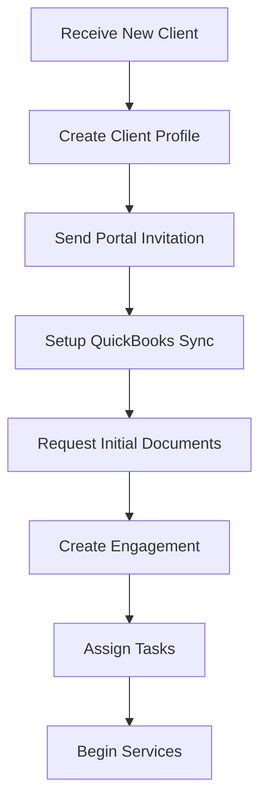
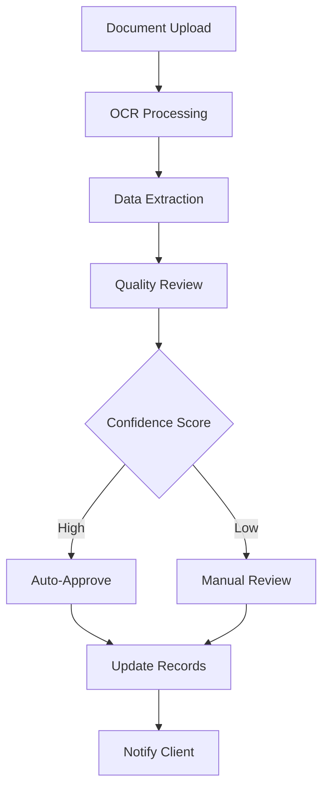
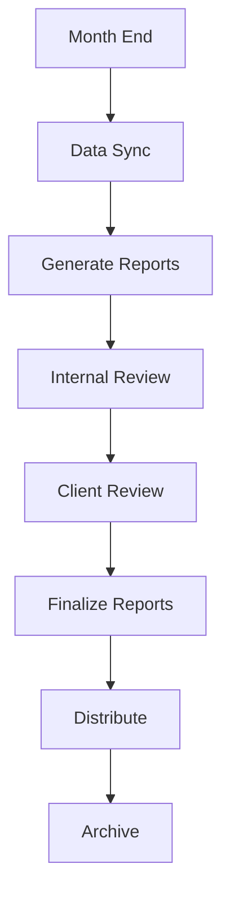

# Quick Start Guide

## Table of Contents

1. [5-Minute Setup](#5-minute-setup)
2. [Essential First Steps](#essential-first-steps)
3. [Basic Workflows](#basic-workflows)
4. [Key Features Overview](#key-features-overview)
5. [Common Tasks](#common-tasks)
6. [Integration Setup](#integration-setup)
7. [Next Steps](#next-steps)

---

## 5-Minute Setup

### For CPA Firms

#### Step 1: Organization Setup (2 minutes)
```bash
1. Access your organization portal at: https://[your-subdomain].cpaplatform.com
2. Log in with your admin credentials
3. Complete organization profile:
   - Firm name and address
   - Primary contact information
   - Business license numbers
   - Specializations and services
```

#### Step 2: Team Member Setup (2 minutes)
```bash
1. Navigate to Settings → Team Management
2. Add team members:
   - Email addresses
   - Roles (Owner, Admin, CPA, Staff)
   - Departments (Tax, Audit, Advisory)
3. Send invitation emails
4. Configure permission levels
```

#### Step 3: Essential Integrations (1 minute)
```bash
1. QuickBooks: Settings → Integrations → Connect QuickBooks
2. Email: Settings → Email Configuration
3. Storage: Verify Azure storage connection
4. Notifications: Configure alert preferences
```

### For Individual Users

#### Step 1: Account Access (1 minute)
```bash
1. Check email for invitation link
2. Click invitation and create password
3. Verify email address
4. Complete profile information
```

#### Step 2: Security Setup (2 minutes)
```bash
1. Navigate to Settings → Security
2. Enable Two-Factor Authentication
3. Add backup email/phone
4. Review security preferences
```

#### Step 3: Dashboard Customization (2 minutes)
```bash
1. Go to Dashboard
2. Add/remove widgets based on your role
3. Set notification preferences
4. Bookmark frequently used sections
```

---

## Essential First Steps

### For Administrators

#### 1. Organization Configuration
- [ ] Complete organization profile
- [ ] Upload company logo and branding
- [ ] Configure subscription and billing
- [ ] Set up security policies
- [ ] Define user roles and permissions

#### 2. System Integration
- [ ] Connect QuickBooks (if applicable)
- [ ] Configure email settings
- [ ] Set up document storage preferences
- [ ] Test backup and recovery procedures
- [ ] Configure audit logging

#### 3. Team Onboarding
- [ ] Create user accounts for team members
- [ ] Assign appropriate roles and permissions
- [ ] Provide login credentials securely
- [ ] Schedule training sessions
- [ ] Create user documentation

### For CPAs and Staff

#### 1. Profile Setup
- [ ] Complete personal profile information
- [ ] Set communication preferences
- [ ] Configure dashboard layout
- [ ] Test mobile access
- [ ] Review security settings

#### 2. Client Management
- [ ] Import existing client list
- [ ] Create client profiles
- [ ] Set up client portal access
- [ ] Configure client-specific settings
- [ ] Test client communication features

#### 3. Document Organization
- [ ] Set up folder structure
- [ ] Configure document categories
- [ ] Test upload and OCR features
- [ ] Create document naming conventions
- [ ] Set up retention policies

---

## Basic Workflows

### New Client Onboarding



#### Step-by-Step Process:
1. **Create Client Profile**
   - Navigate to Clients → Add New Client
   - Enter business and contact information
   - Set client status to "Prospect" initially

2. **Send Portal Invitation**
   - Go to client profile → Portal Access
   - Generate secure invitation link
   - Send welcome email with login instructions

3. **Setup QuickBooks Integration**
   - Client profile → Integrations → QuickBooks
   - Guide client through OAuth authorization
   - Configure sync preferences

4. **Request Initial Documents**
   - Create document request list
   - Send via client portal or email
   - Set up automated reminders

5. **Create Engagement**
   - Navigate to Engagements → New Engagement
   - Select engagement type and scope
   - Set timeline and deliverables

### Document Processing Workflow



#### Processing Steps:
1. **Upload Detection**
   - System automatically detects new uploads
   - Triggers OCR processing pipeline
   - Sends confirmation to uploader

2. **OCR and Extraction**
   - AI processes document content
   - Extracts structured data
   - Assigns confidence scores

3. **Review and Approval**
   - High confidence: Auto-approved
   - Low confidence: Manual review required
   - Updates client records automatically

### Monthly Reporting Workflow



---

## Key Features Overview

### Dashboard Features
- **Client Overview**: Active clients and recent activities
- **Task Management**: Pending tasks and deadlines
- **Financial Metrics**: Key performance indicators
- **Recent Activity**: System-wide activity feed
- **Quick Actions**: Common task shortcuts

### Client Management
- **Profile Management**: Comprehensive client information
- **Portal Access**: Secure client communication
- **Document Storage**: Organized file management
- **Financial Integration**: QuickBooks synchronization
- **Communication History**: Complete interaction logs

### Document Management
- **Smart Upload**: Drag-and-drop with auto-categorization
- **OCR Processing**: Automatic text and data extraction
- **Version Control**: Document revision tracking
- **Security**: Encryption and access controls
- **Search**: Powerful search and filtering

### Task and Workflow Management
- **Task Creation**: Flexible task management system
- **Workflow Templates**: Pre-defined work processes
- **Team Collaboration**: Assignment and tracking
- **Deadline Management**: Automated reminders
- **Progress Tracking**: Real-time status updates

### Reporting and Analytics
- **Financial Reports**: Automated report generation
- **Custom Reports**: Flexible report builder
- **Scheduled Delivery**: Automated report distribution
- **Interactive Dashboards**: Real-time data visualization
- **Export Options**: Multiple format support

---

## Common Tasks

### Adding a New Client
```bash
# Quick method
1. Click "Add Client" button on dashboard
2. Fill required fields (name, email, business type)
3. Click "Save and Continue"
4. Setup additional details in next screens

# Detailed method
1. Navigate to Clients → Add New Client
2. Complete all profile sections
3. Configure portal access
4. Setup integrations
5. Create initial engagement
```

### Uploading Documents
```bash
# Bulk upload
1. Navigate to Documents → Upload
2. Drag multiple files to upload area
3. Select client and category
4. Add descriptions if needed
5. Click "Upload All"

# Single document with details
1. Go to specific client → Documents
2. Click "Upload Document"
3. Select file and set detailed metadata
4. Add tags and notes
5. Save with full categorization
```

### Creating Tasks
```bash
# Quick task
1. Use "+" button on dashboard
2. Select "Create Task"
3. Fill title, assignee, due date
4. Save

# Detailed task
1. Navigate to Tasks → New Task
2. Complete all fields including:
   - Description and requirements
   - Checklist items
   - Dependencies
   - File attachments
3. Set priority and notifications
4. Assign and save
```

### Generating Reports
```bash
# Standard report
1. Go to Reports → Generate Report
2. Select report type
3. Choose date range and clients
4. Click "Generate"
5. Download when ready

# Custom report
1. Navigate to Reports → Custom Report Builder
2. Select data sources
3. Configure filters and grouping
4. Choose visualization options
5. Save as template for reuse
```

---

## Integration Setup

### QuickBooks Integration

#### Prerequisites
- QuickBooks Online or Desktop subscription
- Admin access to QuickBooks company file
- Active internet connection
- Compatible browser

#### Setup Process
```bash
1. Platform Setup:
   - Navigate to Settings → Integrations
   - Click "Connect QuickBooks"
   - Select QuickBooks version (Online/Desktop)

2. Authorization:
   - Click "Connect to QuickBooks"
   - Log in to Intuit account
   - Authorize platform access
   - Select company file

3. Configuration:
   - Set sync frequency (hourly/daily)
   - Choose data types to sync
   - Configure error handling
   - Test connection

4. Initial Sync:
   - Monitor sync progress
   - Review imported data
   - Resolve any conflicts
   - Verify data accuracy
```

### Email Configuration

#### SMTP Setup
```bash
1. Navigate to Settings → Email Configuration
2. Enter SMTP server details:
   - Server: smtp.your-provider.com
   - Port: 587 (TLS) or 465 (SSL)
   - Username: your-email@domain.com
   - Password: your-app-password
3. Test email delivery
4. Configure email templates
5. Set up automated notifications
```

### Azure Services Integration

#### Storage Configuration
```bash
1. Verify Azure Storage connection
2. Configure container settings
3. Set up CDN for document delivery
4. Configure backup policies
5. Test file upload/download
```

---

## Next Steps

### Week 1: Foundation
- [ ] Complete organization setup
- [ ] Add all team members
- [ ] Import existing client data
- [ ] Set up basic integrations
- [ ] Train team on basic features

### Week 2: Process Implementation
- [ ] Create workflow templates
- [ ] Set up document organization
- [ ] Configure reporting schedules
- [ ] Train clients on portal usage
- [ ] Implement security policies

### Week 3: Optimization
- [ ] Fine-tune workflows
- [ ] Create custom reports
- [ ] Set up automated processes
- [ ] Optimize team permissions
- [ ] Gather user feedback

### Month 1: Advanced Features
- [ ] Implement advanced workflows
- [ ] Set up complex integrations
- [ ] Create custom dashboards
- [ ] Optimize performance
- [ ] Plan expansion features

### Ongoing: Best Practices
- [ ] Regular security reviews
- [ ] Performance monitoring
- [ ] User training updates
- [ ] Feature adoption tracking
- [ ] Continuous improvement

---

## Quick Reference

### Keyboard Shortcuts
```bash
# Navigation
Ctrl/Cmd + D: Dashboard
Ctrl/Cmd + C: Clients
Ctrl/Cmd + T: Tasks
Ctrl/Cmd + U: Upload Document

# Actions
Ctrl/Cmd + N: New (context-dependent)
Ctrl/Cmd + S: Save
Ctrl/Cmd + F: Search
Esc: Close modal/cancel action
```

### Mobile Quick Actions
- **Swipe right**: Mark task complete
- **Swipe left**: Archive/delete
- **Long press**: Quick actions menu
- **Pull down**: Refresh content

### Common URLs
- **Dashboard**: `/dashboard`
- **Clients**: `/clients`
- **Documents**: `/documents`
- **Tasks**: `/tasks`
- **Reports**: `/reports`
- **Settings**: `/settings`

---

## Getting Help

### Immediate Assistance
- **Help Center**: Click "?" icon in top navigation
- **Live Chat**: Available during business hours
- **Keyboard Shortcut**: Press F1 for context help
- **Video Tutorials**: Accessible from help menu

### Support Channels
- **Email**: support@cpaplatform.com
- **Phone**: Available during business hours
- **Documentation**: Comprehensive online guides
- **Community**: User forums and discussions

### Training Resources
- **Onboarding Videos**: Step-by-step tutorials
- **Webinars**: Regular training sessions
- **Best Practices Guide**: Optimization tips
- **Feature Updates**: New feature announcements

*This quick start guide will get you up and running quickly. For detailed information on specific features, refer to the comprehensive user manual and feature-specific documentation.*
