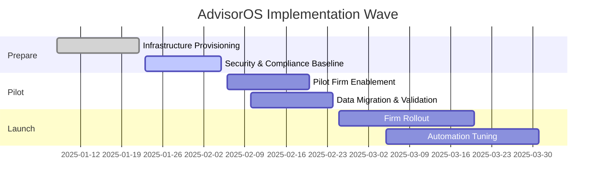

# Implementation Runbook

> [!SUMMARY]
> Step-by-step guide for operations teams to configure AdvisorOS, onboard firms, and coach end users.

## Quick Links

- [Platform Overview](FEATURES.md)
- [Architecture Cheat Sheet](ARCHITECTURE.md)
- [Admin Checklist](ADMINISTRATOR_GUIDE.md)
- [Jump to Troubleshooting](#troubleshooting)
- [Client Success Playbook]({{ site.github.repository_url }}/blob/main/CLIENT_SUCCESS_SYSTEM.md)

---
## Table of Contents

1. [Launch Checklist (45 Days to Go-Live)](#launch-checklist-45-days-to-go-live)
2. [Weekly Operating Rhythm](#weekly-operating-rhythm)
3. [Implementation Timeline](#implementation-timeline)
4. [Feedback Loop](#feedback-loop)
5. [Getting Started](#getting-started)
6. [Navigation Overview](#navigation-overview)
7. [Client Management](#client-management)
8. [Document Management](#document-management)
9. [Financial Dashboard](#financial-dashboard)
10. [Task Management](#task-management)
11. [Reports and Analytics](#reports-and-analytics)
12. [QuickBooks Integration](#quickbooks-integration)
13. [User Settings](#user-settings)
14. [Billing and Subscriptions](#billing-and-subscriptions)
15. [Collaboration Features](#collaboration-features)
16. [Troubleshooting](#troubleshooting)

---

## Launch Checklist (45 Days to Go-Live)

| Milestone | Owner | Reference |
| --- | --- | --- |
| Provision Azure foundations | Platform Engineering | [Deployment Blueprint](DEPLOYMENT.md) |
| Stand up non-production environments | DevOps | [Administrator Guide](ADMINISTRATOR_GUIDE.md#environment-configuration) |
| Run pilot firm readiness review | Client Success Lead | [Implementation Runbook](#weekly-operating-rhythm) |
| Validate integrations & data sync | Integrations Squad | [QuickBooks Integration Guide](QUICKBOOKS_SETUP.md) |
| Train frontline teams | Enablement Lead | [User Guide (Comprehensive)](USER_GUIDE_COMPREHENSIVE.md) |

> [!IMPORTANT]
> Mirror every milestone in your backlog tool. Use the [Production Launch Plan]({{ site.github.repository_url }}/blob/main/ADVISOROS_PRODUCTION_LAUNCH_PLAN.md) as the master schedule and link tasks back to these checklist items.

## Weekly Operating Rhythm

- **Monday stand-up (15 min)** -> Confirm weekend automation status using [Operations Runbook](operations/RUNBOOK.md#monitoring-checklist) and review open incidents.
- **Mid-week adoption review (30 min)** -> Pull usage insights from [Feature Adoption dashboards]({{ site.github.repository_url }}/blob/main/PRODUCTION_SUCCESS_METRICS_FRAMEWORK.md) and adjust enablement focus.
- **Thursday release readiness (45 min)** -> Walk through the [Production Readiness Checklist](PRODUCTION_READINESS_CHECKLIST.md) before shipping any changes.
- **Friday retro (30 min)** -> Log wins, blockers, and client insights in the [Client Success System]({{ site.github.repository_url }}/blob/main/CLIENT_SUCCESS_SYSTEM.md) so the next sprint starts with context.

## Implementation Timeline

Align this view with the more detailed [Production Launch Plan]({{ site.github.repository_url }}/blob/main/ADVISOROS_PRODUCTION_LAUNCH_PLAN.md) so every workstream leads with the same timeline.

## Feedback Loop

> [!NOTE]
> The fastest way to keep the platform sharp is to close the loop between support, product, and engineering.

1. Capture field learnings in the [Client Success System]({{ site.github.repository_url }}/blob/main/CLIENT_SUCCESS_SYSTEM.md) immediately after each onboarding session.
2. Translate systemic issues into product backlog items using the [Technical Debt Assessment]({{ site.github.repository_url }}/blob/main/TECHNICAL_DEBT_ASSESSMENT.md).
3. Run quarterly reviews against the [Post-Launch Support Optimization]({{ site.github.repository_url }}/blob/main/POST_LAUNCH_SUPPORT_OPTIMIZATION.md) checklist to ensure playbooks stay relevant.
4. Feed resolved issues back into this runbook so new team members inherit the latest guidance.
## Getting Started

### System Requirements
- **Browser**: Chrome 90+, Firefox 88+, Safari 14+, Edge 90+
- **Internet Connection**: Stable broadband connection
- **Screen Resolution**: Minimum 1280x720, recommended 1920x1080

### First-Time Login
1. Access your organization's portal at `https://[your-subdomain]cpaplatformcom`
2. Enter your email address and password
3. Complete two-factor authentication setup if required
4. Review and accept terms of service

### Dashboard Overview
The main dashboard provides:
- **Client Overview**: Summary of active clients and recent activities
- **Task Queue**: Pending tasks requiring attention
- **Recent Documents**: Latest uploaded or modified documents
- **Financial Insights**: Key metrics and alerts
- **Quick Actions**: Common tasks and shortcuts

---

## Navigation Overview

### Main Navigation Menu
- **Dashboard**: Overview of all activities and metrics
- **Clients**: Client management and profiles
- **Documents**: File storage and document management
- **Tasks**: Task tracking and workflow management
- **Reports**: Financial reports and analytics
- **Settings**: User preferences and organization settings

### User Roles and Permissions
- **Owner**: Full administrative access
- **Admin**: User management and organization settings
- **CPA**: Client work and document access
- **Staff**: Limited access based on assignments

---

## Client Management

### Adding New Clients
1. Navigate to **Clients** -> **Add New Client**
2. Fill out required information:
   - Business name and legal name
   - Contact information
   - Business type and industry
   - Tax ID (if available)
3. Set client status (Active, Prospect, Inactive)
4. Configure client-specific settings
5. Save and begin QuickBooks sync if applicable

### Client Profile Management
Each client profile includes:
- **Basic Information**: Contact details, addresses, business type
- **Financial Data**: Synced QuickBooks information
- **Documents**: Client-specific file storage
- **Notes**: Communication history and important notes
- **Tasks**: Assigned work and deadlines
- **Billing**: Invoice history and payment status

### Client Status Management
- **Active**: Regular client with ongoing services
- **Prospect**: Potential client in sales process
- **Inactive**: Past client or on hold

---

## Document Management

### Uploading Documents
1. Select client or use general document storage
2. Choose **Upload Documents**
3. Drag and drop files or click to browse
4. Categorize documents:
   - Tax Returns
   - Financial Statements
   - Bank Statements
   - Receipts and Invoices
   - W-2s and 1099s
   - Other

### Document Categories and Tags
- **Category**: Primary classification (tax_return, bank_statement, etc)
- **Subcategory**: More specific classification
- **Year/Quarter**: Time period association
- **Tags**: Custom labels for easy searching

### OCR and Data Extraction
- Automatic text extraction from uploaded documents
- AI-powered data recognition for tax forms
- Manual review for documents with low confidence scores
- Structured data extraction for key financial information

### Document Security
- **Access Levels**: Public, Organization, Client, Restricted
- **Encryption**: Automatic encryption for sensitive documents
- **Audit Trail**: Complete history of document access and changes
- **Retention Policies**: Automatic archiving and deletion schedules

---

## Financial Dashboard

### Key Metrics
- **Revenue Tracking**: Monthly and annual revenue analysis
- **Client Health Scores**: Risk assessment and engagement levels
- **Cash Flow Analysis**: Accounts receivable and payable trends
- **Profitability Metrics**: Engagement profitability and efficiency

### Interactive Charts
Powered by Tremor UI for:
- Revenue trends over time
- Client distribution by industry
- Task completion rates
- Document processing volumes

### Alerts and Notifications
- Overdue invoices
- Missing required documents
- Approaching deadlines
- QuickBooks sync issues

---

## Task Management

### Creating Tasks
1. Navigate to **Tasks** ->  **Create New Task**
2. Fill out task details:
   - Title and description
   - Assigned team member
   - Due date and priority
   - Associated client or engagement
3. Add checklist items if needed
4. Set dependencies on other tasks
5. Save and notify assignee

### Task Types
- **Document Review**: Review and verify client documents
- **Data Entry**: Input information into systems
- **Client Meeting**: Schedule and track client interactions
- **Preparation**: Tax return or report preparation
- **Review**: Internal review and quality control

### Workflow Automation
- **Templates**: Pre-defined task sequences for common work
- **Automation**: Automatic task creation based on triggers
- **Dependencies**: Tasks that must be completed in sequence
- **Notifications**: Email and in-app alerts for deadlines

---

## Reports and Analytics

### Standard Reports
- **Client Financial Summary**: Comprehensive financial overview
- **Tax Preparation Status**: Progress on tax returns
- **Time Tracking Reports**: Staff utilization and billing
- **Document Audit Reports**: Compliance and completeness

### Custom Report Builder
1. Select data sources and date ranges
2. Choose visualization types (charts, tables, summaries)
3. Apply filters and grouping
4. Preview and adjust formatting
5. Save as template for future use

### Scheduled Reports
- **Frequency**: Daily, weekly, monthly, quarterly
- **Recipients**: Email distribution lists
- **Formats**: PDF, Excel, CSV
- **Delivery**: Automatic generation and sending

---

## QuickBooks Integration

### Initial Setup
1. Navigate to **Settings** ->  **Integrations** ->  **QuickBooks**
2. Click **Connect to QuickBooks**
3. Authorize access through Intuit OAuth
4. Select company file for synchronization
5. Configure sync preferences

### Data Synchronization
- **Chart of Accounts**: Account structure and balances
- **Customers**: Client information and contact details
- **Transactions**: Income, expenses, and journal entries
- **Reports**: Financial statements and trial balances

### Sync Monitoring
- **Sync Status**: Real-time synchronization progress
- **Error Handling**: Automatic retry and error reporting
- **Data Validation**: Consistency checks and alerts
- **Manual Sync**: On-demand synchronization triggers

---

## User Settings

### Profile Management
- **Personal Information**: Name, email, phone number
- **Password**: Change password and security settings
- **Two-Factor Authentication**: Setup and manage 2FA
- **Notifications**: Email and in-app notification preferences

### Display Preferences
- **Theme**: Light or dark mode
- **Time Zone**: Local time zone configuration
- **Language**: Interface language selection
- **Dashboard Layout**: Customize widget arrangement

### Security Settings
- **Active Sessions**: View and manage login sessions
- **Login History**: Audit trail of access attempts
- **API Keys**: Generate and manage API access tokens
- **Data Export**: Request personal data exports

---

## Billing and Subscriptions

### Subscription Management
- **Current Plan**: View active subscription details
- **Usage Metrics**: Track feature usage against limits
- **Billing History**: Download invoices and payment records
- **Payment Methods**: Manage credit cards and billing info

### Plan Upgrades
1. Compare available plans and features
2. Select new subscription tier
3. Review pricing and billing cycle
4. Confirm upgrade and payment
5. Access new features immediately

### Invoice Management
- **Client Invoicing**: Create and send professional invoices
- **Payment Tracking**: Monitor payment status and history
- **Automated Billing**: Recurring invoice generation
- **Integration**: Sync with QuickBooks for accounting

---

## Collaboration Features

### Team Communication
- **Comments**: Add comments to documents and tasks
- **Mentions**: Tag team members for notifications
- **Activity Feeds**: See real-time updates on client work
- **Notes**: Shared notes and meeting minutes

### Document Collaboration
- **Sharing**: Share documents with team members or clients
- **Annotations**: Add highlights and notes to documents
- **Version Control**: Track document changes and revisions
- **Review Workflows**: Structured review and approval processes

### Client Portal Access
- **Secure Login**: Provide clients with portal access
- **Document Sharing**: Share specific documents with clients
- **Status Updates**: Keep clients informed on progress
- **Communication**: Secure messaging with clients

---

## Troubleshooting

### Common Issues

#### Login Problems
- **Forgot Password**: Use password reset link
- **Two-Factor Issues**: Contact admin to reset 2FA
- **Account Locked**: Wait for timeout or contact support
- **Browser Issues**: Clear cache and cookies

#### Document Upload Issues
- **File Size**: Maximum 50MB per file
- **File Types**: PDF, DOC, DOCX, XLS, XLSX, JPG, PNG supported
- **Network Issues**: Check internet connection
- **Browser Compatibility**: Use supported browser versions

#### QuickBooks Sync Issues
- **Authorization Expired**: Reconnect QuickBooks integration
- **Data Conflicts**: Review and resolve sync errors
- **Missing Data**: Check QuickBooks permissions
- **Connection Timeout**: Retry sync or contact support

### Performance Optimization
- **Browser Cache**: Clear regularly for best performance
- **Multiple Tabs**: Limit number of open platform tabs
- **File Sizes**: Optimize large files before upload
- **Network**: Use stable internet connection

### Getting Help
- **Help Center**: Access built-in help documentation
- **Support Tickets**: Submit issues through platform
- **Email Support**: Contact support@cpaplatformcom
- **Phone Support**: Available during business hours

### Emergency Contacts
- **Technical Issues**: technical-support@cpaplatformcom
- **Billing Issues**: billing@cpaplatformcom
- **Security Concerns**: security@cpaplatformcom
- **General Support**: support@cpaplatformcom

---

## Best Practices

### Security
- Use strong, unique passwords
- Enable two-factor authentication
- Log out when leaving workstation
- Report suspicious activity immediately

### Data Management
- Categorize documents consistently
- Use descriptive file names
- Regular backup important work
- Archive old files appropriately

### Collaboration
- Communicate changes clearly
- Use comments for important notes
- Keep client information confidential
- Follow professional standards

### Efficiency
- Use keyboard shortcuts
- Set up notification preferences
- Organize dashboard widgets
- Leverage automation features

---

*For additional support, please contact your system administrator or our support team*

