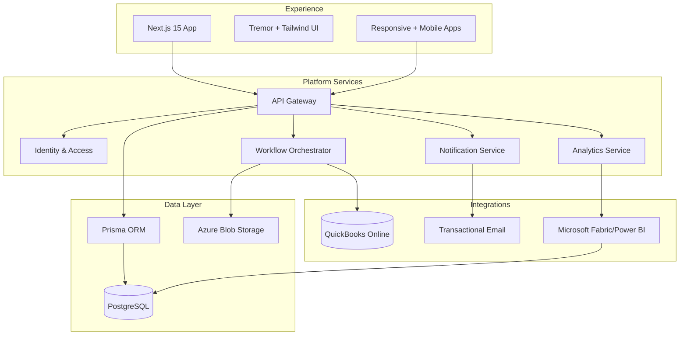
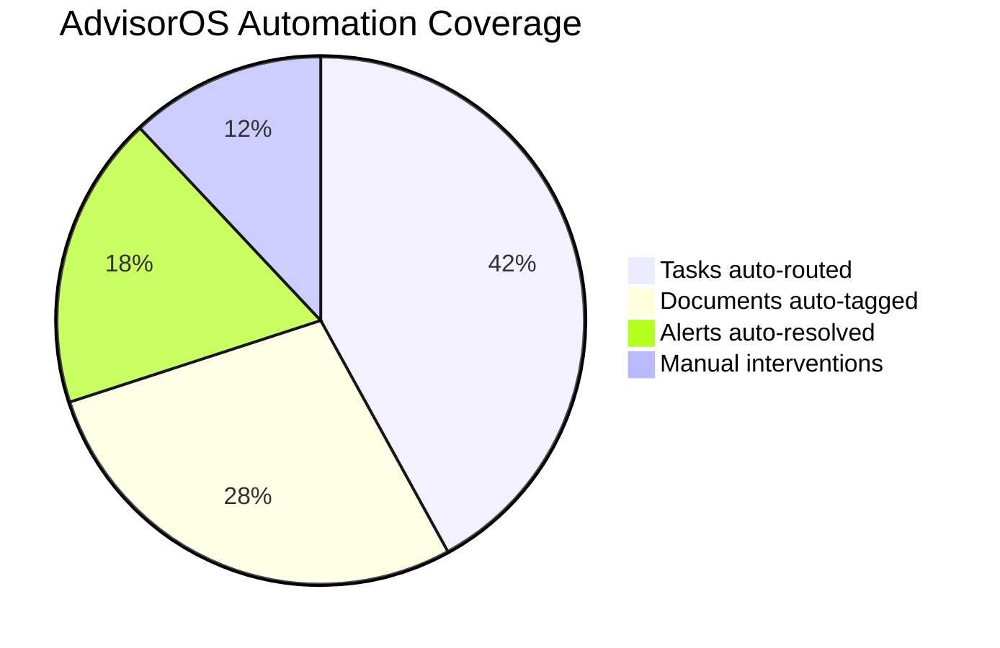
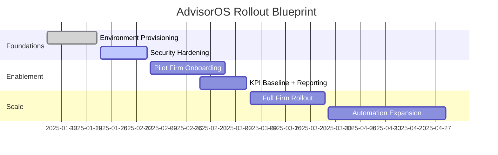

# AdvisorOS Documentation

AdvisorOS is the operating system for modern CPA firms. Use this site as the single briefing room for product narrative, implementation playbooks, and day-to-day operations. Everything here links directly to the living documents in this repo so you are always reading the source of truth.

> [!TIP]
> Pin this page in your browser. The tiles and dashboards below reflect the documents we update most often during rollouts, production support, and stakeholder briefings.

## Choose Your Track

| Track | Start Here | Why It Matters |
| --- | --- | --- |
| Storytelling & positioning | [Executive Quick Start](QUICK_START.md) | Anchor leadership on value, pricing posture, and launch narrative. |
| Field implementation | [Implementation Runbook](README_USER.md) | Step-by-step onboarding workflow with checklists and troubleshooting. |
| Product capability dive | [Product Capabilities](FEATURES.md) | Browse feature pillars with adoption plays, metrics, and demo hooks. |
| Architecture & deployment | [Architecture Deep Dive](ARCHITECTURE.md) | Understand platform topology before touching infrastructure. |
| Engineering setup | [Developer Environment Setup](DEVELOPER_SETUP_ENHANCED.md) | Provision the local stack, bootstrap databases, and align CI/CD. |
| Platform operations | [Operations Command Center](operations/index.md) | Incident response, deployment motions, and production guardrails. |

> [!NOTE]
> Running an executive review? Pair the [Production Launch Executive Summary](../PRODUCTION_LAUNCH_EXECUTIVE_SUMMARY.md) with the [Success Metrics Framework](../PRODUCTION_SUCCESS_METRICS_FRAMEWORK.md).

## Release Radar

- **Launch blueprint** ? Follow the staged plan in [ADVISOROS_PRODUCTION_LAUNCH_PLAN.md](../ADVISOROS_PRODUCTION_LAUNCH_PLAN.md) with the rollback checklist on standby.
- **Client success signals** ? Track adoption KPIs in [CLIENT_SUCCESS_SYSTEM.md](../CLIENT_SUCCESS_SYSTEM.md) and surface wins in stakeholder decks.
- **Security commitments** ? Reconfirm hardening measures outlined in [COMPREHENSIVE_SECURITY_AUDIT_REPORT.md](../COMPREHENSIVE_SECURITY_AUDIT_REPORT.md) before every major release.
- **Go-live validation** ? Use [PRODUCTION_READINESS_CHECKLIST.md](PRODUCTION_READINESS_CHECKLIST.md) as the final gate before flipping any production switch.

## Architecture Systems Map

Dive deeper with the full [architecture deep-dive](ARCHITECTURE.md) and deployment automation in the [Azure blueprint](../infrastructure/main.bicep).

## Automation Scorecard

Ground these numbers with the measurement model in the [Production Success Metrics Framework](../PRODUCTION_SUCCESS_METRICS_FRAMEWORK.md). Replace the placeholder values with your latest telemetry export before external reviews.

## Product Walkthrough

Swap in real screenshots from `docs/assets/screenshots/` so prospects see the actual experience. Include caption callouts referencing client outcomes from [CLIENT_SUCCESS_SYSTEM.md](../CLIENT_SUCCESS_SYSTEM.md).

## Operating Rhythm

Use this as the backbone for stakeholder updates. The granular workstream detail lives in [PRODUCTION_ROLLBACK_PROCEDURES.md](../PRODUCTION_ROLLBACK_PROCEDURES.md) and [POST_LAUNCH_SUPPORT_OPTIMIZATION.md](../POST_LAUNCH_SUPPORT_OPTIMIZATION.md).

## Operations Command Center

> [!IMPORTANT]
> When production gets noisy, jump straight into these documents—no rummaging through PDFs required.

- [Incident Response Playbook](operations/incident-response.md)
- [Operations Runbook](operations/RUNBOOK.md)
- [Production Deployment Guide](operations/DEPLOYMENT_GUIDE.md)
- [Compliance Oversight](compliance/README.md)
- [Database Reference](DATABASE.md)
- [Integration Guides](INTEGRATION_GUIDES.md)

## Proof Points & Talking Tracks

- Pull win stories and quotes from the [Client Success System](../CLIENT_SUCCESS_SYSTEM.md) for every sales cycle.
- Reference the [Market Intelligence Analysis](../COMPREHENSIVE_MARKET_INTELLIGENCE_ANALYSIS.md) when product marketing asks for competitive positioning.
- Highlight the [Revenue Intelligence System](../REVENUE_INTELLIGENCE_SYSTEM.md) when CFOs push for financial insights beyond compliance work.

## Contribute & Keep It Fresh

> [!WARNING]
> Treat this site like production code. Broken links and stale screenshots erode trust instantly.

1. Update docs locally, run `npm run format`, and verify with `bundle exec jekyll serve` if you need a preview.
2. Store images in `docs/assets/screenshots/` (PNG preferred) and media in `docs/assets/media/`.
3. Cross-link to existing playbooks instead of duplicating content. If something is missing, add a new section and call it out in your PR.
4. Record what changed in release notes or the appropriate plan documents so downstream teams stay aligned.

