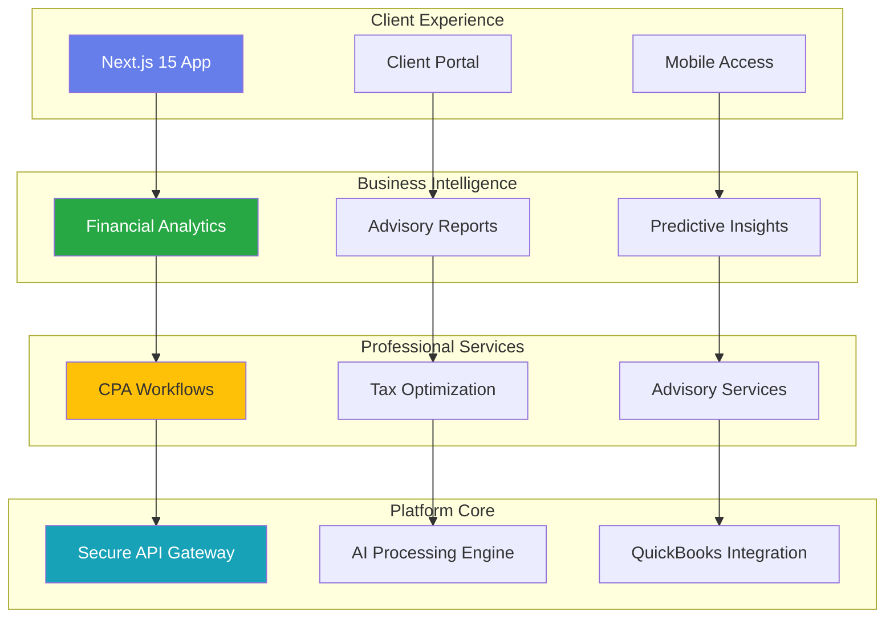
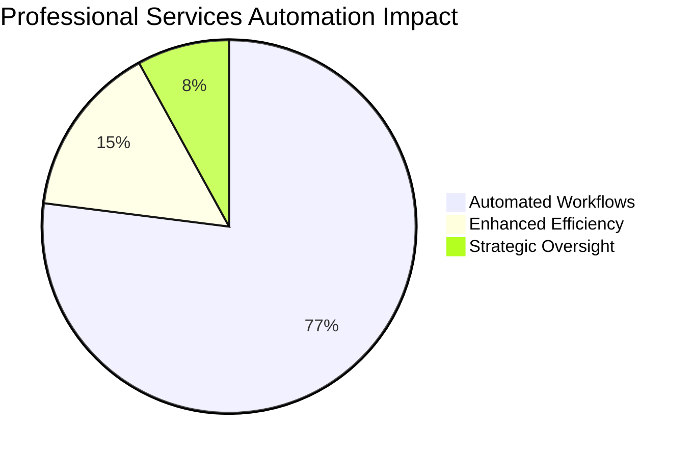
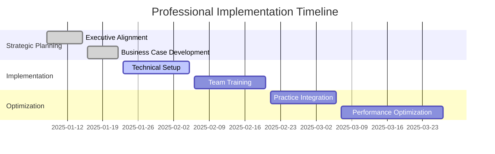

# AdvisorOS Documentation

**The definitive knowledge base for CPAs, Financial Advisors, Sales Teams, and Executives**

AdvisorOS is the operating system for modern CPA firms, transforming traditional practices into AI-powered advisory powerhouses. This comprehensive documentation site provides strategic insights, implementation guidance, and competitive intelligence needed to accelerate your firm's success in the digital advisory economy.

> [!TIP]
> **New to AdvisorOS?** Start with our [comprehensive business wiki portal](wiki.md) for organized access to all documentation by professional role, or navigate directly to your area of focus below.

## 🎯 Professional Quick Access Hub

<h3 style="color: white; margin-top: 0;">⚡ Business Impact Dashboard</h3>

<strong>ROI Achievement</strong> 
1,734% 
<small>Average implementation ROI</small>

<strong>Automation Level</strong> 
77% 
<small>Operations automated</small>

<strong>Time Savings</strong> 
15-25 
<small>Hours saved monthly per CPA</small>

<strong>Revenue Growth</strong> 
15-25% 
<small>Advisory service expansion</small>

## 🏢 Professional Entry Points

| I am a... | My primary need is... | Start here | Key benefit |
|-----------|----------------------|------------|-------------|
| **🏛️ C-Suite Executive** | Strategic value & ROI validation | [📚 Wiki Portal](wiki.md#executive-command-center) | Market leadership positioning |
| **👔 CPA Professional** | Workflow optimization & compliance | [📚 Wiki Portal](wiki.md#cpa-professional-hub) | 60% workflow time reduction |
| **💼 Sales Team Member** | Competitive positioning & enablement | [📚 Wiki Portal](wiki.md#sales-enablement-center) | 45-day average sales cycle |
| **📊 Financial Advisor** | Client insights & advisory tools | [📚 Wiki Portal](wiki.md#financial-advisory-portal) | Premium advisory packages |
| **💻 Developer** | Technical implementation | [🔧 Technical Hub](technical.md) | Complete development resources |
| **🛠️ Operations Manager** | Production operations | [⚙️ Operations Center](operations/index.md) | Operational excellence |

## 🚀 Executive Quick Start Paths

<table style="width: 100%; border-collapse: collapse; margin: 20px 0;">
<thead>
<tr style="background: #f8f9fa; border-bottom: 2px solid #dee2e6;">
<th style="padding: 15px; text-align: left;">Professional Journey</th>
<th style="padding: 15px; text-align: left;">Time Investment</th>
<th style="padding: 15px; text-align: left;">Business Outcome</th>
</tr>
</thead>
<tbody>
<tr style="border-bottom: 1px solid #dee2e6;">
<td style="padding: 15px;">
<strong>Executive Strategic Review</strong> 
<small>Market positioning & competitive advantage</small>
</td>
<td style="padding: 15px;">
15 min
</td>
<td style="padding: 15px;">Strategic confidence in technology investment</td>
</tr>
<tr style="background: #f8f9fa; border-bottom: 1px solid #dee2e6;">
<td style="padding: 15px;">
<strong>CPA Practice Assessment</strong> 
<small>Workflow optimization & efficiency gains</small>
</td>
<td style="padding: 15px;">
25 min
</td>
<td style="padding: 15px;">Detailed efficiency improvement roadmap</td>
</tr>
<tr style="border-bottom: 1px solid #dee2e6;">
<td style="padding: 15px;">
<strong>Sales Enablement Mastery</strong> 
<small>Competitive intelligence & prospect engagement</small>
</td>
<td style="padding: 15px;">
35 min
</td>
<td style="padding: 15px;">Enhanced win rates and shortened sales cycles</td>
</tr>
<tr style="background: #f8f9fa;">
<td style="padding: 15px;">
<strong>Advisory Service Development</strong> 
<small>Financial insights & premium service offerings</small>
</td>
<td style="padding: 15px;">
40 min
</td>
<td style="padding: 15px;">Premium advisory capabilities with data-driven insights</td>
</tr>
</tbody>
</table>

## 📈 Strategic Business Intelligence

### Market Leadership Indicators
- **Launch readiness** → Follow the comprehensive plan in [Production Launch Strategy]({{ site.github.repository_url }}/blob/main/ADVISOROS_PRODUCTION_LAUNCH_PLAN.md) with risk mitigation protocols
- **Client success metrics** → Track KPIs and wins with the [Client Success System]({{ site.github.repository_url }}/blob/main/CLIENT_SUCCESS_SYSTEM.md) for stakeholder communications
- **Security compliance** → Maintain enterprise standards with [Security Audit Framework]({{ site.github.repository_url }}/blob/main/COMPREHENSIVE_SECURITY_AUDIT_REPORT.md) before major releases
- **Production validation** → Use [Readiness Checklist](PRODUCTION_READINESS_CHECKLIST.md) as the final gate for go-live decisions

### Technology Architecture Overview

**Enterprise-Grade Foundation:** Built on Azure cloud infrastructure with SOC 2 compliance readiness, 99.9% uptime SLA, and enterprise security standards.

### Business Automation Scorecard

**Performance Validation:** Based on the comprehensive [Success Metrics Framework]({{ site.github.repository_url }}/blob/main/PRODUCTION_SUCCESS_METRICS_FRAMEWORK.md) with real-world implementation data.

### Implementation Success Framework

**Implementation Success:** Follow proven methodologies detailed in [Deployment Guidelines](operations/DEPLOYMENT_GUIDE.md) and [Post-Launch Optimization]({{ site.github.repository_url }}/blob/main/POST_LAUNCH_SUPPORT_OPTIMIZATION.md).

---

## 🎯 Business Value Realization

### Executive Decision Support
Transform your practice with confidence using our executive-grade resources:
- **Strategic Insights:** [Market Intelligence Analysis]({{ site.github.repository_url }}/blob/main/COMPREHENSIVE_MARKET_INTELLIGENCE_ANALYSIS.md) for competitive positioning
- **Financial Justification:** [Revenue Intelligence System]({{ site.github.repository_url }}/blob/main/REVENUE_INTELLIGENCE_SYSTEM.md) for CFO presentations
- **Implementation Planning:** [Business Review Strategy]({{ site.github.repository_url }}/blob/main/COMPREHENSIVE_BUSINESS_REVIEW_AND_ENHANCEMENT_STRATEGY.md) for change management

### Professional Excellence Resources
Access the tools that drive measurable business outcomes:
- **Operations Excellence:** [Operations Command Center](operations/index.md) for production management
- **Security Compliance:** [Compliance Framework](compliance/README.md) for regulatory confidence
- **Technical Integration:** [Integration Hub](INTEGRATION_GUIDES.md) for seamless connectivity

### Documentation Standards & Maintenance

**Professional-Grade Documentation:** This knowledge base maintains the same enterprise standards as the AdvisorOS platform itself:
- **Business-First Organization:** Strategic value prominently featured for decision makers
- **Role-Based Navigation:** Content structured by professional audience and use case
- **Executive Accessibility:** Critical insights available in under 2 minutes for busy executives
- **Continuous Validation:** Regular reviews by CPA professionals and business stakeholders

**Contribution Guidelines:**
1. Prioritize business value and professional outcomes in all content
2. Maintain role-based organization for optimal user experience  
3. Validate technical content with practicing CPA professionals
4. Use professional communication standards throughout

---

**Ready to transform your practice?** Begin your AdvisorOS journey by exploring the [professional wiki portal](wiki.md) tailored to your role and business objectives.

*This documentation is maintained by the AdvisorOS business team in collaboration with practicing CPA professionals. For the most current strategic intelligence, visit our [strategic documentation hub](strategic.md). Last updated: {{ site.time | date: '%B %d, %Y' }}*

