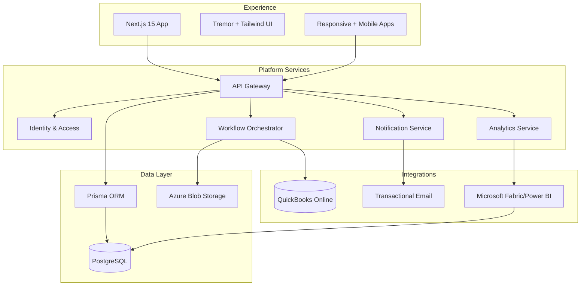
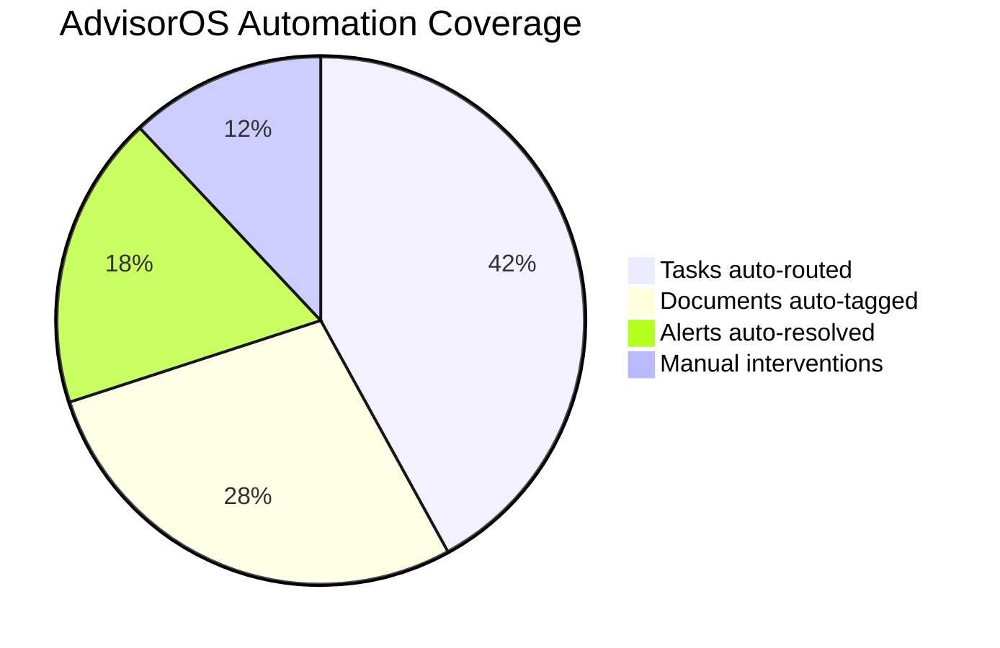
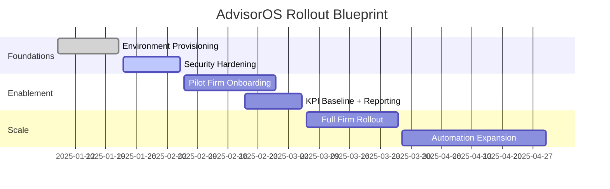

# AdvisorOS Documentation

AdvisorOS is the operating system for modern CPA firms. Use this site as the single briefing room for product narrative, implementation playbooks, and day-to-day operations. Everything here links directly to the living documents in this repo so you are always reading the source of truth.

> [!TIP]
> Pin this page in your browser. The tiles and dashboards below reflect the documents we update most often during rollouts, production support, and stakeholder briefings.

## Portal at a Glance

| Experience | Launch Link | Primary Use | Quick Action |
| --- | --- | --- | --- |
| :file_folder: GitHub-native hub | [README.md](README.md) | Browse the curated tiles directly in the GitHub file viewer. | Add it to your repo favorites for one-click access during reviews. |
| :compass: In-repo microsite | [Documentation Portal](index.md) | Navigate with section anchors, breadcrumbs, and mermaid diagrams while working locally. | Tap <kbd>cmd</kbd>+<kbd>k</kbd> (or <kbd>ctrl</kbd>+<kbd>k</kbd>) to jump to headings in supported editors. |
| :globe_with_meridians: Published site | [GitHub Pages](https://markusahling.github.io/AdvisorOS/) | Share the polished GitHub Pages experience with stakeholders once published. | Use the site-wide search to surface nested guides instantly. |

> [!INFO]
> Switching contexts? Each launcher above resolves to the same source files, so updates propagate everywhere once merged.

## Choose Your Track

| Track | Start Here | Primary Audience | Why It Matters |
| --- | --- | --- | --- |
| Storytelling & positioning | [Executive Quick Start](QUICK_START.md) | Executive sponsors, GTM leaders | Anchor leadership on value, pricing posture, and the launch narrative. |
| Field implementation | [Implementation Runbook](README_USER.md) | Engagement managers, customer success | Step-by-step onboarding workflow with checklists and troubleshooting paths. |
| Product capability dive | [Product Capabilities](FEATURES.md) | Sales engineers, solution consultants | Browse feature pillars with adoption plays, metrics, and demo hooks. |
| Architecture & deployment | [Architecture Deep Dive](ARCHITECTURE.md) | Architects, infrastructure owners | Understand platform topology before touching infrastructure. |
| Engineering setup | [Developer Environment Setup](DEVELOPER_SETUP_ENHANCED.md) | Engineers, QA, DevOps | Provision the local stack, bootstrap databases, and align CI/CD. |
| Platform operations | [Operations Command Center](operations/index.md) | SRE, support, compliance | Incident response, deployment motions, and production guardrails. |

## Track Launch Kits

<strong>Executive Leadership</strong> — communicate the why

- Core briefings: [Executive Quick Start](QUICK_START.md) · [Production Launch Executive Summary]({{ site.github.repository_url }}/blob/main/PRODUCTION_LAUNCH_EXECUTIVE_SUMMARY.md)
- Metrics pairing: [Production Success Metrics Framework]({{ site.github.repository_url }}/blob/main/PRODUCTION_SUCCESS_METRICS_FRAMEWORK.md)
- Enablement tool: [Revenue Intelligence System]({{ site.github.repository_url }}/blob/main/REVENUE_INTELLIGENCE_SYSTEM.md)
- > [!TIP] Draft board decks by combining the executive summary with a live extract from the metrics framework.

<strong>Implementation & Client Success</strong> — deliver the how

- Anchor guide: [Implementation Runbook](README_USER.md)
- Playbooks: [Client Success System]({{ site.github.repository_url }}/blob/main/CLIENT_SUCCESS_SYSTEM.md) · [Operations Runbook](operations/RUNBOOK.md)
- Troubleshooting trio: [FAQ & Troubleshooting](FAQ_TROUBLESHOOTING.md) · [Troubleshooting Index](TROUBLESHOOTING.md) · [QuickBooks Setup](QUICKBOOKS_SETUP.md)
- > [!NOTE] Promote these links in kickoff emails so every team starts from the same source of truth.

<strong>Product & Architecture</strong> — master the what

- Deep dives: [Product Capabilities](FEATURES.md) · [Architecture Deep Dive](ARCHITECTURE.md)
- System references: [Architecture Diagram Archive](architecture/README.md) · [API Reference](API_REFERENCE.md)
- Compliance pairing: [Comprehensive Security Audit]({{ site.github.repository_url }}/blob/main/COMPREHENSIVE_SECURITY_AUDIT_REPORT.md) · [Security Vulnerability Remediation Guide]({{ site.github.repository_url }}/blob/main/SECURITY_VULNERABILITY_REMEDIATION_GUIDE.md)
- > [!IMPORTANT] Always cite the architecture deep dive in infrastructure change requests to keep diagrams and IaC aligned.

<strong>Engineering Enablement</strong> — unblock the builders

- Quickstart: [Developer Environment Setup](DEVELOPER_SETUP_ENHANCED.md) · [Developer Setup Guide](README_DEV.md)
- CI/CD: [Deployment Blueprint](DEPLOYMENT.md) · [Production Readiness Checklist](PRODUCTION_READINESS_CHECKLIST.md)
- Data: [Database Reference](DATABASE.md) · [API Specs](api/README.md)
- > [!TIP] Use the `Developer Setup` guide side-by-side with the `Deployment Blueprint` when pairing new engineers.

<strong>Operations & Compliance</strong> — protect the runway

- Command center: [Operations Index](operations/index.md) · [Incident Response Playbook](operations/incident-response.md)
- Governance: [Compliance Oversight](compliance/README.md) · [Security Compliance Report]({{ site.github.repository_url }}/blob/main/SECURITY_COMPLIANCE_REPORT.md)
- Business continuity: [Production Rollback Procedures]({{ site.github.repository_url }}/blob/main/PRODUCTION_ROLLBACK_PROCEDURES.md) · [Post-Launch Support Optimization]({{ site.github.repository_url }}/blob/main/POST_LAUNCH_SUPPORT_OPTIMIZATION.md)
- > [!WARNING] Keep the rollback plan bookmarked—treat it like production code.

## Release Radar

> [!INFO]
> - **Launch blueprint** → Follow the staged plan in [ADVISOROS_PRODUCTION_LAUNCH_PLAN.md]({{ site.github.repository_url }}/blob/main/ADVISOROS_PRODUCTION_LAUNCH_PLAN.md) with the rollback checklist on standby.
> - **Client success signals** → Track adoption KPIs in [CLIENT_SUCCESS_SYSTEM.md]({{ site.github.repository_url }}/blob/main/CLIENT_SUCCESS_SYSTEM.md) and surface wins in stakeholder decks.
> - **Security commitments** → Reconfirm hardening measures outlined in [COMPREHENSIVE_SECURITY_AUDIT_REPORT.md]({{ site.github.repository_url }}/blob/main/COMPREHENSIVE_SECURITY_AUDIT_REPORT.md) before every major release.
> - **Go-live validation** → Use [PRODUCTION_READINESS_CHECKLIST.md](PRODUCTION_READINESS_CHECKLIST.md) as the final gate before flipping any production switch.

## Architecture Systems Map

Dive deeper with the full [architecture deep dive](ARCHITECTURE.md) and deployment automation in the [Azure blueprint](../infrastructure/main.bicep).

## Automation Scorecard

Ground these numbers with the measurement model in the [Production Success Metrics Framework]({{ site.github.repository_url }}/blob/main/PRODUCTION_SUCCESS_METRICS_FRAMEWORK.md). Replace the placeholder values with your latest telemetry export before external reviews.

## Spotlight Bundles

Executive weekly briefing
: Combine [Executive Quick Start](QUICK_START.md), [Production Launch Executive Summary]({{ site.github.repository_url }}/blob/main/PRODUCTION_LAUNCH_EXECUTIVE_SUMMARY.md), and the [Revenue Intelligence System]({{ site.github.repository_url }}/blob/main/REVENUE_INTELLIGENCE_SYSTEM.md) to keep leadership aligned.

Implementation day zero
: Pair the [Implementation Runbook](README_USER.md) with the [Deployment Blueprint](DEPLOYMENT.md) and [Operations Runbook](operations/RUNBOOK.md) for a seamless handoff from sales to delivery.

Incident command activation
: Use [Operations Command Center](operations/index.md), [Incident Response Playbook](operations/incident-response.md), and [Production Rollback Procedures]({{ site.github.repository_url }}/blob/main/PRODUCTION_ROLLBACK_PROCEDURES.md) together to triage issues.

## Search & Navigation Shortcuts

- Press <kbd>/</kbd> in GitHub or <kbd>cmd</kbd>+<kbd>k</kbd> to jump to the in-page search box.
- Filter docs in the repo with `path:docs/ <keyword>` in the GitHub search bar.
- Use <kbd>t</kbd> in the web UI to open the file finder pre-filtered for documentation.

## Operations Command Center

> [!IMPORTANT]
> When production gets noisy, jump straight into these documents—no rummaging through PDFs required.
> - [Incident Response Playbook](operations/incident-response.md)
> - [Operations Runbook](operations/RUNBOOK.md)
> - [Production Deployment Guide](operations/DEPLOYMENT_GUIDE.md)
> - [Compliance Oversight](compliance/README.md)
> - [Database Reference](DATABASE.md)
> - [Integration Guides](INTEGRATION_GUIDES.md)

## Product Walkthrough

Swap in real screenshots from `docs/assets/screenshots/` so prospects see the actual experience. Include caption callouts referencing client outcomes from [CLIENT_SUCCESS_SYSTEM.md]({{ site.github.repository_url }}/blob/main/CLIENT_SUCCESS_SYSTEM.md).

## Operating Rhythm

Use this as the backbone for stakeholder updates. The granular workstream detail lives in [PRODUCTION_ROLLBACK_PROCEDURES.md]({{ site.github.repository_url }}/blob/main/PRODUCTION_ROLLBACK_PROCEDURES.md) and [POST_LAUNCH_SUPPORT_OPTIMIZATION.md]({{ site.github.repository_url }}/blob/main/POST_LAUNCH_SUPPORT_OPTIMIZATION.md).

## Proof Points & Talking Tracks

- Pull win stories and quotes from the [Client Success System]({{ site.github.repository_url }}/blob/main/CLIENT_SUCCESS_SYSTEM.md) for every sales cycle.
- Reference the [Market Intelligence Analysis]({{ site.github.repository_url }}/blob/main/COMPREHENSIVE_MARKET_INTELLIGENCE_ANALYSIS.md) when product marketing asks for competitive positioning.
- Highlight the [Revenue Intelligence System]({{ site.github.repository_url }}/blob/main/REVENUE_INTELLIGENCE_SYSTEM.md) when CFOs push for financial insights beyond compliance work.

## Contribution Workflow

> [!WARNING]
> Treat this site like production code. Broken links and stale screenshots erode trust instantly.
>
> - [ ] Update docs locally, run `npm run format`, and preview with `bundle exec jekyll serve` if you need a local build.
> - [ ] Store images in `docs/assets/screenshots/` (PNG preferred) and media in `docs/assets/media/`.
> - [ ] Cross-link to existing playbooks instead of duplicating content; add new sections if you identify a gap.
> - [ ] Summarize what changed in release notes or the appropriate plan documents so downstream teams stay aligned.

