# AdvisorOS Integrations Hub

Comprehensive integration documentation for connecting AdvisorOS with third-party services, accounting software, and custom applications. This hub provides setup guides, best practices, and troubleshooting resources for all integration scenarios.

## 🔌 Integration Categories

### 📊 Accounting & Financial Systems
Core accounting software integrations for financial data synchronization.

| Integration | Type | Purpose | Documentation |
|-------------|------|---------|---------------|
| **QuickBooks Online** | Official API | Bi-directional financial data sync | [QuickBooks Setup](QUICKBOOKS_SETUP.md) |
| **QuickBooks Desktop** | File-based | Import/export financial data | [Integration Guides](INTEGRATION_GUIDES.md) |
| **Xero** | Official API | Financial data synchronization | [Integration Guides](INTEGRATION_GUIDES.md) |
| **Sage** | File-based | Data import capabilities | [Integration Guides](INTEGRATION_GUIDES.md) |
| **Excel/CSV** | File import | Manual data import | [Integration Guides](INTEGRATION_GUIDES.md) |

### 💳 Payment & Billing Systems
Payment processing and subscription management integrations.

| Integration | Purpose | Features |
|-------------|---------|----------|
| **Stripe** | Payment processing | Subscriptions, invoicing, payment methods |
| **Payment Gateways** | Alternative processing | Multiple payment options |
| **Billing Systems** | Invoice management | Automated billing workflows |

### ☁️ Cloud & Infrastructure Services
Cloud services and infrastructure integrations.

| Service Category | Azure Services | Purpose |
|------------------|----------------|---------|
| **Storage** | Azure Blob Storage | Document and file storage |
| **AI Services** | Cognitive Services | OCR, text analytics, AI features |
| **Authentication** | Azure AD | Single sign-on and identity management |
| **Monitoring** | Application Insights | Performance and error monitoring |
| **Search** | Cognitive Search | Document and data search |

### 📧 Communication & Collaboration
Email, messaging, and collaboration tool integrations.

| Category | Services | Capabilities |
|----------|----------|--------------|
| **Email** | SMTP, Exchange, Office 365 | Transactional emails, notifications |
| **Calendar** | Outlook, Google Calendar | Meeting scheduling, reminders |
| **Communication** | Teams, Slack | Team collaboration |
| **Video** | Zoom, Teams | Virtual meetings |

### 🔐 Security & Identity
Authentication, authorization, and security service integrations.

| Service | Purpose | Features |
|---------|---------|----------|
| **Azure Active Directory** | Identity management | SSO, MFA, user provisioning |
| **SAML Providers** | Enterprise SSO | Identity federation |
| **OAuth Providers** | Social login | Google, Microsoft authentication |
| **Security Tools** | Threat protection | Security monitoring, compliance |

## 🚀 Integration Architecture

```mermaid
graph TB
    subgraph "AdvisorOS Core"
        A[API Gateway]
        B[Integration Service]
        C[Data Transformation]
        D[Webhook Manager]
    end
    
    subgraph "Accounting Systems"
        E[QuickBooks Online]
        F[QuickBooks Desktop]
        G[Xero]
        H[Sage]
    end
    
    subgraph "Cloud Services"
        I[Azure Blob Storage]
        J[Azure AI Services]
        K[Azure AD]
        L[Application Insights]
    end
    
    subgraph "Payment Systems"
        M[Stripe]
        N[Payment Gateways]
        O[Billing Systems]
    end
    
    subgraph "Communication"
        P[Email Services]
        Q[Calendar Systems]
        R[Collaboration Tools]
    end
    
    A --> B
    B --> C
    B --> D
    
    B --> E
    B --> F
    B --> G
    B --> H
    
    B --> I
    B --> J
    B --> K
    B --> L
    
    B --> M
    B --> N
    B --> O
    
    B --> P
    B --> Q
    B --> R
```

## 📚 Integration Documentation

### Setup Guides
- [**Integration Overview**](INTEGRATION_GUIDES.md) - Comprehensive integration guide
- [**QuickBooks Setup**](QUICKBOOKS_SETUP.md) - Complete QuickBooks integration
- [**API Reference**](API_REFERENCE.md) - Complete API documentation
- [**Authentication Guide**]({{ site.github.repository_url }}/blob/main/docs/api/README.md) - API authentication methods

### Advanced Integration Topics
- [**Webhook Configuration**]({{ site.github.repository_url }}/blob/main/docs/api-specs/endpoints.md) - Real-time event notifications
- [**Data Transformation**]({{ site.github.repository_url }}/blob/main/INTEGRATION_ROADMAP.md) - Data mapping and transformation
- [**Error Handling**](FAQ_TROUBLESHOOTING.md) - Integration error resolution
- [**Performance Optimization**]({{ site.github.repository_url }}/blob/main/API_OPTIMIZATION_GUIDE.md) - Integration performance tuning

### Security & Compliance
- [**Security Framework**]({{ site.github.repository_url }}/blob/main/COMPREHENSIVE_SECURITY_AUDIT_REPORT.md) - Integration security requirements
- [**Compliance Guidelines**](compliance/README.md) - Regulatory compliance for integrations
- [**Data Protection**]({{ site.github.repository_url }}/blob/main/SECURITY_COMPLIANCE_REPORT.md) - Data handling and privacy

## 🔧 Integration Patterns

### Real-Time Synchronization
- **Webhook-based**: Immediate data updates via HTTP callbacks
- **API Polling**: Regular checks for data changes
- **Event-driven**: Message queue-based integration
- **Streaming**: Continuous data flow for high-volume scenarios

### Batch Processing
- **Scheduled Imports**: Regular bulk data imports
- **File-based**: CSV, Excel, and other file formats
- **ETL Processes**: Extract, transform, load workflows
- **Data Warehousing**: Analytics and reporting integration

### Hybrid Approaches
- **Mixed Mode**: Combine real-time and batch processing
- **Fallback Mechanisms**: Graceful degradation strategies
- **Cache Strategies**: Performance optimization techniques
- **Retry Logic**: Robust error handling and recovery

## 📋 Integration Checklist

### Pre-Integration Planning
- [ ] **Requirements Analysis**: Define integration scope and objectives
- [ ] **Technical Assessment**: Evaluate integration complexity and requirements
- [ ] **Security Review**: Assess security implications and requirements
- [ ] **Performance Planning**: Determine performance and scalability needs
- [ ] **Compliance Check**: Verify regulatory compliance requirements

### Implementation Phase
- [ ] **Environment Setup**: Configure development and testing environments
- [ ] **Authentication**: Implement secure authentication mechanisms
- [ ] **Data Mapping**: Define data transformation and mapping rules
- [ ] **Error Handling**: Implement robust error handling and logging
- [ ] **Testing**: Comprehensive integration testing and validation

### Post-Implementation
- [ ] **Monitoring**: Set up monitoring and alerting
- [ ] **Documentation**: Create comprehensive integration documentation
- [ ] **Training**: Train users on integration features and workflows
- [ ] **Maintenance**: Establish ongoing maintenance and support procedures
- [ ] **Performance Review**: Monitor and optimize integration performance

## 🎯 Integration Success Metrics

### Technical Metrics
- **Uptime**: Integration availability and reliability
- **Latency**: Data synchronization speed and responsiveness
- **Throughput**: Volume of data processed per unit time
- **Error Rate**: Frequency and types of integration errors
- **Data Quality**: Accuracy and completeness of synchronized data

### Business Metrics
- **User Adoption**: Percentage of users actively using integrations
- **Time Savings**: Reduction in manual data entry and processing
- **Process Efficiency**: Improvement in workflow automation
- **Cost Reduction**: Savings from automated processes
- **Client Satisfaction**: Impact on client experience and satisfaction

### Operational Metrics
- **Maintenance Effort**: Time spent on integration maintenance
- **Support Tickets**: Volume and types of integration-related issues
- **Deployment Frequency**: Rate of integration updates and improvements
- **Recovery Time**: Time to resolve integration failures
- **Scalability**: Ability to handle increased integration load

## 🆘 Integration Support

### Self-Service Resources
- **Documentation**: Comprehensive integration guides and references
- **Code Examples**: Sample implementations and best practices
- **Troubleshooting**: Common issues and resolution steps
- **Community Forum**: Peer support and discussion

### Direct Support
- **Technical Support**: Email and phone support for integration issues
- **Implementation Services**: Professional services for complex integrations
- **Training Programs**: Workshops and training sessions
- **Partner Network**: Certified integration partners and consultants

### Developer Resources
- **SDK Libraries**: Official software development kits
- **API Testing Tools**: Postman collections and testing utilities
- **Sandbox Environment**: Safe testing environment for integration development
- **Developer Portal**: Comprehensive developer resources and tools

---

*This integrations hub provides comprehensive resources for connecting AdvisorOS with external systems and services. All integration documentation is maintained to reflect the latest API versions and best practices.*