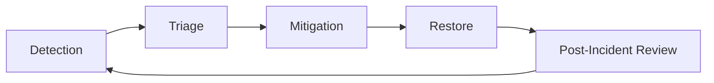

# Operations Command Center

> [!SUMMARY]
> Everything you need to keep AdvisorOS healthy in production: incidents, deployments, compliance, and observability playbooks.

## Quick Actions

- Review the [Operations Runbook](RUNBOOK.md) before every on-call shift.
- Confirm change windows against the [Production Deployment Guide](DEPLOYMENT_GUIDE.md).
- Keep the [Production Readiness Checklist](../PRODUCTION_READINESS_CHECKLIST.md) handy for every release.
- Bookmark the [Incident Response Playbook](incident-response.md) for midnight triage.

## Incident Workflow

Each stage maps directly to the procedures inside the [Incident Response Playbook](incident-response.md).

## Change Calendar

| Change Type | Cadence | Owner | Reference |
| --- | --- | --- | --- |
| Feature deployments | Weekly | Release Captain | [Production Deployment Guide](DEPLOYMENT_GUIDE.md) |
| Infrastructure patches | Bi-weekly | Platform Engineering | [Administrator Guide]({{ site.github.repository_url }}/blob/main/ADMINISTRATOR_GUIDE.md#maintenance--updates) |
| Security drills | Quarterly | Security Officer | [Security Compliance Report]({{ site.github.repository_url }}/blob/main/SECURITY_COMPLIANCE_REPORT.md) |
| Backup validation | Monthly | Database Lead | [Database Reference](../DATABASE.md) |

## Playbooks

- [Incident Response Playbook](incident-response.md)
- [Operations Runbook](RUNBOOK.md)
- [Production Deployment Guide](DEPLOYMENT_GUIDE.md)
- [Compliance Oversight](../compliance/README.md)
- [Database Recovery Checklist](../DATABASE.md)
- [Post-Launch Support Optimization]({{ site.github.repository_url }}/blob/main/POST_LAUNCH_SUPPORT_OPTIMIZATION.md)

## Reporting Rhythm

1. Publish weekly health summaries in Slack using data from [Feature Success dashboards]({{ site.github.repository_url }}/blob/main/PRODUCTION_SUCCESS_METRICS_FRAMEWORK.md).
2. Run monthly compliance reviews referencing [COMPREHENSIVE_SECURITY_AUDIT_REPORT.md]({{ site.github.repository_url }}/blob/main/COMPREHENSIVE_SECURITY_AUDIT_REPORT.md).
3. Share quarterly automation gains and client impact from [CLIENT_SUCCESS_SYSTEM.md]({{ site.github.repository_url }}/blob/main/CLIENT_SUCCESS_SYSTEM.md).

