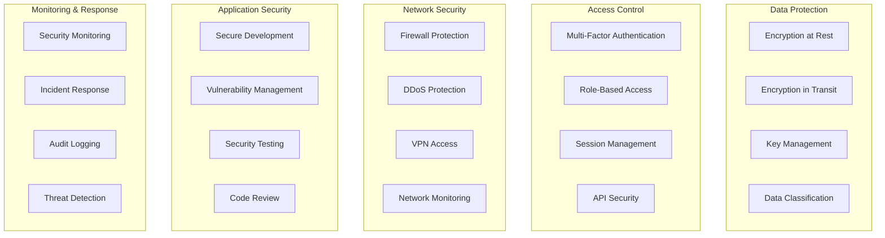
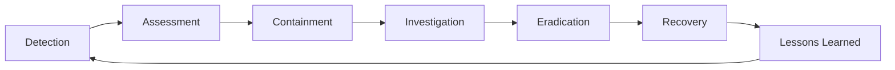

# Security & Compliance Hub

Comprehensive security and compliance documentation for AdvisorOS, covering regulatory frameworks, security controls, audit procedures, and compliance management for CPA firms and their clients.

## 🛡️ Security Framework Overview

AdvisorOS implements enterprise-grade security controls designed to meet the stringent requirements of CPA firms and their clients, ensuring data protection, regulatory compliance, and operational security.

### Core Security Principles
- **Data Protection**: End-to-end encryption and secure data handling
- **Access Control**: Role-based permissions and multi-factor authentication
- **Audit Trail**: Comprehensive logging and monitoring
- **Compliance**: SOC 2, GDPR, and industry-specific requirements
- **Incident Response**: Rapid detection and response capabilities

## 📋 Compliance Framework

### Regulatory Compliance
AdvisorOS maintains compliance with multiple regulatory frameworks relevant to CPA firms and financial services.

| Framework | Status | Documentation | Scope |
|-----------|--------|---------------|-------|
| **SOC 2 Type II** | ✅ Certified | [SOC 2 Overview](compliance/soc2/overview.md) | Security, availability, processing integrity |
| **GDPR** | ✅ Compliant | [GDPR Compliance]({{ site.github.repository_url }}/blob/main/docs/admin/compliance/gdpr-compliance.md) | EU data protection |
| **CCPA** | ✅ Compliant | [Compliance Overview](compliance/README.md) | California privacy rights |
| **HIPAA** | 🔄 Ready | [Data Protection]({{ site.github.repository_url }}/blob/main/docs/admin/compliance/data-protection.md) | Healthcare information |
| **PCI DSS** | ✅ Compliant | [Security Audit Report]({{ site.github.repository_url }}/blob/main/COMPREHENSIVE_SECURITY_AUDIT_REPORT.md) | Payment card data |

### Industry Standards
- **AICPA Trust Services Criteria**: Complete alignment with trust service principles
- **IRS Security Requirements**: Tax professional data protection standards
- **State Board Requirements**: CPA licensing and practice standards
- **Professional Ethics**: AICPA and state board ethical requirements

## 🔒 Security Controls

### Technical Safeguards
Comprehensive technical security measures protecting data and systems.

### Administrative Safeguards
Organizational policies and procedures ensuring security governance.

| Control Category | Implementation | Documentation |
|------------------|----------------|---------------|
| **Security Policies** | Comprehensive security policy framework | [Security Configuration]({{ site.github.repository_url }}/blob/main/docs/admin/security/security-config.md) |
| **Access Management** | User lifecycle and access controls | [User Management]({{ site.github.repository_url }}/blob/main/docs/admin/security/user-management.md) |
| **Training Program** | Security awareness and training | [Security Compliance]({{ site.github.repository_url }}/blob/main/SECURITY_COMPLIANCE_REPORT.md) |
| **Incident Response** | Structured incident management | [Incident Response](operations/incident-response.md) |
| **Risk Management** | Risk assessment and mitigation | [Security Audit]({{ site.github.repository_url }}/blob/main/COMPREHENSIVE_SECURITY_AUDIT_REPORT.md) |

### Physical Safeguards
Data center and infrastructure security controls.

- **Facility Security**: Secure data center facilities with 24/7 monitoring
- **Environmental Controls**: Climate, power, and fire protection systems
- **Physical Access**: Biometric and card-based access controls
- **Equipment Security**: Secure handling and disposal of hardware
- **Backup Systems**: Redundant systems and disaster recovery capabilities

## 🔐 Security Features

### Encryption & Data Protection
- **AES-256 Encryption**: Industry-standard encryption for data at rest
- **TLS 1.3**: Latest transport layer security for data in transit
- **Key Management**: Azure Key Vault for secure key storage
- **Data Masking**: Sensitive data protection in non-production environments
- **Secure Deletion**: Cryptographic erasure for data disposal

### Identity & Access Management
- **Multi-Factor Authentication**: TOTP, SMS, and hardware token support
- **Single Sign-On**: SAML and OAuth integration with enterprise identity providers
- **Role-Based Access Control**: Granular permissions based on job functions
- **Privileged Access Management**: Enhanced controls for administrative access
- **Session Security**: Secure session handling and timeout controls

### Audit & Monitoring
- **Comprehensive Logging**: All system activities and user actions logged
- **Real-Time Monitoring**: 24/7 security monitoring and alerting
- **Audit Trails**: Immutable audit logs for compliance and forensics
- **Anomaly Detection**: AI-powered detection of unusual activities
- **Compliance Reporting**: Automated compliance status reporting

## 📊 Security Metrics & KPIs

### Security Performance Indicators
Track and measure security effectiveness across multiple dimensions.

| Metric Category | Key Indicators | Target |
|------------------|----------------|---------|
| **Availability** | System uptime, service availability | 99.9% |
| **Security Incidents** | Incident count, mean time to resolution | <1 hour MTTR |
| **Compliance** | Audit findings, control effectiveness | Zero critical findings |
| **Access Control** | Failed login attempts, access violations | <0.1% failure rate |
| **Data Protection** | Encryption coverage, data loss incidents | 100% coverage, zero loss |

### Risk Assessment Matrix
Continuous risk evaluation and mitigation tracking.

| Risk Category | Likelihood | Impact | Mitigation Status |
|---------------|------------|--------|-------------------|
| **Data Breach** | Low | High | ✅ Comprehensive controls |
| **System Outage** | Medium | Medium | ✅ Redundancy implemented |
| **Insider Threat** | Low | High | ✅ Access controls and monitoring |
| **Compliance Violation** | Low | High | ✅ Ongoing compliance program |
| **Third-Party Risk** | Medium | Medium | ✅ Vendor risk management |

## 🔍 Audit & Compliance Management

### Internal Audit Program
- **Regular Assessments**: Quarterly security assessments and control testing
- **Control Validation**: Ongoing validation of security control effectiveness
- **Gap Analysis**: Identification and remediation of compliance gaps
- **Risk Assessments**: Annual comprehensive risk assessments
- **Penetration Testing**: Regular external security testing

### External Audits
- **SOC 2 Type II**: Annual independent security audits
- **Compliance Assessments**: Regular regulatory compliance reviews
- **Certification Maintenance**: Ongoing maintenance of security certifications
- **Third-Party Validations**: Independent security validations
- **Regulatory Examinations**: Cooperation with regulatory examinations

### Documentation Management
- **Policy Library**: Centralized security and compliance policies
- **Procedure Documentation**: Detailed operational procedures
- **Training Materials**: Security awareness and training content
- **Audit Evidence**: Comprehensive audit trail and evidence collection
- **Reporting Templates**: Standardized compliance reporting formats

## 🆘 Incident Response & Security Support

### Security Incident Response
Structured approach to security incident management and response.

### Response Team Roles
- **Incident Commander**: Overall incident coordination and communication
- **Security Analyst**: Technical investigation and analysis
- **Legal Counsel**: Legal and regulatory guidance
- **Communications**: Internal and external communications
- **Technical Lead**: System restoration and remediation

### Escalation Procedures
- **Level 1**: Minor security events handled by operations team
- **Level 2**: Moderate incidents requiring security team involvement
- **Level 3**: Major incidents requiring executive and legal involvement
- **Level 4**: Critical incidents requiring external notification and support

## 📚 Security Resources

### Training & Awareness
- **Security Awareness Program**: Regular training for all users
- **Phishing Simulation**: Ongoing phishing awareness testing
- **Role-Based Training**: Specialized training for different user roles
- **Compliance Training**: Regulatory and industry-specific training
- **Incident Response Training**: Emergency response procedures

### Security Tools & Technologies
- **Vulnerability Scanner**: Regular vulnerability assessments
- **Security Information and Event Management (SIEM)**: Centralized security monitoring
- **Endpoint Protection**: Advanced threat protection for endpoints
- **Network Security**: Firewall, intrusion detection, and prevention
- **Backup and Recovery**: Comprehensive data protection and recovery

### External Resources
- **Security Advisories**: Industry security alerts and advisories
- **Threat Intelligence**: External threat intelligence feeds
- **Professional Organizations**: ISACA, (ISC)², SANS participation
- **Regulatory Guidance**: IRS, AICPA, and state board guidance
- **Industry Forums**: Security and compliance community participation

---

*This security and compliance hub provides comprehensive resources for maintaining the highest levels of security and regulatory compliance in AdvisorOS deployments.*