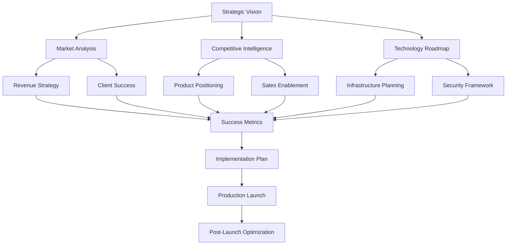

# Strategic Documentation Hub

This section contains executive-level strategic documents, business intelligence reports, and high-level planning materials for AdvisorOS. These documents provide stakeholders with comprehensive insights into market positioning, competitive analysis, and strategic roadmaps.

## 📋 Executive Summary Documents

### Core Strategic Planning
- [**Production Launch Executive Summary**]({{ site.github.repository_url }}/blob/main/PRODUCTION_LAUNCH_EXECUTIVE_SUMMARY.md) - Executive overview of production launch strategy
- [**Comprehensive Business Review**]({{ site.github.repository_url }}/blob/main/COMPREHENSIVE_BUSINESS_REVIEW_AND_ENHANCEMENT_STRATEGY.md) - Complete business analysis and enhancement strategy
- [**Strategic Review Executive Summary**]({{ site.github.repository_url }}/blob/main/STRATEGIC_REVIEW_EXECUTIVE_SUMMARY.md) - High-level strategic review and recommendations

### Launch & Production Planning
- [**Production Launch Plan**]({{ site.github.repository_url }}/blob/main/ADVISOROS_PRODUCTION_LAUNCH_PLAN.md) - Detailed production launch roadmap
- [**Production Readiness Checklist**](PRODUCTION_READINESS_CHECKLIST.md) - Comprehensive readiness assessment
- [**Production Launch Security Checklist**]({{ site.github.repository_url }}/blob/main/PRODUCTION_LAUNCH_SECURITY_CHECKLIST.md) - Security validation for production
- [**Production Rollback Procedures**]({{ site.github.repository_url }}/blob/main/PRODUCTION_ROLLBACK_PROCEDURES.md) - Emergency rollback protocols

## 📊 Business Intelligence & Analytics

### Market & Competitive Analysis
- [**Market Intelligence Analysis**]({{ site.github.repository_url }}/blob/main/COMPREHENSIVE_MARKET_INTELLIGENCE_ANALYSIS.md) - Comprehensive market research and positioning
- [**Revenue Intelligence System**]({{ site.github.repository_url }}/blob/main/REVENUE_INTELLIGENCE_SYSTEM.md) - Revenue optimization and business intelligence
- [**Client Success System**]({{ site.github.repository_url }}/blob/main/CLIENT_SUCCESS_SYSTEM.md) - Client engagement and success metrics

### Performance & Metrics
- [**Production Success Metrics Framework**]({{ site.github.repository_url }}/blob/main/PRODUCTION_SUCCESS_METRICS_FRAMEWORK.md) - KPI tracking and success measurement
- [**Financial Analytics Implementation**]({{ site.github.repository_url }}/blob/main/FINANCIAL_ANALYTICS_IMPLEMENTATION.md) - Financial reporting and analytics capabilities
- [**Advanced Financial Analytics Recommendations**]({{ site.github.repository_url }}/blob/main/ADVANCED_FINANCIAL_ANALYTICS_RECOMMENDATIONS.md) - Enhanced analytics features

## 🎯 Domain-Specific Strategies

### CPA Industry Optimization
- [**CPA Workflow Optimization Summary**]({{ site.github.repository_url }}/blob/main/CPA_WORKFLOW_OPTIMIZATION_SUMMARY.md) - Industry-specific workflow improvements
- [**Tax Season Optimization Strategy**]({{ site.github.repository_url }}/blob/main/TAX_SEASON_OPTIMIZATION_STRATEGY.md) - Tax season preparation and optimization
- [**Sales Enablement Playbook**]({{ site.github.repository_url }}/blob/main/SALES_ENABLEMENT_PLAYBOOK_FINANCIAL_ADVISORY.md) - Financial advisory sales strategy

### Technology & Innovation
- [**Intelligent Automation System**]({{ site.github.repository_url }}/blob/main/INTELLIGENT_AUTOMATION_SYSTEM.md) - AI and automation roadmap
- [**AI System Overview**]({{ site.github.repository_url }}/blob/main/AI_SYSTEM_README.md) - Artificial intelligence capabilities
- [**Testing Automation Framework**]({{ site.github.repository_url }}/blob/main/TESTING_AUTOMATION_FRAMEWORK.md) - Quality assurance strategy

## 🏗️ Infrastructure & Operations

### Technical Infrastructure
- [**Operational Infrastructure Roadmap**]({{ site.github.repository_url }}/blob/main/OPERATIONAL_INFRASTRUCTURE_ROADMAP.md) - Infrastructure development plan
- [**Integration Roadmap**]({{ site.github.repository_url }}/blob/main/INTEGRATION_ROADMAP.md) - Third-party integration strategy
- [**Cost Optimization Strategy**](COST_OPTIMIZATION_STRATEGY.md) - Infrastructure cost management

### Enhancement Portfolios
- [**Comprehensive Enhancement Portfolio**]({{ site.github.repository_url }}/blob/main/ADVISOROS_COMPREHENSIVE_ENHANCEMENT_PORTFOLIO.md) - Complete feature enhancement roadmap
- [**Codex Technical Enhancement Specifications**]({{ site.github.repository_url }}/blob/main/CODEX_TECHNICAL_ENHANCEMENT_SPECIFICATIONS.md) - Technical improvement specifications
- [**Technical Debt Assessment**]({{ site.github.repository_url }}/blob/main/TECHNICAL_DEBT_ASSESSMENT.md) - Technical debt analysis and remediation

## 🛡️ Security & Compliance

### Security Analysis
- [**Comprehensive Security Audit Report**]({{ site.github.repository_url }}/blob/main/COMPREHENSIVE_SECURITY_AUDIT_REPORT.md) - Complete security assessment
- [**Security Compliance Report**]({{ site.github.repository_url }}/blob/main/SECURITY_COMPLIANCE_REPORT.md) - Regulatory compliance status
- [**Security Vulnerability Remediation Guide**]({{ site.github.repository_url }}/blob/main/SECURITY_VULNERABILITY_REMEDIATION_GUIDE.md) - Vulnerability management

### Post-Launch Support
- [**Post Launch Support Optimization**]({{ site.github.repository_url }}/blob/main/POST_LAUNCH_SUPPORT_OPTIMIZATION.md) - Ongoing support strategy
- [**Production User Onboarding Guide**]({{ site.github.repository_url }}/blob/main/PRODUCTION_USER_ONBOARDING_GUIDE.md) - User adoption strategy

## 📈 Strategic Planning Framework

## 📋 Strategic Document Categories

### Executive Leadership
Strategic documents for C-level executives and board members:
- Business strategy and market positioning
- Financial performance and revenue optimization
- Competitive analysis and market intelligence
- Investment priorities and resource allocation

### Product Strategy
Product development and enhancement planning:
- Feature roadmaps and enhancement portfolios
- User experience and interface improvements
- Technology integration and automation
- Quality assurance and testing strategies

### Operational Excellence
Operational efficiency and process optimization:
- Workflow automation and optimization
- Infrastructure scaling and cost management
- Security and compliance frameworks
- Support and customer success strategies

### Implementation Planning
Deployment and rollout strategies:
- Production launch planning and checklists
- Risk assessment and mitigation strategies
- User onboarding and change management
- Success metrics and performance monitoring

## 🎯 Strategic Priorities Matrix

| Priority Level | Focus Area | Key Documents |
|----------------|------------|---------------|
| **Critical** | Production Launch | Launch Plan, Readiness Checklist, Security Checklist |
| **High** | Market Position | Market Intelligence, Competitive Analysis |
| **Medium** | Feature Enhancement | Enhancement Portfolio, Technical Specifications |
| **Ongoing** | Optimization | Success Metrics, Cost Optimization, Performance |

## 📊 Key Performance Indicators

### Business Metrics
- Revenue growth and diversification
- Client acquisition and retention
- Market share and competitive position
- Operational efficiency improvements

### Technical Metrics
- System performance and reliability
- Security compliance and audit results
- Integration success and data quality
- Automation coverage and effectiveness

### User Experience Metrics
- User adoption and engagement
- Client satisfaction scores
- Support ticket volume and resolution time
- Feature utilization and feedback

---

*This strategic documentation hub provides comprehensive access to all high-level planning materials, business intelligence reports, and executive summaries for AdvisorOS stakeholders.*