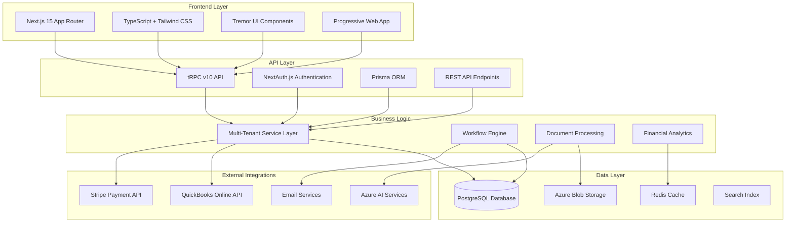

# Technical Documentation Hub

Comprehensive technical resources for developers, architects, and system administrators working with AdvisorOS. This hub provides detailed information about the platform's architecture, APIs, integrations, and development practices.

## 🏗️ Architecture & Design

### System Architecture
- [**Architecture Overview**](ARCHITECTURE.md) - Complete system architecture and technology stack
- [**Database Design**](DATABASE.md) - Database schema, relationships, and optimization
- [**API Reference**](API_REFERENCE.md) - Complete API documentation and endpoints
- [**Integration Guides**](INTEGRATION_GUIDES.md) - Third-party service integrations

### Architecture Decision Records (ADRs)
- [**ADR Overview**](architecture/adrs/README.md) - Architecture decision record index
- [**Multi-Tenant Data Isolation**](architecture/adrs/001-multi-tenant-data-isolation.md) - Data isolation strategy
- [**Prisma Schema Design**](architecture/adrs/002-prisma-schema-design.md) - Database ORM decisions
- [**Next.js App Router API Design**](architecture/adrs/003-nextjs-app-router-api-design.md) - Frontend architecture
- [**Azure Infrastructure Scaling**](architecture/adrs/004-azure-infrastructure-scaling.md) - Cloud infrastructure strategy
- [**Security Architecture Compliance**](architecture/adrs/005-security-architecture-compliance.md) - Security framework design

### Technical Analysis
- [**Architecture Audit Summary**](architecture/ARCHITECTURE_AUDIT_SUMMARY.md) - Architecture review and recommendations
- [**Technical Debt Analysis**](architecture/TECHNICAL_DEBT_ANALYSIS.md) - Technical debt assessment and planning

## 💻 Development Resources

### Developer Setup & Workflow
- [**Developer Setup Guide**](README_DEV.md) - Complete development environment setup
- [**Enhanced Developer Setup**](DEVELOPER_SETUP_ENHANCED.md) - Advanced development configuration
- [**Development Setup Guide**]({{ site.github.repository_url }}/blob/main/DEVELOPMENT_SETUP.md) - Alternative setup instructions
- [**Getting Started**]({{ site.github.repository_url }}/blob/main/GETTING_STARTED.md) - Quick start for developers

### Code Quality & Testing
- [**Testing Guide**]({{ site.github.repository_url }}/blob/main/apps/web/README.testing.md) - Testing strategies and frameworks
- [**Component Guidelines**]({{ site.github.repository_url }}/blob/main/apps/web/src/components/README.md) - React component standards
- [**Client Management Backend**]({{ site.github.repository_url }}/blob/main/apps/web/src/docs/CLIENT_MANAGEMENT_BACKEND.md) - Backend architecture details

### Package Documentation
- [**Analytics Package**]({{ site.github.repository_url }}/blob/main/packages/analytics/README.md) - Analytics and reporting utilities
- [**Database Package**]({{ site.github.repository_url }}/blob/main/packages/database/README.md) - Database utilities and schemas
- [**UI Package**]({{ site.github.repository_url }}/blob/main/packages/ui/README.md) - Shared UI components
- [**Database Implementation Guide**]({{ site.github.repository_url }}/blob/main/packages/database/IMPLEMENTATION_GUIDE.md) - Database setup and usage
- [**Database Performance**]({{ site.github.repository_url }}/blob/main/packages/database/PERFORMANCE.md) - Performance optimization guide
- [**Database Seeding**]({{ site.github.repository_url }}/blob/main/packages/database/seed/README.md) - Data seeding procedures

## 🔧 Infrastructure & Operations

### Deployment & Infrastructure
- [**Deployment Guide**](DEPLOYMENT.md) - Application deployment procedures
- [**Azure Infrastructure**]({{ site.github.repository_url }}/blob/main/infrastructure/azure/README.md) - Azure cloud infrastructure setup
- [**Operations Runbook**](operations/RUNBOOK.md) - Day-to-day operational procedures
- [**Deployment Guide (Operations)**](operations/DEPLOYMENT_GUIDE.md) - Production deployment processes

### Performance & Optimization
- [**Database Optimization Report**]({{ site.github.repository_url }}/blob/main/DATABASE_OPTIMIZATION_REPORT.md) - Database performance analysis
- [**API Optimization Guide**]({{ site.github.repository_url }}/blob/main/API_OPTIMIZATION_GUIDE.md) - API performance optimization
- [**Build Issues & Remediation**]({{ site.github.repository_url }}/blob/main/BUILD_ISSUES_AND_REMEDIATION.md) - Common build problems and solutions

### Database Management
- [**Quick Database Setup**]({{ site.github.repository_url }}/blob/main/QUICK_DATABASE_SETUP.md) - Rapid database configuration
- [**Windows Setup**]({{ site.github.repository_url }}/blob/main/WINDOWS_SETUP.md) - Windows development environment
- [**Backend Foundation Summary**]({{ site.github.repository_url }}/blob/main/BACKEND_FOUNDATION_SUMMARY.md) - Backend architecture overview

## 🔌 Integrations & APIs

### Integration Documentation
- [**QuickBooks Setup**](QUICKBOOKS_SETUP.md) - QuickBooks Online integration
- [**Integration Setup**]({{ site.github.repository_url }}/blob/main/INTEGRATION_SETUP.md) - General integration procedures
- [**API Specifications**](api-specs/endpoints.md) - Detailed API endpoint documentation

### API Resources
- [**API Routes Documentation**](api/routes/client.md) - Client management API routes
- [**API Overview**](api/README.md) - API usage and authentication
- [**OpenAPI Specification**](openapi.yaml) - Machine-readable API specification

## 🛠️ Development Tools & Utilities

### Code Generation & Templates
- [**Technical Documentation Template**](templates/TECHNICAL_DOC_TEMPLATE.md) - Standard documentation format
- [**Design System Components**](design-system/components.md) - UI component library
- [**Developer Resources**](developer/README.md) - Additional developer tools

### AI & Automation Development
- [**Claude Code Prompts**]({{ site.github.repository_url }}/blob/main/prompts/claude-code/) - AI-assisted development prompts
- [**Feature Agent Prompts**]({{ site.github.repository_url }}/blob/main/prompts/feature-agents/) - Feature-specific development guidance

## 📊 Technical Architecture Overview



## 🔍 Development Quick Reference

### Essential Commands
```bash
# Development
npm run dev                 # Start development server
npm run build              # Build for production
npm run lint               # Run ESLint
npm run type-check         # TypeScript validation

# Database
npm run db:push            # Push schema changes
npm run db:studio          # Open Prisma Studio
npm run db:seed            # Seed development data
npm run db:migrate         # Run migrations

# Testing
npm run test              # Run test suite
npm run test:e2e          # Run end-to-end tests
npm run test:coverage     # Generate coverage report
```

### Key Technologies
- **Frontend**: Next.js 15, React 18, TypeScript, Tailwind CSS
- **Backend**: Node.js, tRPC, Prisma ORM, PostgreSQL
- **Authentication**: NextAuth.js with JWT tokens
- **Storage**: Azure Blob Storage, Redis caching
- **Deployment**: Docker, Azure Container Instances
- **Monitoring**: Application Insights, Azure Monitor

### Development Workflow
1. **Setup**: Clone repo and run `npm install`
2. **Environment**: Configure `.env.local` with required variables
3. **Database**: Run `npm run db:push` and `npm run db:seed`
4. **Development**: Start with `npm run dev`
5. **Testing**: Run `npm run test` before committing
6. **Building**: Validate with `npm run build`

## 📚 Additional Resources

### Community & Support
- **GitHub Repository**: [markus41/AdvisorOS](https://github.com/markus41/AdvisorOS)
- **Issue Tracking**: GitHub Issues for bug reports and feature requests
- **Documentation**: Comprehensive wiki and technical guides
- **Support**: Email support@advisoros.io for technical assistance

### Contributing Guidelines
- **Code Standards**: Follow TypeScript and React best practices
- **Testing**: Write tests for new features and bug fixes
- **Documentation**: Update relevant documentation with changes
- **Security**: Follow secure coding practices and review guidelines

---

*This technical hub provides comprehensive resources for developing, deploying, and maintaining AdvisorOS. All documentation is kept current with the latest platform updates and best practices.*