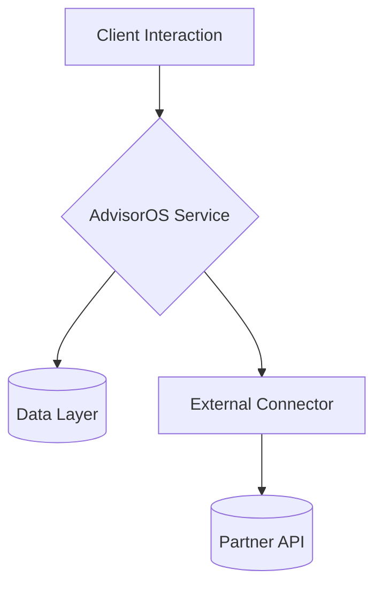

# AdvisorOS Technical Doc Template

> [!TIP]
> Start every AdvisorOS technical narrative by anchoring the business impact before you unpack the build. This template blends executive-ready storytelling with the deep implementation detail delivery teams need.

## Overview

| Field | Guidance |
| --- | --- |
| **Purpose** | Clarify the capability, the decisions it informs, and why this documentation matters now. |
| **Audience** | Name the primary roles, along with any prerequisite tooling or expertise. |
| **Context** | Summarize the problem space and the scenarios the asset covers using confident, plain language. |

> [!NOTE]
> Add a short "Why it matters" paragraph beneath the table that echoes the Advisory-first tone our partners expect.

## Business Value & ROI

| Outcome | Narrative | Leading Indicators |
| --- | --- | --- |
| Revenue / Growth | Describe how the solution expands advisory services or wallet share. | e.g., New subscription uplift %, new segments launched |
| Efficiency | Quantify cycle-time reductions, automation savings, or utilization wins. | e.g., Hours saved / month, automation coverage % |
| Risk & Trust | Show how governance, compliance, or audit posture improves. | e.g., Reduction in exception handling, audit findings |

> [!IMPORTANT]
> Close with a bullet list translating the table into finance-ready sound bites (2–3 bullets max).

## Key Connectors/Dependencies

- **AdvisorOS Modules**
  - _Component / dependency_ — Describe why it matters (link to repo or doc where helpful).
- **External Services**
  - _Vendor / API_ — Note authentication, throughput, or licensing nuances.
- **Operational Readiness Checklist**
  - [ ] Itemized pre-flight validations (change approvals, access reviews, etc.)
  - [ ] Security or compliance confirmations
  - [ ] Data quality or migration checkpoints

## Implementation Guidance

> [!TIP]
> Use subheadings (`###`) for each major track (Architecture, Configuration, Deployment, Validation). Supplement with code blocks, diagrams, and collapsible sections to keep the doc scannable.

### Architecture Snapshot

### Step-by-Step Playbooks

<strong>Track Name</strong> — When to run this play

1. **Action** — Explain what to do and why it unlocks value.
2. **Validation** — Provide commands, screenshots, or queries to confirm success.
3. **Escalation** — Link to troubleshooting or runbooks if something fails.

### Quality Gates & Monitoring
- Define acceptance tests, observability hooks, and rollout metrics.
- Link to dashboards, alert policies, or automated tests.

## Future Enhancements

| Theme | Description | Owner / ETA |
| --- | --- | --- |
| Optimization | Identify quick wins or refinements. | _Team / Quarter_ |
| Innovation | Highlight experimental AI, analytics, or partnership ideas. | _Team / Quarter_ |
| Risk Mitigation | Document known gaps and proactive responses. | _Team / Quarter_ |

> [!CAUTION]
> Call out any blockers that require leadership sponsorship or budget decisions.

## Cross-References

- [Related Asset](../path/RELATED.md) — Why the reader should open it next.
- [Operational Playbook](../path/PLAYBOOK.md) — Which team owns execution.
- [Change Log](../path/CHANGELOG.md) — Where updates will be tracked.
