# AdvisorOS Wiki Portal

Welcome to the comprehensive AdvisorOS knowledge base. This wiki serves as the central hub for all documentation, guides, procedures, and technical specifications for the AdvisorOS CPA Advisory Platform.

## 📚 Knowledge Base Categories

### 🚀 Getting Started
Perfect for new users, administrators, and developers looking to understand and implement AdvisorOS.

| Resource | Audience | Purpose |
|----------|----------|---------|
| [Platform Overview](index.md) | All Users | High-level introduction and value proposition |
| [Quick Start Guide](QUICK_START.md) | Business Users | 5-minute setup and basic workflows |
| [Developer Setup](README_DEV.md) | Developers | Complete development environment setup |
| [Administrator Guide](ADMINISTRATOR_GUIDE.md) | IT Admins | System administration and configuration |

### 💼 Business Documentation
Strategic and operational guidance for business stakeholders.

| Resource | Audience | Purpose |
|----------|----------|---------|
| [Product Capabilities](FEATURES.md) | All Stakeholders | Comprehensive feature overview |
| [User Guide](USER_GUIDE_COMPREHENSIVE.md) | End Users | Complete user workflow documentation |
| [Client Portal Guide](CLIENT_PORTAL_GUIDE.md) | Clients & CPAs | Client-facing portal usage |
| [Production Launch Plan]({{ site.github.repository_url }}/blob/main/ADVISOROS_PRODUCTION_LAUNCH_PLAN.md) | Executives | Strategic launch roadmap |

### 🔧 Technical Documentation
In-depth technical resources for developers and system administrators.

| Resource | Audience | Purpose |
|----------|----------|---------|
| [Architecture Overview](ARCHITECTURE.md) | Architects | System design and technology stack |
| [API Reference](API_REFERENCE.md) | Developers | Complete API documentation |
| [Database Schema](DATABASE.md) | Developers | Database design and operations |
| [Integration Guides](INTEGRATION_GUIDES.md) | Developers | Third-party integration setup |

### 🛠️ Operations & Maintenance
Operational procedures and maintenance guides for keeping AdvisorOS running smoothly.

| Resource | Audience | Purpose |
|----------|----------|---------|
| [Operations Command Center](operations/index.md) | DevOps | Production operations hub |
| [Deployment Guide](operations/DEPLOYMENT_GUIDE.md) | DevOps | Deployment procedures |
| [Incident Response](operations/incident-response.md) | Operations | Emergency response procedures |
| [Operations Runbook](operations/RUNBOOK.md) | Operations | Day-to-day operational tasks |

### 🔒 Security & Compliance
Security protocols, compliance frameworks, and audit procedures.

| Resource | Audience | Purpose |
|----------|----------|---------|
| [Security Audit Report]({{ site.github.repository_url }}/blob/main/COMPREHENSIVE_SECURITY_AUDIT_REPORT.md) | Security Teams | Comprehensive security assessment |
| [Compliance Overview](compliance/README.md) | Compliance Officers | Regulatory compliance framework |
| [SOC 2 Compliance](compliance/soc2/overview.md) | Auditors | SOC 2 certification details |
| [Security Vulnerability Guide]({{ site.github.repository_url }}/blob/main/SECURITY_VULNERABILITY_REMEDIATION_GUIDE.md) | Security Teams | Vulnerability management |

### 📈 Analytics & Intelligence
Business intelligence, reporting, and analytics capabilities.

| Resource | Audience | Purpose |
|----------|----------|---------|
| [Financial Analytics]({{ site.github.repository_url }}/blob/main/FINANCIAL_ANALYTICS_IMPLEMENTATION.md) | Business Analysts | Financial reporting and analytics |
| [Revenue Intelligence]({{ site.github.repository_url }}/blob/main/REVENUE_INTELLIGENCE_SYSTEM.md) | CFOs | Revenue optimization insights |
| [Client Success System]({{ site.github.repository_url }}/blob/main/CLIENT_SUCCESS_SYSTEM.md) | Customer Success | Client engagement tracking |
| [Market Intelligence]({{ site.github.repository_url }}/blob/main/COMPREHENSIVE_MARKET_INTELLIGENCE_ANALYSIS.md) | Strategy Teams | Market analysis and positioning |

### 🎯 Specialized Workflows
Domain-specific guides and optimization strategies.

| Resource | Audience | Purpose |
|----------|----------|---------|
| [CPA Workflow Optimization]({{ site.github.repository_url }}/blob/main/CPA_WORKFLOW_OPTIMIZATION_SUMMARY.md) | CPAs | Industry-specific workflows |
| [Tax Season Optimization]({{ site.github.repository_url }}/blob/main/TAX_SEASON_OPTIMIZATION_STRATEGY.md) | Tax Professionals | Tax season preparation |
| [QuickBooks Setup](QUICKBOOKS_SETUP.md) | Accountants | QuickBooks integration |
| [Sales Enablement]({{ site.github.repository_url }}/blob/main/SALES_ENABLEMENT_PLAYBOOK_FINANCIAL_ADVISORY.md) | Sales Teams | Sales process and materials |

## 🗺️ Documentation Ecosystem Map

```mermaid
graph TD
    A[AdvisorOS Wiki Portal] --> B[Getting Started]
    A --> C[Business Documentation]
    A --> D[Technical Documentation]
    A --> E[Operations & Maintenance]
    A --> F[Security & Compliance]
    A --> G[Analytics & Intelligence]
    A --> H[Specialized Workflows]
    
    B --> B1[Platform Overview]
    B --> B2[Quick Start Guide]
    B --> B3[Developer Setup]
    B --> B4[Administrator Guide]
    
    C --> C1[Product Capabilities]
    C --> C2[User Guide]
    C --> C3[Client Portal Guide]
    C --> C4[Production Launch Plan]
    
    D --> D1[Architecture Overview]
    D --> D2[API Reference]
    D --> D3[Database Schema]
    D --> D4[Integration Guides]
    
    E --> E1[Operations Command Center]
    E --> E2[Deployment Guide]
    E --> E3[Incident Response]
    E --> E4[Operations Runbook]
    
    F --> F1[Security Audit Report]
    F --> F2[Compliance Overview]
    F --> F3[SOC 2 Compliance]
    F --> F4[Security Vulnerability Guide]
    
    G --> G1[Financial Analytics]
    G --> G2[Revenue Intelligence]
    G --> G3[Client Success System]
    G --> G4[Market Intelligence]
    
    H --> H1[CPA Workflow Optimization]
    H --> H2[Tax Season Optimization]
    H --> H3[QuickBooks Setup]
    H --> H4[Sales Enablement]
```

## 🔍 Quick Navigation by Role

### For Developers
1. Start with [Developer Setup](README_DEV.md)
2. Review [Architecture Overview](ARCHITECTURE.md)
3. Explore [API Reference](API_REFERENCE.md)
4. Check [Integration Guides](INTEGRATION_GUIDES.md)

### For Administrators
1. Begin with [Administrator Guide](ADMINISTRATOR_GUIDE.md)
2. Study [Operations Command Center](operations/index.md)
3. Review [Security & Compliance](compliance/README.md)
4. Understand [Deployment Guide](operations/DEPLOYMENT_GUIDE.md)

### For Business Users
1. Start with [Quick Start Guide](QUICK_START.md)
2. Explore [Product Capabilities](FEATURES.md)
3. Reference [User Guide](USER_GUIDE_COMPREHENSIVE.md)
4. Check [Client Portal Guide](CLIENT_PORTAL_GUIDE.md)

### For Executives
1. Review [Platform Overview](index.md)
2. Study [Production Launch Plan]({{ site.github.repository_url }}/blob/main/ADVISOROS_PRODUCTION_LAUNCH_PLAN.md)
3. Analyze [Market Intelligence]({{ site.github.repository_url }}/blob/main/COMPREHENSIVE_MARKET_INTELLIGENCE_ANALYSIS.md)
4. Check [Success Metrics]({{ site.github.repository_url }}/blob/main/PRODUCTION_SUCCESS_METRICS_FRAMEWORK.md)

## 📖 Documentation Standards

### Content Guidelines
- **Clarity**: Use clear, concise language appropriate for the target audience
- **Structure**: Follow consistent formatting and organization patterns
- **Completeness**: Provide comprehensive coverage of topics
- **Currency**: Keep information up-to-date with regular reviews

### Technical Standards
- **Markdown**: All documentation uses standard Markdown formatting
- **Mermaid**: Diagrams use Mermaid syntax for consistency
- **Cross-linking**: Extensive internal and external linking
- **Metadata**: Proper Jekyll front matter for navigation

### Maintenance Process
1. **Regular Reviews**: Quarterly documentation reviews
2. **Update Triggers**: Updates triggered by feature releases
3. **Feedback Integration**: User feedback incorporated continuously
4. **Version Control**: All changes tracked through Git

## 🆘 Getting Help

### Documentation Issues
- **Broken Links**: Report via GitHub issues
- **Missing Information**: Request additions through pull requests
- **Unclear Content**: Suggest improvements via comments

### Technical Support
- **Email**: support@advisoros.io
- **GitHub Issues**: Technical problems and bug reports
- **Discussion Forums**: Community discussions and Q&A

### Training Resources
- **Video Tutorials**: Available in [user guide videos](user-guide/videos/)
- **Webinars**: Scheduled training sessions
- **Documentation**: Self-paced learning materials

---

*This wiki is maintained by the AdvisorOS team and community contributors. Last updated: {{ site.time | date: '%B %d, %Y' }}*