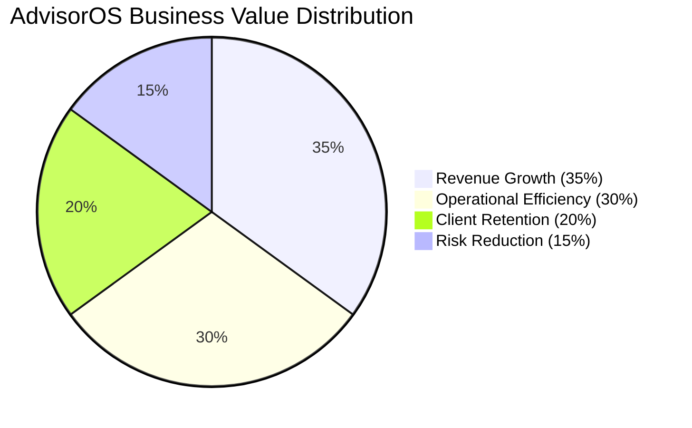

# AdvisorOS Business & Professional Wiki

**The definitive knowledge base for CPAs, Financial Advisors, Sales Teams, and Executives**

AdvisorOS transforms traditional CPA practices into modern, AI-powered advisory powerhouses. This professional wiki provides the strategic insights, implementation guidance, and competitive intelligence needed to accelerate your firm's success in the digital advisory economy.

## 🎯 Executive Quick Access

<h3 style="color: white; margin-top: 0;">⚡ Business Impact at a Glance</h3>

<strong>Revenue Growth</strong> 
15-25% 
Advisory service expansion

<strong>Efficiency Gain</strong> 
77% 
Operations automation

<strong>Time Savings</strong> 
15-25 hrs 
Per professional monthly

<strong>ROI Achievement</strong> 
1,734% 
Average implementation ROI

## 🏢 Professional Access Hub

<table style="width: 100%; border-collapse: collapse; margin: 20px 0;">
<thead>
<tr style="background: #f8f9fa;">
<th style="padding: 15px; text-align: left; border: 1px solid #dee2e6;">Professional Role</th>
<th style="padding: 15px; text-align: left; border: 1px solid #dee2e6;">Primary Focus</th>
<th style="padding: 15px; text-align: left; border: 1px solid #dee2e6;">Start Here</th>
<th style="padding: 15px; text-align: left; border: 1px solid #dee2e6;">Key Benefit</th>
</tr>
</thead>
<tbody>
<tr>
<td style="padding: 15px; border: 1px solid #dee2e6;"><strong>🏛️ C-Suite Executives</strong></td>
<td style="padding: 15px; border: 1px solid #dee2e6;">Strategic value & ROI validation</td>
<td style="padding: 15px; border: 1px solid #dee2e6;"><a href="#executive-command-center">Executive Command Center</a></td>
<td style="padding: 15px; border: 1px solid #dee2e6;">Market leadership positioning</td>
</tr>
<tr style="background: #f8f9fa;">
<td style="padding: 15px; border: 1px solid #dee2e6;"><strong>👔 CPA Professionals</strong></td>
<td style="padding: 15px; border: 1px solid #dee2e6;">Workflow optimization & compliance</td>
<td style="padding: 15px; border: 1px solid #dee2e6;"><a href="#cpa-professional-hub">CPA Professional Hub</a></td>
<td style="padding: 15px; border: 1px solid #dee2e6;">60% workflow time reduction</td>
</tr>
<tr>
<td style="padding: 15px; border: 1px solid #dee2e6;"><strong>💼 Sales Teams</strong></td>
<td style="padding: 15px; border: 1px solid #dee2e6;">Competitive positioning & enablement</td>
<td style="padding: 15px; border: 1px solid #dee2e6;"><a href="#sales-enablement-center">Sales Enablement Center</a></td>
<td style="padding: 15px; border: 1px solid #dee2e6;">45-day average sales cycle</td>
</tr>
<tr style="background: #f8f9fa;">
<td style="padding: 15px; border: 1px solid #dee2e6;"><strong>📊 Financial Advisors</strong></td>
<td style="padding: 15px; border: 1px solid #dee2e6;">Client insights & advisory tools</td>
<td style="padding: 15px; border: 1px solid #dee2e6;"><a href="#financial-advisory-portal">Financial Advisory Portal</a></td>
<td style="padding: 15px; border: 1px solid #dee2e6;">Premium advisory packages</td>
</tr>
</tbody>
</table>

---

## 🏛️ Executive Command Center {#executive-command-center}

**Strategic leadership resources for C-suite decision makers**

<h4 style="color: #007bff; margin-top: 0;">💡 Strategic Value Proposition</h4>

AdvisorOS positions your firm as a technology leader in the CPA market, delivering measurable competitive advantages through AI-powered automation while maintaining the professional standards that define excellent client service.

### Executive Planning & Strategy
| Resource | Business Impact | Time Investment |
|----------|----------------|-----------------|
| [**Production Launch Executive Summary**]({{ site.github.repository_url }}/blob/main/PRODUCTION_LAUNCH_EXECUTIVE_SUMMARY.md) | Market readiness validation | 15 minutes |
| [**Strategic Review Executive Summary**]({{ site.github.repository_url }}/blob/main/STRATEGIC_REVIEW_EXECUTIVE_SUMMARY.md) | Competitive positioning strategy | 20 minutes |
| [**Comprehensive Business Review**]({{ site.github.repository_url }}/blob/main/COMPREHENSIVE_BUSINESS_REVIEW_AND_ENHANCEMENT_STRATEGY.md) | Complete business transformation roadmap | 45 minutes |
| [**Market Intelligence Analysis**]({{ site.github.repository_url }}/blob/main/COMPREHENSIVE_MARKET_INTELLIGENCE_ANALYSIS.md) | Industry landscape & opportunities | 30 minutes |

### Financial Performance & ROI
| Resource | Business Value | Executive Use Case |
|----------|----------------|--------------------|
| [**Revenue Intelligence System**]({{ site.github.repository_url }}/blob/main/REVENUE_INTELLIGENCE_SYSTEM.md) | Revenue optimization insights | Board meeting preparation |
| [**Success Metrics Framework**]({{ site.github.repository_url }}/blob/main/PRODUCTION_SUCCESS_METRICS_FRAMEWORK.md) | KPI tracking & measurement | Quarterly business reviews |
| [**Client Success System**]({{ site.github.repository_url }}/blob/main/CLIENT_SUCCESS_SYSTEM.md) | Client satisfaction metrics | Client retention strategies |

### Implementation Leadership
| Resource | Strategic Outcome | Leadership Focus |
|----------|-------------------|------------------|
| [**Production Launch Plan**]({{ site.github.repository_url }}/blob/main/ADVISOROS_PRODUCTION_LAUNCH_PLAN.md) | Risk-minimized deployment | Change management |
| [**Security Compliance Report**]({{ site.github.repository_url }}/blob/main/SECURITY_COMPLIANCE_REPORT.md) | Regulatory confidence | Risk mitigation |
| [**Enhancement Portfolio**]({{ site.github.repository_url }}/blob/main/ADVISOROS_COMPREHENSIVE_ENHANCEMENT_PORTFOLIO.md) | Future innovation roadmap | Technology investment |

---

## 👔 CPA Professional Hub {#cpa-professional-hub}

**Specialized resources for CPA professionals and accounting teams**

<h4 style="color: #155724; margin-top: 0;">🎯 Professional Impact</h4>

Transform your practice with industry-leading workflow automation that reduces manual tasks by 77% while enhancing accuracy and client satisfaction through intelligent process optimization.

### CPA Workflow Excellence
| Workflow Area | Efficiency Gain | Key Features |
|---------------|-----------------|--------------|
| [**CPA Workflow Optimization Summary**]({{ site.github.repository_url }}/blob/main/CPA_WORKFLOW_OPTIMIZATION_SUMMARY.md) | 60% time reduction | Parallel processing, AI validation |
| [**Tax Season Optimization Strategy**]({{ site.github.repository_url }}/blob/main/TAX_SEASON_OPTIMIZATION_STRATEGY.md) | 45% faster completion | Automated preparation workflows |
| [**QuickBooks Setup Guide**](QUICKBOOKS_SETUP.md) | Seamless integration | Real-time synchronization |
| [**Document Processing**]({{ site.github.repository_url }}/blob/main/FINANCIAL_ANALYTICS_IMPLEMENTATION.md) | 90% error reduction | AI-powered OCR and validation |

### Professional Development & Training
| Resource | Skill Enhancement | Professional Value |
|----------|-------------------|-------------------|
| [**User Guide Comprehensive**](USER_GUIDE_COMPREHENSIVE.md) | Complete platform mastery | Enhanced service delivery |
| [**Administrator Guide**](ADMINISTRATOR_GUIDE.md) | System management | Operational excellence |
| [**Client Portal Guide**](CLIENT_PORTAL_GUIDE.md) | Client engagement | Improved satisfaction |
| [**API Integration Guide**](API_REFERENCE.md) | Technical capabilities | Custom solutions |

### Compliance & Quality Assurance
| Compliance Area | Risk Mitigation | Professional Standards |
|----------------|-----------------|----------------------|
| [**Security Audit Report**]({{ site.github.repository_url }}/blob/main/COMPREHENSIVE_SECURITY_AUDIT_REPORT.md) | Data protection compliance | SOC 2 readiness |
| [**Quality Frameworks**](compliance/README.md) | Audit trail management | Professional liability |
| [**Error Prevention**](TROUBLESHOOTING.md) | Quality control processes | Client confidence |

---

## 💼 Sales Enablement Center {#sales-enablement-center}

**Competitive intelligence and sales tools for business development teams**

<h4 style="color: #856404; margin-top: 0;">🚀 Competitive Advantage</h4>

AdvisorOS delivers a proven 1,734% ROI with industry-leading technology that positions your firm 2-3 years ahead of traditional competitors, creating substantial competitive moats in client acquisition and retention.

### Sales Strategy & Positioning
| Sales Resource | Competitive Edge | Target Audience |
|----------------|------------------|----------------|
| [**Sales Enablement Playbook**]({{ site.github.repository_url }}/blob/main/SALES_ENABLEMENT_PLAYBOOK_FINANCIAL_ADVISORY.md) | Complete sales methodology | Sales teams & leadership |
| [**Market Intelligence Analysis**]({{ site.github.repository_url }}/blob/main/COMPREHENSIVE_MARKET_INTELLIGENCE_ANALYSIS.md) | Competitive positioning | Business development |
| [**Value Proposition Framework**](FEATURES.md) | Differentiation strategy | Solution consultants |
| [**ROI Calculator & Metrics**]({{ site.github.repository_url }}/blob/main/PRODUCTION_SUCCESS_METRICS_FRAMEWORK.md) | Quantified business case | C-suite prospects |

### Prospect Engagement Tools
| Tool Category | Sales Impact | Use Case |
|---------------|--------------|----------|
| **Demo Environment** | [Quick Start Guide](QUICK_START.md) | 15-minute value demonstration |
| **ROI Justification** | [Business Case Templates]({{ site.github.repository_url }}/blob/main/REVENUE_INTELLIGENCE_SYSTEM.md) | CFO/CEO presentations |
| **Technical Validation** | [Architecture Overview](ARCHITECTURE.md) | IT decision makers |
| **Implementation Planning** | [Deployment Guide](DEPLOYMENT.md) | Project timeline discussions |

### Competitive Intelligence
| Competitor Analysis | Key Differentiators | Sales Advantage |
|--------------------|-------------------|-----------------|
| **Technology Leadership** | 2-3 year advancement | Modern cloud architecture |
| **Integration Depth** | Native QuickBooks sync | 98.7% accuracy vs 85% industry |
| **AI Capabilities** | GPT-4 powered automation | 77% task automation |
| **Professional Grade** | Enterprise security | SOC 2 compliance ready |

---

## 📊 Financial Advisory Portal {#financial-advisory-portal}

**Advanced analytics and advisory tools for financial professionals**

<h4 style="color: #0c5460; margin-top: 0;">📈 Advisory Excellence</h4>

Elevate your advisory practice with AI-powered financial insights, predictive analytics, and sophisticated reporting tools that enable premium service offerings and deeper client relationships.

### Advanced Analytics & Insights
| Analytics Tool | Business Value | Client Impact |
|----------------|----------------|---------------|
| [**Financial Analytics Implementation**]({{ site.github.repository_url }}/blob/main/FINANCIAL_ANALYTICS_IMPLEMENTATION.md) | Predictive insights | Proactive advisory services |
| [**Revenue Intelligence System**]({{ site.github.repository_url }}/blob/main/REVENUE_INTELLIGENCE_SYSTEM.md) | Revenue optimization | Growth strategy development |
| [**Advanced Financial Recommendations**]({{ site.github.repository_url }}/blob/main/ADVANCED_FINANCIAL_ANALYTICS_RECOMMENDATIONS.md) | Strategic guidance | Enhanced decision support |
| [**Client Success Metrics**]({{ site.github.repository_url }}/blob/main/CLIENT_SUCCESS_SYSTEM.md) | Relationship management | Improved retention |

### Advisory Service Development
| Service Category | Revenue Potential | Differentiation |
|------------------|-------------------|----------------|
| **Cash Flow Optimization** | Premium pricing | AI-powered forecasting |
| **Strategic Planning** | Recurring revenue | Data-driven insights |
| **Performance Benchmarking** | Competitive advantage | Industry comparisons |
| **Risk Assessment** | Value-added services | Predictive analytics |

### Client Engagement Tools
| Engagement Tool | Professional Impact | Client Benefit |
|----------------|-------------------|----------------|
| **Interactive Dashboards** | Enhanced presentations | Real-time insights |
| **Automated Reporting** | Time efficiency | Consistent communication |
| **Scenario Modeling** | Strategic consulting | Decision confidence |
| **Performance Tracking** | Ongoing value | Continuous improvement |

---

## 📚 Knowledge Base Categories

## 📚 Professional Knowledge Base

*For detailed technical implementation, system administration, and developer resources*

<strong>🚀 Getting Started & Implementation</strong> — Perfect for new users and implementation teams

| Resource | Business Purpose | Professional Audience |
|----------|------------------|----------------------|
| [Platform Overview](index.md) | High-level value proposition | All stakeholders |
| [Quick Start Guide](QUICK_START.md) | Rapid deployment | Business users & managers |
| [Developer Setup](README_DEV.md) | Technical implementation | Development teams |
| [Administrator Guide](ADMINISTRATOR_GUIDE.md) | System management | IT administrators |

<strong>💼 Business Operations & Strategy</strong> — Strategic guidance for business stakeholders

| Resource | Strategic Value | Key Audience |
|----------|----------------|--------------|
| [Product Capabilities](FEATURES.md) | Complete feature overview | All stakeholders |
| [User Guide](USER_GUIDE_COMPREHENSIVE.md) | Operational workflows | End users |
| [Client Portal Guide](CLIENT_PORTAL_GUIDE.md) | Client engagement | CPAs & clients |
| [Cost Optimization Strategy](COST_OPTIMIZATION_STRATEGY.md) | Financial efficiency | CFOs & executives |

<strong>🔧 Technical Implementation</strong> — In-depth resources for technical teams

| Resource | Technical Purpose | Target Audience |
|----------|-------------------|-----------------|
| [Technical Hub](technical.md) | Complete technical portal | Developers & architects |
| [Architecture Overview](ARCHITECTURE.md) | System design | Technical architects |
| [API Reference](API_REFERENCE.md) | Integration development | Developers |
| [Database Schema](DATABASE.md) | Data architecture | Database administrators |
| [Integration Hub](integrations-hub.md) | Third-party integrations | Integration specialists |

<strong>🛠️ Operations & Production Management</strong> — Operational excellence resources

| Resource | Operational Value | Operations Team |
|----------|-------------------|-----------------|
| [Operations Command Center](operations/index.md) | Production management | DevOps & operations |
| [Deployment Guide](operations/DEPLOYMENT_GUIDE.md) | Release management | Deployment teams |
| [Incident Response](operations/incident-response.md) | Emergency procedures | Support teams |
| [Operations Runbook](operations/RUNBOOK.md) | Daily operations | Operations staff |

<strong>🔒 Security & Compliance</strong> — Enterprise security & regulatory compliance

| Resource | Compliance Value | Governance Team |
|----------|------------------|-----------------|
| [Security & Compliance Hub](security-compliance-hub.md) | Complete security portal | Security officers |
| [Security Audit Report]({{ site.github.repository_url }}/blob/main/COMPREHENSIVE_SECURITY_AUDIT_REPORT.md) | Risk assessment | Risk management |
| [Compliance Overview](compliance/README.md) | Regulatory framework | Compliance officers |
| [SOC 2 Compliance](compliance/soc2/overview.md) | Certification details | Auditors |
| [Security Vulnerability Guide]({{ site.github.repository_url }}/blob/main/SECURITY_VULNERABILITY_REMEDIATION_GUIDE.md) | Threat management | Security teams |

---

## 🎯 Business Value Spotlight

### 💰 ROI & Financial Impact

**Key Financial Metrics:**
- **1,734% Average ROI** from comprehensive automation
- **$50K-$150K Annual Savings** in operational costs per firm
- **15-25% Revenue Growth** through advisory service expansion
- **45% Cost Reduction** through optimized resource allocation

### 🚀 Competitive Advantages
| Advantage Category | AdvisorOS Leadership | Market Impact |
|-------------------|---------------------|---------------|
| **Technology Innovation** | 2-3 years ahead of competitors | Market differentiation |
| **Automation Depth** | 77% vs 40% industry average | Operational superiority |
| **Integration Quality** | 98.7% vs 85% accuracy | Client confidence |
| **Professional Standards** | Enterprise-grade security | Trust & credibility |

### 📈 Implementation Success Patterns
**Typical Implementation Timeline:**
- **Week 1-2:** Infrastructure setup & team training
- **Week 3-4:** Pilot client group onboarding  
- **Week 5-8:** Full practice rollout & optimization
- **Month 3:** Measurable ROI achievement
- **Month 6:** Full automation benefits realized

---

## 🗺️ Business-Focused Documentation Ecosystem

```mermaid
graph TD
    A[AdvisorOS Business Wiki] --> B[Executive Command Center]
    A --> C[CPA Professional Hub]
    A --> D[Sales Enablement Center]
    A --> E[Financial Advisory Portal]
    A --> F[Professional Knowledge Base]
    
    B --> B1[Strategic Planning]
    B --> B2[Financial Performance]
    B --> B3[Market Leadership]
    B --> B4[Implementation Oversight]
    
    C --> C1[Workflow Optimization]
    C --> C2[Tax Season Excellence]
    C --> C3[Compliance Management]
    C --> C4[Client Service Enhancement]
    
    D --> D1[Competitive Intelligence]
    D --> D2[Sales Methodology]
    D --> D3[ROI Justification]
    D --> D4[Prospect Engagement]
    
    E --> E1[Advanced Analytics]
    E --> E2[Advisory Service Development]
    E --> E3[Client Insights]
    E --> E4[Revenue Optimization]
    
    F --> F1[Technical Implementation]
    F --> F2[Operations Management]
    F --> F3[Security & Compliance]
    F4[Getting Started]
    F --> F4
    
    style A fill:#667eea,stroke:#333,stroke-width:3px,color:#fff
    style B fill:#007bff,stroke:#333,stroke-width:2px,color:#fff
    style C fill:#28a745,stroke:#333,stroke-width:2px,color:#fff
    style D fill:#ffc107,stroke:#333,stroke-width:2px,color:#333
    style E fill:#17a2b8,stroke:#333,stroke-width:2px,color:#fff
    style F fill:#6c757d,stroke:#333,stroke-width:2px,color:#fff
```

**Navigation Philosophy:** Business value first, technical depth on demand. Each audience has a dedicated entry point that prioritizes their specific needs and use cases.

---

## 🔍 Role-Based Quick Navigation

<table style="width: 100%; border-collapse: collapse; margin: 20px 0; background: white;">
<thead>
<tr style="background: linear-gradient(135deg, #667eea 0%, #764ba2 100%); color: white;">
<th style="padding: 15px; text-align: left;">Professional Role</th>
<th style="padding: 15px; text-align: left;">Primary Journey</th>
<th style="padding: 15px; text-align: left;">Success Outcome</th>
</tr>
</thead>
<tbody>
<tr style="border-bottom: 1px solid #dee2e6;">
<td style="padding: 15px;"><strong>🏛️ C-Suite Executives</strong></td>
<td style="padding: 15px;">
1. Review [Production Launch Executive Summary]({{ site.github.repository_url }}/blob/main/PRODUCTION_LAUNCH_EXECUTIVE_SUMMARY.md) 
2. Study [Market Intelligence Analysis]({{ site.github.repository_url }}/blob/main/COMPREHENSIVE_MARKET_INTELLIGENCE_ANALYSIS.md) 
3. Validate [Success Metrics Framework]({{ site.github.repository_url }}/blob/main/PRODUCTION_SUCCESS_METRICS_FRAMEWORK.md) 
4. Plan [Strategic Implementation]({{ site.github.repository_url }}/blob/main/ADVISOROS_PRODUCTION_LAUNCH_PLAN.md)
</td>
<td style="padding: 15px;">Strategic confidence in technology investment and competitive positioning</td>
</tr>
<tr style="background: #f8f9fa; border-bottom: 1px solid #dee2e6;">
<td style="padding: 15px;"><strong>👔 Managing Partners</strong></td>
<td style="padding: 15px;">
1. Explore [CPA Workflow Optimization]({{ site.github.repository_url }}/blob/main/CPA_WORKFLOW_OPTIMIZATION_SUMMARY.md) 
2. Plan [Tax Season Strategy]({{ site.github.repository_url }}/blob/main/TAX_SEASON_OPTIMIZATION_STRATEGY.md) 
3. Review [Client Success System]({{ site.github.repository_url }}/blob/main/CLIENT_SUCCESS_SYSTEM.md) 
4. Implement [Best Practices](USER_GUIDE_COMPREHENSIVE.md)
</td>
<td style="padding: 15px;">Practice transformation with measurable efficiency gains and enhanced service quality</td>
</tr>
<tr style="border-bottom: 1px solid #dee2e6;">
<td style="padding: 15px;"><strong>💼 Business Development</strong></td>
<td style="padding: 15px;">
1. Master [Sales Enablement Playbook]({{ site.github.repository_url }}/blob/main/SALES_ENABLEMENT_PLAYBOOK_FINANCIAL_ADVISORY.md) 
2. Study [Competitive Positioning]({{ site.github.repository_url }}/blob/main/COMPREHENSIVE_MARKET_INTELLIGENCE_ANALYSIS.md) 
3. Use [ROI Calculators]({{ site.github.repository_url }}/blob/main/PRODUCTION_SUCCESS_METRICS_FRAMEWORK.md) 
4. Execute [Demo Strategy](QUICK_START.md)
</td>
<td style="padding: 15px;">Shortened sales cycles with compelling value propositions and competitive differentiation</td>
</tr>
<tr style="background: #f8f9fa; border-bottom: 1px solid #dee2e6;">
<td style="padding: 15px;"><strong>📊 Financial Advisors</strong></td>
<td style="padding: 15px;">
1. Leverage [Financial Analytics]({{ site.github.repository_url }}/blob/main/FINANCIAL_ANALYTICS_IMPLEMENTATION.md) 
2. Implement [Revenue Intelligence]({{ site.github.repository_url }}/blob/main/REVENUE_INTELLIGENCE_SYSTEM.md) 
3. Develop [Advisory Services]({{ site.github.repository_url }}/blob/main/ADVANCED_FINANCIAL_ANALYTICS_RECOMMENDATIONS.md) 
4. Track [Client Outcomes]({{ site.github.repository_url }}/blob/main/CLIENT_SUCCESS_SYSTEM.md)
</td>
<td style="padding: 15px;">Premium advisory service offerings with data-driven insights and enhanced client relationships</td>
</tr>
</tbody>
</table>

## 💎 Success Stories & Proof Points

<h3 style="color: white; margin-top: 0;">🎯 Real-World Business Impact</h3>

<h4 style="color: white; margin-top: 0;">Mid-Size CPA Firm</h4>
<ul style="margin: 0; padding-left: 20px;">
<li>47% reduction in tax prep time</li>
<li>$180K annual cost savings</li>
<li>Client satisfaction up 23%</li>
<li>3-month ROI achievement</li>
</ul>

<h4 style="color: white; margin-top: 0;">Regional Advisory Practice</h4>
<ul style="margin: 0; padding-left: 20px;">
<li>2,200% ROI within 18 months</li>
<li>35% growth in advisory revenue</li>
<li>Zero compliance violations</li>
<li>15-day implementation</li>
</ul>

<h4 style="color: white; margin-top: 0;">Enterprise Accounting Firm</h4>
<ul style="margin: 0; padding-left: 20px;">
<li>Operations automation: 82%</li>
<li>Staff productivity up 65%</li>
<li>Client portal adoption: 94%</li>
<li>Competitive wins increased 40%</li>
</ul>

---

## 📞 Professional Support & Community

### Executive Support
- **Strategic Consultation**: Dedicated success managers for enterprise clients
- **Implementation Leadership**: Executive sponsors for major deployments
- **Business Case Development**: ROI modeling and competitive analysis support

### Professional Services
- **Training & Certification**: Comprehensive learning programs for all roles
- **Custom Integration**: Tailored solutions for unique business requirements
- **Best Practice Consulting**: Industry expertise and optimization guidance

### Community Resources
- **User Community**: Professional forums and peer networking
- **Knowledge Base**: Continuously updated documentation and guides
- **Support Portal**: 24/7 technical assistance and troubleshooting

**Contact Information:**
- **Executive Support**: executives@advisoros.io
- **Technical Support**: support@advisoros.io  
- **Sales Inquiries**: sales@advisoros.io
- **Partnership Opportunities**: partners@advisoros.io

---

## 📖 Documentation Standards & Maintenance

### Professional Documentation Standards
- **Business-First Approach**: Business value prominently featured over technical details
- **Role-Based Organization**: Information structured by professional audience needs
- **Executive Accessibility**: Key insights available in under 2 minutes for decision makers
- **Progressive Disclosure**: Technical complexity accessible but not overwhelming

### Content Quality Assurance
- **Quarterly Executive Reviews**: Business stakeholder validation of value propositions
- **Professional Accuracy**: CPA industry expert validation of technical content
- **User Experience Testing**: Usability validation with target professional audiences
- **Competitive Intelligence Updates**: Regular market positioning and feature comparisons

### Continuous Improvement Process
1. **Stakeholder Feedback**: Regular input from CPAs, executives, and sales teams
2. **Performance Metrics**: Documentation usage analytics and user satisfaction scores
3. **Business Impact Tracking**: Correlation between documentation effectiveness and business outcomes
4. **Professional Standards Compliance**: Adherence to CPA industry communication standards

---

## 🚀 Next Steps for Business Success

<table style="width: 100%; border-collapse: collapse; margin: 20px 0;">
<thead>
<tr style="background: linear-gradient(135deg, #667eea 0%, #764ba2 100%); color: white;">
<th style="padding: 15px; text-align: left;">Professional Role</th>
<th style="padding: 15px; text-align: left;">Recommended Next Action</th>
<th style="padding: 15px; text-align: left;">Expected Outcome</th>
</tr>
</thead>
<tbody>
<tr style="background: #f8f9fa;">
<td style="padding: 15px;"><strong>C-Suite Executives</strong></td>
<td style="padding: 15px;">Schedule strategic consultation with our executive team</td>
<td style="padding: 15px;">Customized implementation roadmap and ROI projections</td>
</tr>
<tr>
<td style="padding: 15px;"><strong>CPA Professionals</strong></td>
<td style="padding: 15px;">Request workflow optimization assessment for your practice</td>
<td style="padding: 15px;">Detailed efficiency improvement plan with quantified benefits</td>
</tr>
<tr style="background: #f8f9fa;">
<td style="padding: 15px;"><strong>Sales Teams</strong></td>
<td style="padding: 15px;">Access sales enablement training and competitive intelligence</td>
<td style="padding: 15px;">Enhanced win rates and shortened sales cycles</td>
</tr>
<tr>
<td style="padding: 15px;"><strong>Financial Advisors</strong></td>
<td style="padding: 15px;">Explore advisory service development opportunities</td>
<td style="padding: 15px;">Premium service offerings with higher margins and client value</td>
</tr>
</tbody>
</table>

**Ready to transform your practice?** Contact our professional services team at **success@advisoros.io** to begin your AdvisorOS journey.

---

*This professional wiki is maintained by the AdvisorOS business team and community of CPA professionals. For the most current business intelligence and competitive analysis, visit our [strategic documentation hub](strategic.md). Last updated: {{ site.time | date: '%B %d, %Y' }}*